# SmartTravel Database Document

> Generated by [`prisma-markdown`](https://github.com/samchon/prisma-markdown)

- [default](#default)

## default

```mermaid
erDiagram
"User" {
  String id PK
  String email UK
  String passwordHash
  UserRole role
  Boolean isVerified
  String verificationToken "nullable"
  String resetPasswordToken "nullable"
  DateTime createdAt
  DateTime updatedAt
}
"Profile" {
  String id PK
  String userId FK,UK
  String fullName
  String avatarUrl "nullable"
  String coverUrl "nullable"
  String bio "nullable"
  String phoneNumber "nullable"
  String homeLocation "nullable"
}
"TravelPreferences" {
  String id PK
  String userId FK,UK
  String preferredPace
  Float dailyBudget
  String activities
  String destinationTypes
  String foodPreferences
}
"Trip" {
  String id PK
  String ownerId FK
  String title
  String description "nullable"
  String destinationName
  DateTime startDate "nullable"
  DateTime endDate "nullable"
  Float totalBudget
  String travelStyle
  Boolean isPublic
  TripStatus status
  String cloneSourceId FK "nullable"
  DateTime createdAt
  DateTime updatedAt
}
"TripDay" {
  String id PK
  String tripId FK
  Int dayIndex
  DateTime date "nullable"
}
"TripActivity" {
  String id PK
  String tripDayId FK
  String destinationId FK "nullable"
  String title "nullable"
  String location "nullable"
  String description "nullable"
  String startTime "nullable"
  String endTime "nullable"
  Float estimatedCost
  Int sequenceOrder
  String notes "nullable"
}
"Destination" {
  String id PK
  String name
  String description "nullable"
  Float latitude
  Float longitude
  String category
  Float averageRating
  String address "nullable"
  String openingHours "nullable"
}
"Post" {
  String id PK
  String authorId FK
  String content
  String mediaUrls
  String tripId FK "nullable"
  String locationId FK "nullable"
  DateTime createdAt
  DateTime deletedAt "nullable"
}
"Comment" {
  String id PK
  String postId FK
  String authorId FK
  String content
  String parentId FK "nullable"
  DateTime createdAt
}
"Like" {
  String id PK
  String postId FK
  String userId FK
  DateTime createdAt
}
"Bookmark" {
  String id PK
  String postId FK
  String userId FK
  DateTime createdAt
}
"Follower" {
  String id PK
  String followerId FK
  String followingId FK
  DateTime createdAt
}
"Message" {
  String id PK
  String conversationId FK
  String senderId FK
  String content
  DateTime createdAt
}
"Conversation" {
  String id PK
  DateTime createdAt
  DateTime updatedAt
}
"Notification" {
  String id PK
  String recipientId FK
  String type
  String content
  Boolean isRead
  String targetId "nullable"
  DateTime createdAt
}
"CheckIn" {
  String id PK
  String userId FK
  String destinationId FK
  String note "nullable"
  DateTime createdAt
}
"Location" {
  String id PK
  String userId FK,UK
  Float latitude
  Float longitude
  DateTime updatedAt
}
"Recommendation" {
  String id PK
  String tripId FK
  String destinationId FK
  Float score
  String recommendationReason "nullable"
}
"AIHistory" {
  String id PK
  String userId FK
  String promptText
  String responseJson
  String type
  DateTime createdAt
}
"Journey" {
  String id PK
  String userId FK
  String title
  String description "nullable"
  String coverImageUrl "nullable"
  Boolean isPublic
  String status
  DateTime startDate "nullable"
  DateTime endDate "nullable"
  Float totalDistance
  DateTime createdAt
  DateTime updatedAt
}
"Route" {
  String id PK
  String journeyId FK
  String name
  String description "nullable"
  String transportMode
  Float distanceKm
  Int durationMin
  String color
  DateTime createdAt
}
"RoutePoint" {
  String id PK
  String routeId FK
  Float latitude
  Float longitude
  Float altitude "nullable"
  Int sequenceOrder
  DateTime timestamp
  String note "nullable"
  String photoUrl "nullable"
}
"LocationHistory" {
  String id PK
  String userId FK
  Float latitude
  Float longitude
  Float accuracy "nullable"
  Float speed "nullable"
  Float heading "nullable"
  DateTime createdAt
}
"Event" {
  String id PK
  String title
  String description "nullable"
  String coverImageUrl "nullable"
  String destinationId FK "nullable"
  Float latitude
  Float longitude
  DateTime startDate
  DateTime endDate "nullable"
  String category
  Int maxAttendees "nullable"
  Int currentCount
  String organizerId FK
  Boolean isPublic
  DateTime createdAt
  DateTime updatedAt
}
"EventAttendee" {
  String id PK
  String eventId FK
  String userId FK
  String status
  DateTime createdAt
}
"TravelerMatch" {
  String id PK
  String userId FK
  String matchedUserId FK
  Float compatScore
  String matchReasons
  String status
  DateTime createdAt
  DateTime updatedAt
}
"ChatConversation" {
  String id PK
  String userId FK
  String title "nullable"
  DateTime createdAt
  DateTime updatedAt
}
"ChatMessage" {
  String id PK
  String conversationId FK
  String role
  DateTime createdAt
  DateTime updatedAt
}
"ChatMessageVersion" {
  String id PK
  String messageId FK
  String content
  Int version
  Boolean isActive
  DateTime createdAt
}
"AIMemory" {
  String id PK
  String userId FK,UK
  String travelPreferences
  String favoriteFoods
  String budget "nullable"
  String transportation
  String favoriteLocations
  DateTime createdAt
  DateTime updatedAt
}
"UserRecommendation" {
  String id PK
  String userId FK
  String location
  String destinationId FK "nullable"
  String priority
  String reason "nullable"
  String type
  DateTime createdAt
  DateTime updatedAt
}
"TravelHistory" {
  String id PK
  String userId FK
  String location
  String destinationId FK "nullable"
  DateTime time
  String rating "nullable"
  Float cost
  DateTime createdAt
  DateTime updatedAt
}
"FavoriteFood" {
  String id PK
  String userId FK
  String name
  String region "nullable"
  String description "nullable"
  Float rating "nullable"
  DateTime createdAt
  DateTime updatedAt
}
"SavedPlace" {
  String id PK
  String userId FK
  String name
  String category
  Float latitude
  Float longitude
  String address "nullable"
  String imageUrl "nullable"
  DateTime createdAt
  DateTime updatedAt
}
"AIFeedback" {
  String id PK
  String userId FK
  String messageId FK,UK
  Int rating
  String comment "nullable"
  DateTime createdAt
  DateTime updatedAt
}
"ToolCall" {
  String id PK
  String messageId FK
  String toolName
  String input
  String output "nullable"
  String status
  DateTime createdAt
}
"SystemCache" {
  String key
  String type
  String value
  DateTime expiresAt
  DateTime createdAt
  DateTime updatedAt
}
"KnowledgeContent" {
  String id PK
  String title
  String body
  String category
  DateTime createdAt
  DateTime updatedAt
}
"KnowledgeQuestion" {
  String id PK
  String contentId FK
  String questionText
  DateTime createdAt
  DateTime updatedAt
}
"KnowledgeAnswer" {
  String id PK
  String contentId FK
  String answerText
  DateTime createdAt
  DateTime updatedAt
}
"SafetyWarning" {
  String id PK
  String type
  String description
  Float latitude
  Float longitude
  Float radiusKm
  DateTime createdAt
  DateTime expiresAt "nullable"
}
"ModelRegistry" {
  String id PK
  String name UK
  String provider
  String type
  String version
  Boolean isActive
  DateTime createdAt
  DateTime updatedAt
}
"KnowledgeVersion" {
  String id PK
  Int versionNumber UK
  String commitMessage "nullable"
  DateTime createdAt
}
"PromptVersion" {
  String id PK
  String templateName
  String versionHash UK
  String templateText
  Boolean isActive
  DateTime createdAt
}
"AIChatLog" {
  String id PK
  String messageId FK,UK
  String query
  String llmPrompt
  String llmResponse
  Float similarityScore
  Int confidenceScore
  String reliabilityLevel
  Int groundednessScore
  Int claimVerScore
  String retrievedContext
  Int promptTokens
  Int completionTokens
  Int totalTokens
  Float apiCostUsd
  Int latencyMs
  Int ttftMs
  Boolean guardrailsBlocked
  String securityThreatType "nullable"
  Int unsupportedClaims
  String modelId FK
  String promptId FK
  DateTime createdAt
}
"UserFeedback" {
  String id PK
  String chatLogId FK
  Int rating
  String comment "nullable"
  String correctedText "nullable"
  Boolean isProcessed
  DateTime createdAt
}
"CacheMetadata" {
  String id PK
  String cacheKey UK
  String queryText
  String responseJson
  Int hitCount
  DateTime expiresAt
  DateTime createdAt
  DateTime updatedAt
}
"EvaluationHistory" {
  String id PK
  String chatLogId FK
  String metricName
  Float score
  String evaluatorModel
  String reasoning "nullable"
  DateTime createdAt
}
"GuardrailEvent" {
  String id PK
  String chatLogId FK "nullable"
  String ruleViolated
  String severity
  String payloadBlocked
  String actionTaken
  DateTime createdAt
}
"KnowledgeFreshness" {
  String id PK
  String contentId
  String knowledgeCat
  DateTime lastCheckedAt
  Boolean driftDetected
  String sourceHash "nullable"
  Int versionId FK
}
"AuditTrail" {
  String id PK
  String actionType
  String actorName
  String description
  String ipAddress "nullable"
  DateTime createdAt
}
"HandbookDocument" {
  String id PK
  String title
  String category
  String fileType
  String fileName "nullable"
  String fileSize "nullable"
  String content
  String updatedAtStr
  DateTime createdAt
  DateTime updatedAt
}
"_ConversationToUser" {
  String A FK
  String B FK
}
"Profile" |o--|| "User" : user
"TravelPreferences" |o--|| "User" : user
"Trip" }o--|| "User" : owner
"Trip" }o--o| "Trip" : cloneSource
"TripDay" }o--|| "Trip" : trip
"TripActivity" }o--|| "TripDay" : tripDay
"TripActivity" }o--o| "Destination" : destination
"Post" }o--|| "User" : author
"Post" }o--o| "Trip" : trip
"Post" }o--o| "Destination" : destination
"Comment" }o--|| "Post" : post
"Comment" }o--|| "User" : author
"Comment" }o--o| "Comment" : parent
"Like" }o--|| "Post" : post
"Like" }o--|| "User" : user
"Bookmark" }o--|| "Post" : post
"Bookmark" }o--|| "User" : user
"Follower" }o--|| "User" : follower
"Follower" }o--|| "User" : following
"Message" }o--|| "Conversation" : conversation
"Message" }o--|| "User" : sender
"Notification" }o--|| "User" : recipient
"CheckIn" }o--|| "User" : user
"CheckIn" }o--|| "Destination" : destination
"Location" |o--|| "User" : user
"Recommendation" }o--|| "Trip" : trip
"Recommendation" }o--|| "Destination" : destination
"AIHistory" }o--|| "User" : user
"Journey" }o--|| "User" : user
"Route" }o--|| "Journey" : journey
"RoutePoint" }o--|| "Route" : route
"LocationHistory" }o--|| "User" : user
"Event" }o--o| "Destination" : destination
"Event" }o--|| "User" : organizer
"EventAttendee" }o--|| "Event" : event
"EventAttendee" }o--|| "User" : user
"TravelerMatch" }o--|| "User" : user
"TravelerMatch" }o--|| "User" : matchedUser
"ChatConversation" }o--|| "User" : user
"ChatMessage" }o--|| "ChatConversation" : conversation
"ChatMessageVersion" }o--|| "ChatMessage" : message
"AIMemory" |o--|| "User" : user
"UserRecommendation" }o--|| "User" : user
"UserRecommendation" }o--o| "Destination" : destination
"TravelHistory" }o--|| "User" : user
"TravelHistory" }o--o| "Destination" : destination
"FavoriteFood" }o--|| "User" : user
"SavedPlace" }o--|| "User" : user
"AIFeedback" }o--|| "User" : user
"AIFeedback" |o--|| "ChatMessage" : message
"ToolCall" }o--|| "ChatMessage" : message
"KnowledgeQuestion" }o--|| "KnowledgeContent" : content
"KnowledgeAnswer" }o--|| "KnowledgeContent" : content
"AIChatLog" }o--|| "ModelRegistry" : model
"AIChatLog" }o--|| "PromptVersion" : prompt
"AIChatLog" |o--|| "ChatMessage" : message
"UserFeedback" }o--|| "AIChatLog" : chatLog
"EvaluationHistory" }o--|| "AIChatLog" : chatLog
"GuardrailEvent" }o--o| "AIChatLog" : chatLog
"KnowledgeFreshness" }o--|| "KnowledgeVersion" : version
"_ConversationToUser" }o--|| "Conversation" : Conversation
"_ConversationToUser" }o--|| "User" : User
```

### `User`

Properties as follows:

- `id`:
- `email`:
- `passwordHash`:
- `role`:
- `isVerified`:
- `verificationToken`:
- `resetPasswordToken`:
- `createdAt`:
- `updatedAt`:

### `Profile`

Properties as follows:

- `id`:
- `userId`:
- `fullName`:
- `avatarUrl`:
- `coverUrl`:
- `bio`:
- `phoneNumber`:
- `homeLocation`:

### `TravelPreferences`

Properties as follows:

- `id`:
- `userId`:
- `preferredPace`:
- `dailyBudget`:
- `activities`:
- `destinationTypes`:
- `foodPreferences`:

### `Trip`

Properties as follows:

- `id`:
- `ownerId`:
- `title`:
- `description`:
- `destinationName`:
- `startDate`:
- `endDate`:
- `totalBudget`:
- `travelStyle`:
- `isPublic`:
- `status`:
- `cloneSourceId`:
- `createdAt`:
- `updatedAt`:

### `TripDay`

Properties as follows:

- `id`:
- `tripId`:
- `dayIndex`:
- `date`:

### `TripActivity`

Properties as follows:

- `id`:
- `tripDayId`:
- `destinationId`:
- `title`:
- `location`:
- `description`:
- `startTime`:
- `endTime`:
- `estimatedCost`:
- `sequenceOrder`:
- `notes`:

### `Destination`

Properties as follows:

- `id`:
- `name`:
- `description`:
- `latitude`:
- `longitude`:
- `category`:
- `averageRating`:
- `address`:
- `openingHours`:

### `Post`

Properties as follows:

- `id`:
- `authorId`:
- `content`:
- `mediaUrls`:
- `tripId`:
- `locationId`:
- `createdAt`:
- `deletedAt`:

### `Comment`

Properties as follows:

- `id`:
- `postId`:
- `authorId`:
- `content`:
- `parentId`:
- `createdAt`:

### `Like`

Properties as follows:

- `id`:
- `postId`:
- `userId`:
- `createdAt`:

### `Bookmark`

Properties as follows:

- `id`:
- `postId`:
- `userId`:
- `createdAt`:

### `Follower`

Properties as follows:

- `id`:
- `followerId`:
- `followingId`:
- `createdAt`:

### `Message`

Properties as follows:

- `id`:
- `conversationId`:
- `senderId`:
- `content`:
- `createdAt`:

### `Conversation`

Properties as follows:

- `id`:
- `createdAt`:
- `updatedAt`:

### `Notification`

Properties as follows:

- `id`:
- `recipientId`:
- `type`:
- `content`:
- `isRead`:
- `targetId`:
- `createdAt`:

### `CheckIn`

Properties as follows:

- `id`:
- `userId`:
- `destinationId`:
- `note`:
- `createdAt`:

### `Location`

Properties as follows:

- `id`:
- `userId`:
- `latitude`:
- `longitude`:
- `updatedAt`:

### `Recommendation`

Properties as follows:

- `id`:
- `tripId`:
- `destinationId`:
- `score`:
- `recommendationReason`:

### `AIHistory`

Properties as follows:

- `id`:
- `userId`:
- `promptText`:
- `responseJson`:
- `type`:
- `createdAt`:

### `Journey`

Properties as follows:

- `id`:
- `userId`:
- `title`:
- `description`:
- `coverImageUrl`:
- `isPublic`:
- `status`:
- `startDate`:
- `endDate`:
- `totalDistance`:
- `createdAt`:
- `updatedAt`:

### `Route`

Properties as follows:

- `id`:
- `journeyId`:
- `name`:
- `description`:
- `transportMode`:
- `distanceKm`:
- `durationMin`:
- `color`:
- `createdAt`:

### `RoutePoint`

Properties as follows:

- `id`:
- `routeId`:
- `latitude`:
- `longitude`:
- `altitude`:
- `sequenceOrder`:
- `timestamp`:
- `note`:
- `photoUrl`:

### `LocationHistory`

Properties as follows:

- `id`:
- `userId`:
- `latitude`:
- `longitude`:
- `accuracy`:
- `speed`:
- `heading`:
- `createdAt`:

### `Event`

Properties as follows:

- `id`:
- `title`:
- `description`:
- `coverImageUrl`:
- `destinationId`:
- `latitude`:
- `longitude`:
- `startDate`:
- `endDate`:
- `category`:
- `maxAttendees`:
- `currentCount`:
- `organizerId`:
- `isPublic`:
- `createdAt`:
- `updatedAt`:

### `EventAttendee`

Properties as follows:

- `id`:
- `eventId`:
- `userId`:
- `status`:
- `createdAt`:

### `TravelerMatch`

Properties as follows:

- `id`:
- `userId`:
- `matchedUserId`:
- `compatScore`:
- `matchReasons`:
- `status`:
- `createdAt`:
- `updatedAt`:

### `ChatConversation`

Properties as follows:

- `id`:
- `userId`:
- `title`:
- `createdAt`:
- `updatedAt`:

### `ChatMessage`

Properties as follows:

- `id`:
- `conversationId`:
- `role`:
- `createdAt`:
- `updatedAt`:

### `ChatMessageVersion`

Properties as follows:

- `id`:
- `messageId`:
- `content`:
- `version`:
- `isActive`:
- `createdAt`:

### `AIMemory`

Properties as follows:

- `id`:
- `userId`:
- `travelPreferences`:
- `favoriteFoods`:
- `budget`:
- `transportation`:
- `favoriteLocations`:
- `createdAt`:
- `updatedAt`:

### `UserRecommendation`

Properties as follows:

- `id`:
- `userId`:
- `location`:
- `destinationId`:
- `priority`:
- `reason`:
- `type`:
- `createdAt`:
- `updatedAt`:

### `TravelHistory`

Properties as follows:

- `id`:
- `userId`:
- `location`:
- `destinationId`:
- `time`:
- `rating`:
- `cost`:
- `createdAt`:
- `updatedAt`:

### `FavoriteFood`

Properties as follows:

- `id`:
- `userId`:
- `name`:
- `region`:
- `description`:
- `rating`:
- `createdAt`:
- `updatedAt`:

### `SavedPlace`

Properties as follows:

- `id`:
- `userId`:
- `name`:
- `category`:
- `latitude`:
- `longitude`:
- `address`:
- `imageUrl`:
- `createdAt`:
- `updatedAt`:

### `AIFeedback`

Properties as follows:

- `id`:
- `userId`:
- `messageId`:
- `rating`:
- `comment`:
- `createdAt`:
- `updatedAt`:

### `ToolCall`

Properties as follows:

- `id`:
- `messageId`:
- `toolName`:
- `input`:
- `output`:
- `status`:
- `createdAt`:

### `SystemCache`

Properties as follows:

- `key`:
- `type`:
- `value`:
- `expiresAt`:
- `createdAt`:
- `updatedAt`:

### `KnowledgeContent`

Properties as follows:

- `id`:
- `title`:
- `body`:
- `category`:
- `createdAt`:
- `updatedAt`:

### `KnowledgeQuestion`

Properties as follows:

- `id`:
- `contentId`:
- `questionText`:
- `createdAt`:
- `updatedAt`:

### `KnowledgeAnswer`

Properties as follows:

- `id`:
- `contentId`:
- `answerText`:
- `createdAt`:
- `updatedAt`:

### `SafetyWarning`

Properties as follows:

- `id`:
- `type`:
- `description`:
- `latitude`:
- `longitude`:
- `radiusKm`:
- `createdAt`:
- `expiresAt`:

### `ModelRegistry`

Properties as follows:

- `id`:
- `name`:
- `provider`:
- `type`:
- `version`:
- `isActive`:
- `createdAt`:
- `updatedAt`:

### `KnowledgeVersion`

Properties as follows:

- `id`:
- `versionNumber`:
- `commitMessage`:
- `createdAt`:

### `PromptVersion`

Properties as follows:

- `id`:
- `templateName`:
- `versionHash`:
- `templateText`:
- `isActive`:
- `createdAt`:

### `AIChatLog`

Properties as follows:

- `id`:
- `messageId`:
- `query`:
- `llmPrompt`:
- `llmResponse`:
- `similarityScore`:
- `confidenceScore`:
- `reliabilityLevel`:
- `groundednessScore`:
- `claimVerScore`:
- `retrievedContext`:
- `promptTokens`:
- `completionTokens`:
- `totalTokens`:
- `apiCostUsd`:
- `latencyMs`:
- `ttftMs`:
- `guardrailsBlocked`:
- `securityThreatType`:
- `unsupportedClaims`:
- `modelId`:
- `promptId`:
- `createdAt`:

### `UserFeedback`

Properties as follows:

- `id`:
- `chatLogId`:
- `rating`:
- `comment`:
- `correctedText`:
- `isProcessed`:
- `createdAt`:

### `CacheMetadata`

Properties as follows:

- `id`:
- `cacheKey`:
- `queryText`:
- `responseJson`:
- `hitCount`:
- `expiresAt`:
- `createdAt`:
- `updatedAt`:

### `EvaluationHistory`

Properties as follows:

- `id`:
- `chatLogId`:
- `metricName`:
- `score`:
- `evaluatorModel`:
- `reasoning`:
- `createdAt`:

### `GuardrailEvent`

Properties as follows:

- `id`:
- `chatLogId`:
- `ruleViolated`:
- `severity`:
- `payloadBlocked`:
- `actionTaken`:
- `createdAt`:

### `KnowledgeFreshness`

Properties as follows:

- `id`:
- `contentId`:
- `knowledgeCat`:
- `lastCheckedAt`:
- `driftDetected`:
- `sourceHash`:
- `versionId`:

### `AuditTrail`

Properties as follows:

- `id`:
- `actionType`:
- `actorName`:
- `description`:
- `ipAddress`:
- `createdAt`:

### `HandbookDocument`

Properties as follows:

- `id`:
- `title`:
- `category`:
- `fileType`:
- `fileName`:
- `fileSize`:
- `content`:
- `updatedAtStr`:
- `createdAt`:
- `updatedAt`:

### `_ConversationToUser`

Pair relationship table between [Conversation](#Conversation) and [User](#User)

Properties as follows:

- `A`:
- `B`:
