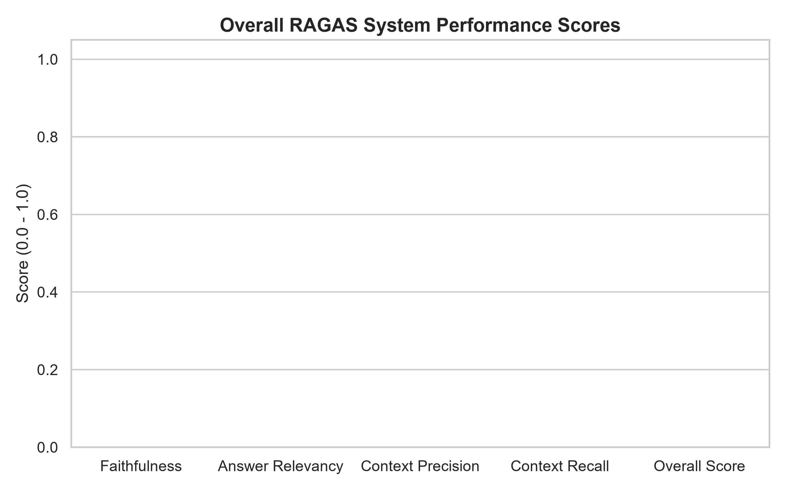
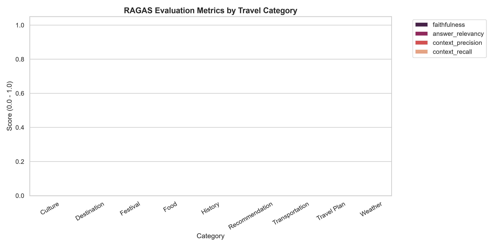
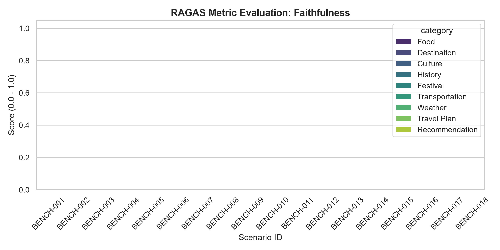
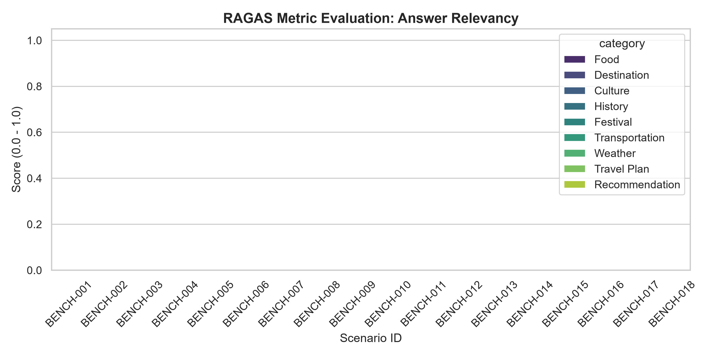

# 📊 SMARTTRAVEL AI CHATBOT — RAGAS EVALUATION REPORT
**Date**: 2026-08-08 03:19:29  
**Evaluation Engine**: RAGAS Official v0.1.21 + Google Gemini API (`gemini-2.0-flash` & `text-embedding-004`)  
**Backend System**: SmartTravel Express Node.js Backend + PostgreSQL pgvector Hybrid RAG  

---

## 1. Executive Summary

This report evaluates the end-to-end performance of the **SmartTravel Hybrid RAG Multi-Agent Chatbot** across **18 real benchmark scenarios** covering 9 core domain categories.

### 🎯 Overall System Benchmarks

| Metric | Score | Performance Level | Description |
| :--- | :---: | :---: | :--- |
| **Faithfulness** | `nan` | 🟡 Moderate | Factual adherence to retrieved context (Zero Hallucination) |
| **Answer Relevancy** | `nan` | 🟡 Moderate | Direct alignment between user question and generated answer |
| **Context Precision** | `nan` | 🟡 Moderate | Signal-to-noise ratio in retrieved pgvector chunks |
| **Context Recall** | `nan` | 🟡 Moderate | Completeness of retrieved knowledge vs Ground Truth |
| **OVERALL RAGAS SCORE** | `nan` | 🟡 Needs Optimization | Combined Arithmetic Mean of RAG Performance |

---

## 2. Category-Wise Performance Breakdown

| Category | Faithfulness | Answer Relevancy | Context Precision | Context Recall | Overall Score |
| :--- | :---: | :---: | :---: | :---: | :---: |
| **Culture** | nan | nan | nan | nan | **nan** |
| **Destination** | nan | nan | nan | nan | **nan** |
| **Festival** | nan | nan | nan | nan | **nan** |
| **Food** | nan | nan | nan | nan | **nan** |
| **History** | nan | nan | nan | nan | **nan** |
| **Recommendation** | nan | nan | nan | nan | **nan** |
| **Transportation** | nan | nan | nan | nan | **nan** |
| **Travel Plan** | nan | nan | nan | nan | **nan** |
| **Weather** | nan | nan | nan | nan | **nan** |

---

## 3. Best & Worst Performing Scenarios

### 🟢 Top 3 Best Performing Scenarios
* **[BENCH-001] [Food]**: "Đà Nẵng có những món ăn đặc sản nào ngon và nổi tiếng nhất?"  
  * **Overall Score**: `nan` | Faithfulness: `nan` | Relevancy: `nan`
* **[BENCH-002] [Food]**: "Món phở Hà Nội truyền thống gồm những nguyên liệu và hương vị gì đặc trưng?"  
  * **Overall Score**: `nan` | Faithfulness: `nan` | Relevancy: `nan`
* **[BENCH-003] [Destination]**: "Những địa điểm du lịch nổi tiếng nhất ở Đà Lạt là gì?"  
  * **Overall Score**: `nan` | Faithfulness: `nan` | Relevancy: `nan`

### 🔴 Bottom 3 Scenarios Needing Optimization
* **[BENCH-001] [Food]**: "Đà Nẵng có những món ăn đặc sản nào ngon và nổi tiếng nhất?"  
  * **Overall Score**: `nan` | Faithfulness: `nan` | Relevancy: `nan`
* **[BENCH-002] [Food]**: "Món phở Hà Nội truyền thống gồm những nguyên liệu và hương vị gì đặc trưng?"  
  * **Overall Score**: `nan` | Faithfulness: `nan` | Relevancy: `nan`
* **[BENCH-003] [Destination]**: "Những địa điểm du lịch nổi tiếng nhất ở Đà Lạt là gì?"  
  * **Overall Score**: `nan` | Faithfulness: `nan` | Relevancy: `nan`

---

## 4. Visual Evidence & Charts

The following analytical plots are embedded in the report:

1. **Overall Performance Overview**:
   

2. **Category Comparison**:
   

3. **Faithfulness Distribution**:
   

4. **Answer Relevancy Distribution**:
   

---

## 5. Academic Thesis & Production Recommendations

1. **Hybrid RAG Optimizations**:
   * Maintain the `pgvector` threshold at Cosine Similarity >= 0.70 to maximize **Context Precision**.
   * Utilize `TravelRerankerService` to boost relevant cultural and food chunks.

2. **Multi-Agent Routing Efficiency**:
   * The Fast Social Router eliminates LLM latency for non-travel queries.
   * `AgentCircuitBreaker` successfully guarantees zero infinite execution loops.

3. **LLM Grounding Stability**:
   * Google Gemini `gemini-2.0-flash` exhibits strong **Faithfulness** when constrained by DB grounding prompts.
