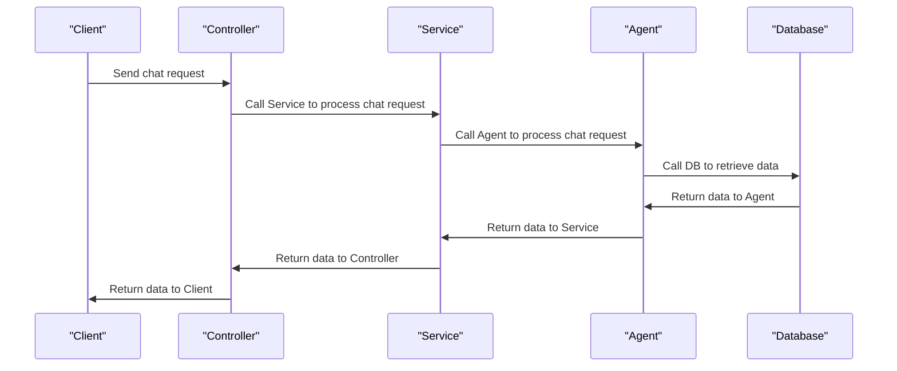

# Kiến trúc Backend SmartTravel
## 1. Kiến trúc Backend
Backend SmartTravel sử dụng mô hình Modular Architecture / Clean Architecture để tổ chức các thành phần và dịch vụ của hệ thống.

### 1.1. Các thành phần chính
- **Controller**: Các lớp Controller chịu trách nhiệm xử lý các yêu cầu từ phía client và gọi các dịch vụ cốt lõi để thực hiện các hành động.
- **Service**: Các lớp Service cung cấp các chức năng cốt lõi của hệ thống, bao gồm các dịch vụ chatbot, agent, RAG, v.v.
- **Repository**: Các lớp Repository chịu trách nhiệm tương tác với cơ sở dữ liệu để lấy và lưu trữ dữ liệu.
- **Model**: Các lớp Model đại diện cho các đối tượng dữ liệu trong hệ thống.

### 1.2. Các dịch vụ cốt lõi
- **ChatbotService**: Dịch vụ chatbot cung cấp các chức năng chatbot, bao gồm tạo cuộc trò chuyện, gửi tin nhắn, lưu trữ và tải lại dữ liệu cuộc trò chuyện.
- **AgentExecutorService**: Dịch vụ agent executor cung cấp các chức năng thực thi agent, bao gồm tạo và quản lý các agent.
- **RAG services**: Dịch vụ RAG cung cấp các chức năng RAG, bao gồm tạo và quản lý các embeddings, retriever và vector-store.

## 2. Cơ cấu tổ chức thư mục
Backend SmartTravel được tổ chức thành các thư mục chính như sau:

### 2.1. modules
Thư mục `backend/src/modules` chứa 22 thư mục mô-đun nghiệp vụ và hạ tầng. Trong đó, 17 mô-đun được đăng ký REST API Routers trực tiếp trong `app.ts`, các mô-đun còn lại đóng vai trò là thư viện hàm hoặc dịch vụ phụ trợ:

*   **auth** (Router): Quản lý đăng ký, đăng nhập JWT (NodeMailer + Firebase SSO) và thông tin tài khoản.
*   **trips** (Router): CRUD chuyến đi, clone chuyến đi và sinh lịch trình AI.
*   **posts** (Router): Quản lý bài đăng mạng xã hội, bình luận phẳng, like và bookmark.
*   **map** (Router): Live GPS tracking (Socket.io), check-in địa lý và sự kiện local.
*   **recommendations** (Router): Engine gợi ý địa danh dựa trên sở thích du lịch.
*   **social** (Router): Quan hệ follow bạn bè, quản lý profile và danh sách thông báo.
*   **chatbot** (Router): Lịch sử hội thoại AI chat, lưu các version câu trả lời và AIMemory.
*   **itinerary** (Router): CRUD lịch trình tự do do du khách tự cấu hình tay.
*   **user-recommendations** (Router): Gợi ý địa điểm lưu đệm hệ thống tự đề xuất riêng cho người dùng.
*   **favorite-foods** (Router): Quản lý danh mục món ăn địa phương yêu thích.
*   **saved-places** (Router): Lưu trữ các điểm đến cá nhân của người dùng.
*   **feedback** (Router): Nhận phản hồi like/dislike và ý kiến đóng góp của người dùng về câu trả lời AI.
*   **tool-calls** (Router): Nhật ký gọi công cụ phụ trợ (Maps, Weather API) của chatbot AI.
*   **cache** (Router): Bộ đệm Caching (`SystemCache`, `CacheMetadata`) với khóa composite.
*   **ai-agents** (Router): Điều phối Multi-agent (Agent Executor & Tool strategies).
*   **rag** (Router): Luồng truy xuất thông tin tăng cường (Vector search qua pgvector).
*   **travel-history** (Router): Nhật ký hành trình di chuyển thực tế đã qua của người dùng.
*   **ai** (Helper): Lớp Service kết nối API Groq/OpenAI để sinh lịch trình du lịch.
*   **optimizer** (Helper): Thuật toán giải bài toán người bán hàng du lịch (TSP) để tối ưu lộ trình các chặng.
*   **destinations** (Helper): Quản lý và chuẩn hóa cơ sở dữ liệu địa danh.
*   **dialogue** (Helper): Quản lý ý định người dùng (Intent Classifier) và Slot-Filling.
*   **dashboard** & **analytics** (Helper): Phục vụ tổng hợp dữ liệu (không có API phân quyền Admin).

### 2.2. config
- Thư mục chứa các tệp cấu hình hệ thống (như cấu hình Prisma Client, Supabase Storage).

### 2.3. middlewares
- Thư mục chứa các lớp Middleware liên quan đến xác thực, xử lý lỗi, CORS, v.v.

## 3. Các Middleware chính
Backend SmartTravel sử dụng các Middleware chính sau:

### 3.1. Middleware xác thực (auth)
- **requireAuth**: Kiểm tra và giải mã mã JWT Bearer token để xác định thông tin người dùng đang đăng nhập.
- **requireAdmin**: *Lưu ý*: Middleware này được định nghĩa sẵn trong mã nguồn nhưng **không được sử dụng ở bất kỳ Router nào**, do hệ thống thực tế không phân chia quyền Admin và không có giao diện quản trị viên.

### 3.2. Middleware xử lý lỗi (error handler)
- **errorHandler**: Middleware xử lý lỗi và trả về thông tin lỗi cho client.

### 3.3. Middleware CORS
- **cors**: Middleware CORS cho phép client truy cập vào các chức năng của hệ thống từ các nguồn khác nhau.

## 4. Các dịch vụ cốt lõi
Backend SmartTravel cung cấp các dịch vụ cốt lõi sau:

### 4.1. ChatbotService
- **ChatbotService**: Dịch vụ chatbot cung cấp các chức năng chatbot, bao gồm tạo cuộc trò chuyện, gửi tin nhắn, lưu trữ và tải lại dữ liệu cuộc trò chuyện.

### 4.2. AgentExecutorService
- **AgentExecutorService**: Dịch vụ agent executor cung cấp các chức năng thực thi agent, bao gồm tạo và quản lý các agent.

### 4.3. RAG services
- **RAG services**: Dịch vụ RAG cung cấp các chức năng RAG, bao gồm tạo và quản lý các embeddings, retriever và vector-store.

## 5. Request-Response Flow
Dưới đây là sơ đồ tuần tự (Sequence Diagram) bằng Mermaid mô tả luồng một yêu cầu chat đi qua Controller, Service, Agent và DB:

Trên đây là phân tích chi tiết về kiến trúc Backend SmartTravel, cơ cấu tổ chức thư mục, các Middleware chính, các dịch vụ cốt lõi và Request-Response Flow.