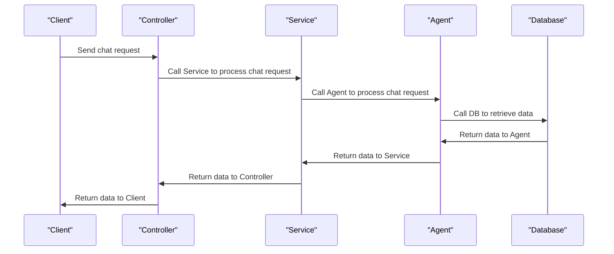

# Kiến trúc Backend SmartTravel
## 1. Kiến trúc Backend
Backend SmartTravel sử dụng mô hình Modular Architecture / Clean Architecture để tổ chức các thành phần và dịch vụ của hệ thống.

### 1.1. Các thành phần chính
- **Controller**: Các lớp Controller chịu trách nhiệm xử lý các yêu cầu từ phía client và gọi các dịch vụ cốt lõi để thực hiện các hành động.
- **Service**: Các lớp Service cung cấp các chức năng cốt lõi của hệ thống, bao gồm các dịch vụ chatbot, agent, RAG, v.v.
- **Repository**: Các lớp Repository chịu trách nhiệm tương tác với cơ sở dữ liệu để lấy và lưu trữ dữ liệu.
- **Model**: Các lớp Model đại diện cho các đối tượng dữ liệu trong hệ thống.

### 1.2. Các dịch vụ cốt lõi
- **ChatbotService**: Dịch vụ chatbot cung cấp các chức năng chatbot, bao gồm tạo cuộc trò chuyện, gửi tin nhắn, lưu trữ và tải lại dữ liệu cuộc trò chuyện.
- **AgentExecutorService**: Dịch vụ agent executor cung cấp các chức năng thực thi agent, bao gồm tạo và quản lý các agent.
- **RAG services**: Dịch vụ RAG cung cấp các chức năng RAG, bao gồm tạo và quản lý các embeddings, retriever và vector-store.

## 2. Cơ cấu tổ chức thư mục
Backend SmartTravel được tổ chức thành các thư mục chính như sau:

### 2.1. modules
- **auth**: Thư mục chứa các lớp Controller và Service liên quan đến xác thực.
- **cache**: Thư mục chứa các lớp Controller và Service liên quan đến cache.
- **chatbot**: Thư mục chứa các lớp Controller và Service liên quan đến chatbot.
- **itinerary**: Thư mục chứa các lớp Controller và Service liên quan đến hành trình.
- **map**: Thư mục chứa các lớp Controller và Service liên quan đến bản đồ.
- **optimizer**: Thư mục chứa các lớp Controller và Service liên quan đến tối ưu hóa.
- **posts**: Thư mục chứa các lớp Controller và Service liên quan đến bài đăng.
- **rag**: Thư mục chứa các lớp Controller và Service liên quan đến RAG.
- **recommendations**: Thư mục chứa các lớp Controller và Service liên quan đến đề xuất.
- **saved-places**: Thư mục chứa các lớp Controller và Service liên quan đến địa điểm lưu trữ.
- **social**: Thư mục chứa các lớp Controller và Service liên quan đến mạng xã hội.
- **tool-calls**: Thư mục chứa các lớp Controller và Service liên quan đến gọi công cụ.
- **trips**: Thư mục chứa các lớp Controller và Service liên quan đến hành trình.

### 2.2. config
- Thư mục chứa các tệp cấu hình hệ thống.

### 2.3. middlewares
- Thư mục chứa các lớp Middleware liên quan đến xác thực, xử lý lỗi, CORS, v.v.

## 3. Các Middleware chính
Backend SmartTravel sử dụng các Middleware chính sau:

### 3.1. Middleware xác thực (auth)
- **requireAuth**: Middleware xác thực yêu cầu phải có token xác thực để truy cập vào các chức năng của hệ thống.
- **requireAdmin**: Middleware xác thực yêu cầu phải có quyền admin để truy cập vào các chức năng của hệ thống.

### 3.2. Middleware xử lý lỗi (error handler)
- **errorHandler**: Middleware xử lý lỗi và trả về thông tin lỗi cho client.

### 3.3. Middleware CORS
- **cors**: Middleware CORS cho phép client truy cập vào các chức năng của hệ thống từ các nguồn khác nhau.

## 4. Các dịch vụ cốt lõi
Backend SmartTravel cung cấp các dịch vụ cốt lõi sau:

### 4.1. ChatbotService
- **ChatbotService**: Dịch vụ chatbot cung cấp các chức năng chatbot, bao gồm tạo cuộc trò chuyện, gửi tin nhắn, lưu trữ và tải lại dữ liệu cuộc trò chuyện.

### 4.2. AgentExecutorService
- **AgentExecutorService**: Dịch vụ agent executor cung cấp các chức năng thực thi agent, bao gồm tạo và quản lý các agent.

### 4.3. RAG services
- **RAG services**: Dịch vụ RAG cung cấp các chức năng RAG, bao gồm tạo và quản lý các embeddings, retriever và vector-store.

## 5. Request-Response Flow
Dưới đây là sơ đồ tuần tự (Sequence Diagram) bằng Mermaid mô tả luồng một yêu cầu chat đi qua Controller, Service, Agent và DB:

Trên đây là phân tích chi tiết về kiến trúc Backend SmartTravel, cơ cấu tổ chức thư mục, các Middleware chính, các dịch vụ cốt lõi và Request-Response Flow.