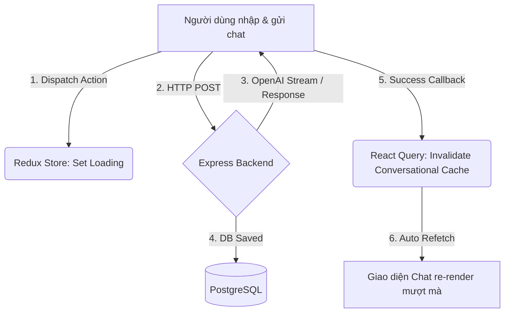

# Phân tích Frontend SmartTravel

## Tổng quan Frontend

SmartTravel Frontend là một ứng dụng Single Page Application (SPA) xây dựng trên nền tảng **React** sử dụng công cụ build **Vite**. 

### Công nghệ cốt lõi & Thư viện sử dụng

* **UI Framework**: React 18+ (Vite)
* **Bản đồ & GIS**: **MapLibre GL** cho hiển thị bản đồ số tương tác (thay thế cho Leaflet/OSM thô).
* **Quản lý trạng thái (State Management)**: **Redux Toolkit** (global client state) phối hợp với **React Query** (quản lý server state, fetching, caching và auto-refetching).
* **Styling (CSS)**: **Tailwind CSS** (không dùng Material-UI).
* **Routing**: **React Router DOM** cho việc chuyển trang phía Client.
* **Tích hợp API**: **Axios** kết hợp Interceptors để tự động đính kèm Bearer token và xử lý lỗi xác thực.

### Cấu trúc thư mục dự án thực tế (`frontend/src/`)

* `components`: Các component dùng chung cho toàn bộ hệ thống (Toast, Modal, Buttons, Input).
* `features`: Tổ chức mã nguồn theo mô-đun chức năng (Domain-driven folder structure):
  * `auth`: Đăng ký, đăng nhập và hồ sơ cá nhân.
  * `map`: Màn hình `MapDashboard.tsx` chứa bản đồ MapLibre, check-in và hiển thị sự kiện local.
  * `blog`: Xem bảng tin cộng đồng, viết bài chia sẻ và comment phẳng.
  * `trips`: Giao diện lên kế hoạch du lịch và tích hợp AI route optimizer.
  * `chat`: Khung chat và quản lý lịch sử hội thoại trợ lý ảo AI.
* `hooks`: Các Custom Hooks của React.
* `services`: Lớp tích hợp dịch vụ gọi API (như `mapService`, `authService`).
* `store`: Cấu hình Redux Store (`store.ts`) và các Redux slices.

---

## Quản lý State & Kết nối

### Redux Toolkit & React Query
Ứng dụng áp dụng mô hình phân tách trạng thái rõ ràng:
* **Redux Toolkit**: Quản lý UI state tạm thời (như trạng thái đóng/mở sidebar, bộ lọc bản đồ hiện tại, thông tin user đã đăng nhập).
* **React Query**: Đồng bộ hóa dữ liệu từ Server, tự động lưu đệm dữ liệu (caching) các API danh sách địa điểm, bài đăng và thông tin chuyến đi giúp giảm tải số lần request.

### Kết nối thời gian thực (Socket.io-client)
Tích hợp WebSockets kết nối trực tiếp đến Express server để truyền tải tọa độ định vị GPS liên tục (`ping_location`) và lắng nghe vị trí của thành viên khác trực tuyến (`friend_location_updated`).

---

## Mermaid Flow

Luồng cập nhật dữ liệu khi người dùng gửi tin nhắn trò chuyện với chatbot AI:

