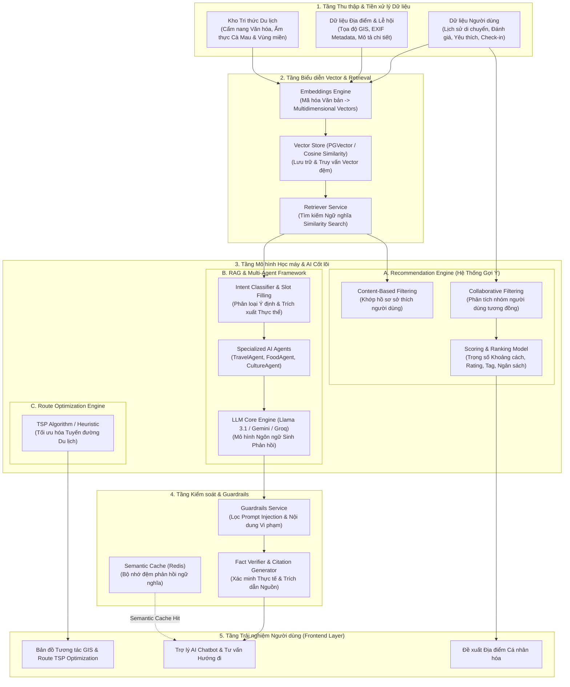

# Sơ đồ Tổng quan Kiến trúc Mô hình Học máy & AI (Machine Learning & AI Architecture)

## 📌 1. Sơ đồ Kiến trúc Tổng quan (Mermaid Diagram)

---

## 🔬 2. Chi tiết Các Phân hệ Mô hình Học máy (Machine Learning Modules)

### 2.1. Phân hệ Gợi ý Cá nhân hóa (Personalized Recommendation Engine)
Hệ thống kết hợp 2 phương pháp Học máy phổ biến:
1. **Content-Based Filtering**:
   - Xây dựng Hồ sơ Vector Sở thích Người dùng (*User Preference Profile*) dựa trên danh mục địa điểm yêu thích, loại hình ẩm thực, mức chi tiêu trung bình và đánh giá quá khứ.
2. **Collaborative Filtering**:
   - Sử dụng thuật toán đo độ tương đồng (*Cosine Similarity / Pearson Correlation*) giữa các người dùng để đưa ra gợi ý từ các hành trình của người dùng tương đồng (*Traveler Matching*).
3. **Mô hình Tính Điểm & Xếp Hạng (Scoring & Ranking Formula)**:
   $$\text{Score}(u, d) = w_1 \cdot \text{Sim}(P_u, F_d) + w_2 \cdot \text{Rating}_d + w_3 \cdot \frac{1}{1 + \alpha \cdot \text{Distance}(u, d)} + w_4 \cdot \text{TagMatch}(u, d)$$

---

### 2.2. Phân hệ Retrieval-Augmented Generation (RAG Engine)
Hệ thống RAG đảm bảo các phản hồi của AI chính xác, cập nhật và không bị ảo giác (*Hallucination*):
* **Embeddings Service**: Mã hóa các tài liệu cẩm nang văn hóa, đặc sản Cà Mau và vùng miền thành các Vector 1536 chiều.
* **Vector Store**: Lưu trữ và tìm kiếm khoảng cách Cosine trên PGVector.
* **Fact Verifier & Citation Generator**: Tự động xác minh lại các dữ kiện do LLM sinh ra dựa trên ngữ cảnh đã trích xuất (*Source Documents*) và tạo trích dẫn nguồn uy tín.

---

### 2.3. Khung Điều hành Đa Trợ lý AI (Multi-Agent Framework)
* **Intent Classification & Slot Filling**: Phân tích câu hỏi đầu vào để trích xuất các slot thực thể (*Destination, Date, Budget, Companion*) và phân loại ý định sang Agent tương ứng:
  * **TravelAgent**: Xử lý lộ trình, thời tiết và tương tác bản đồ GIS.
  * **FoodAgent**: Đề xuất món ăn đặc sản, địa điểm ẩm thực chuẩn vị.
  * **CultureAgent**: Giới thiệu di tích lịch sử, lễ hội văn hóa địa phương.
  * **RecommendationAgent**: Gợi ý điểm đến cá nhân hóa.

---

### 2.4. Phân hệ Tối ưu Lộ trình Du lịch (TSP Route Optimization)
* **Traveling Salesperson Problem (TSP)**: Sử dụng giải thuật di truyền (*Genetic Algorithm*) hoặc thuật toán láng giềng gần nhất (*Nearest Neighbor Heuristic*) kết hợp matrix khoảng cách thực tế để tính toán thứ tự tham quan tối ưu cho du khách, giảm thiểu tối đa quãng đường và chi phí di chuyển.

---

## 📂 3. Liên kết Sơ đồ Lớp & Cơ sở Dữ liệu Đã có
- [Class_Recommendation.puml](file:///d:/Thuc_Tap_NTD/docs/uml/Class/Class_Recommendation.puml)
- [Class_AI_Agents.puml](file:///d:/Thuc_Tap_NTD/docs/uml/Class/Class_AI_Agents.puml)
- [Class_RAG.puml](file:///d:/Thuc_Tap_NTD/docs/uml/Class/Class_RAG.puml)
