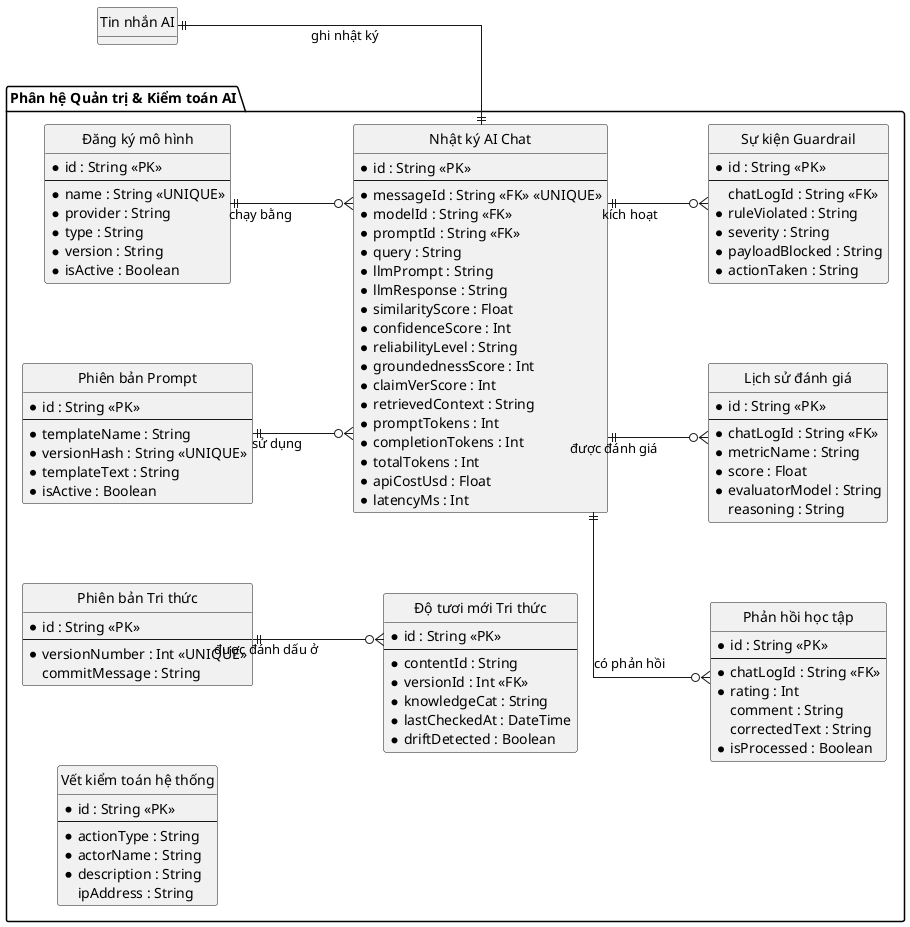
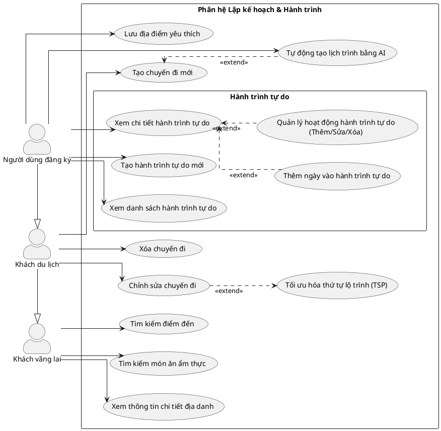
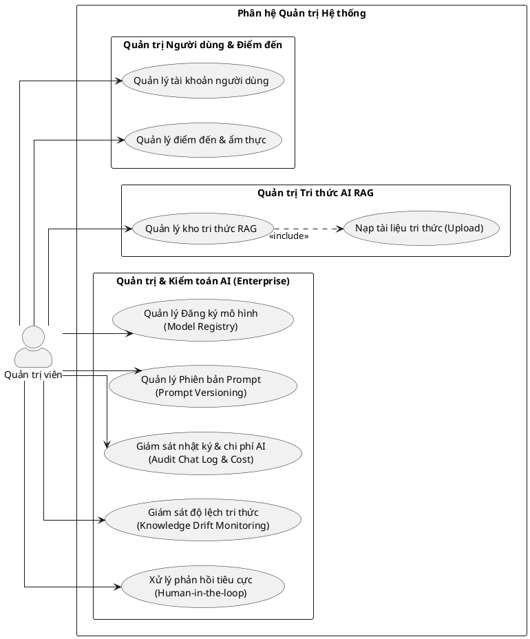
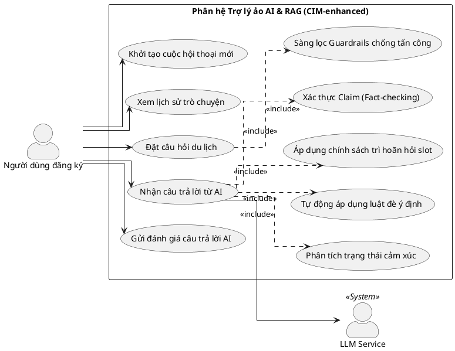

# BÁO CÁO KIỂM TRA VÀ ĐỐI CHIẾU HỆ THỐNG SƠ ĐỒ UML (ERD & USE CASE)

*Tác giả: Principal AI Architect / Technical Review Board*  
*Mục đích: Đối chiếu hệ thống sơ đồ UML trong `docs/uml/ERD` và `docs/uml/usecase` với cơ sở dữ liệu vật lý (schema.prisma) và API thực tế.*

---

## 1. TỔNG QUAN PHÁT HIỆN KIỂM TOÁN (EXECUTIVE SUMMARY)

Qua đối chiếu chéo giữa **Lược đồ CSDL vật lý** (`schema.prisma`) và **Mã nguồn Backend** với **các tài liệu/sơ đồ UML**, Hội đồng TRB phát hiện một số khoảng cách (Gaps) lớn cần được cập nhật để hồ sơ thiết kế khớp 100% với hệ thống thực tế đang chạy:

1. **Về Lược đồ ERD**:
   * **Thực thể ảo (Hallucinated Entities)**: Các sơ đồ cũ vẫn liệt kê `Itinerary`, `ItineraryDay`, `ItineraryActivity` (Lịch trình AI nháp) và `PlaceCache`, `FoodCache`, `BlogCache` là các bảng vật lý độc lập. Thực tế, chúng đã được gộp lại thành `Trip`, `TripDay`, `TripActivity` (dùng trạng thái `TripStatus` để phân loại) và `SystemCache` để tối ưu hóa hiệu năng.
   * **Thiếu hụt phân hệ AI Governance**: 10 bảng CSDL mới phục vụ quản trị AI nâng cao (như `ModelRegistry`, `PromptVersion`, `AIChatLog`, `GuardrailEvent`, `KnowledgeFreshness`, v.v.) chưa được thể hiện trên bất kỳ sơ đồ `.puml` nào.
2. **Về Sơ đồ Use Case**:
   * **UseCase-Trip**: Chưa vẽ các Use Case quản lý **Hành trình tự do (Custom Itinerary)** mà người dùng tự thiết kế qua router `itinerary` (như tạo hành trình, thêm ngày, thêm/sửa/xóa hoạt động).
   * **UseCase-AI**: Chưa tích hợp các Use Case liên quan đến **tầng hội thoại thông minh CIM** (Nhận diện cảm xúc, Loại trừ địa danh bị ghét, Trả lời trước hỏi sau, Xác thực Claim và lọc Guardrails).
   * **UseCase-Admin**: Thiếu toàn bộ các tương tác quản trị của AI Engineer/Admin đối với hệ thống kiểm toán AI (Quản lý Prompt, đăng ký Model, giám sát Drift tri thức, xử lý phản hồi Downvote).

---

## 2. CHI TIẾT KHOẢNG CÁCH & ĐỀ XUẤT CẢI TIẾN

### 2.1. ĐỐI CHIẾU SƠ ĐỒ ERD (DATABASE SCHEMA)

| STT | Thực thể trong Sơ đồ cũ | Thực tế trong `schema.prisma` | Đánh giá & Rủi ro | Giải pháp Điều chỉnh |
| :--- | :--- | :--- | :--- | :--- |
| 1 | `PlaceCache` `FoodCache` `BlogCache` | **`SystemCache`** và **`CacheMetadata`** | **Lệch cấu trúc**: DB thực tế đã gộp 3 bảng này thành `SystemCache` với khóa composite `@@id([key, type])` để tiết kiệm tài nguyên. | Xóa bỏ 3 thực thể cũ trong sơ đồ `ERD_Cache.puml` và thay thế bằng `SystemCache` và `CacheMetadata`. |
| 2 | `Itinerary` `ItineraryDay` `ItineraryActivity` | **Gộp vào `Trip`, `TripDay`, `TripActivity`** | **Lệch nghiệp vụ**: CSDL không có 3 bảng này. Hệ thống dùng bảng `Trip` chính với `status: TripStatus` (`DRAFT_AI`, `DRAFT_USER`, `CONFIRMED`) để lưu trữ lịch trình nháp. | Xóa bỏ sơ đồ `ERD_Lich_Trinh_AI.puml`. Điều chỉnh các mô tả để làm rõ cơ chế Adapter ở tầng Repository chuyển đổi mô hình dữ liệu. |
| 3 | *Chưa có* | **10 Bảng Quản trị AI & Kiểm toán** | **Thiếu sót nghiêm trọng**: Thiếu thông tin thiết kế các thực thể quản trị quan trọng: `ModelRegistry`, `KnowledgeVersion`, `PromptVersion`, `AIChatLog`, `UserFeedback`, `EvaluationHistory`, `GuardrailEvent`, `KnowledgeFreshness`, `AuditTrail`. | **Tạo mới sơ đồ `ERD_AI_Governance.puml`** để mô tả trực quan cấu trúc kiểm toán AI. |

---

### 2.2. ĐỐI CHIẾU SƠ ĐỒ USE CASE

#### A. Sơ đồ `UseCase-Trip.puml` (Phân hệ Chuyến đi & Hành trình)
* **Khoảng cách**: Người dùng có chức năng tự thiết kế **Hành trình tự do (Custom Itinerary)** (CRUD ngày và hoạt động tự do hoàn toàn không phụ thuộc bản đồ). Đây là tính năng lớn của phân hệ `itinerary` nhưng chưa được thể hiện.
* **Đề xuất**: Thêm gói Use Cases:
  * `UC_TRIP_12`: Xem chi tiết hành trình tự do.
  * `UC_TRIP_13`: Tạo hành trình tự do mới.
  * `UC_TRIP_14`: Thêm ngày vào hành trình tự do.
  * `UC_TRIP_15`: Thêm hoạt động vào hành trình tự do.
  * `UC_TRIP_16`: Cập nhật hoạt động hành trình tự do.
  * `UC_TRIP_17`: Xóa hoạt động khỏi hành trình tự do.

#### B. Sơ đồ `UseCase-AI.puml` (Phân hệ Trợ lý ảo AI & RAG)
* **Khoảng cách**: Chỉ vẽ luồng RAG cơ bản. Thiếu các tính năng của **Tầng CIM (Conversation Intelligence)** và **Dual-Guardrails** mới xây dựng.
* **Đề xuất**: Bổ sung các Use Case:
  * `UC_AI_05`: Phân tích cảm xúc người dùng (Emotion Analyzer).
  * `UC_AI_06`: Áp dụng luật đè ý định (Rule Override Engine).
  * `UC_AI_07`: Ghi nhớ địa danh bị loại trừ (Context-based Exclusion).
  * `UC_AI_08`: Trả lời trước, hỏi sau (Answer First, Ask Later).
  * `UC_AI_09`: Xác thực mệnh đề nguyên tử (Claim Fact-Verification).

#### C. Sơ đồ `UseCase-Admin.puml` (Phân hệ Quản trị Hệ thống)
* **Khoảng cách**: Admin chỉ có quản lý bài đăng, người dùng, RAG cơ bản. Thiếu các Use Case liên quan đến **Kiểm toán chất lượng AI (AI Governance & Compliance)**.
* **Đề xuất**: Bổ sung các Use Case:
  * `UC_ADMIN_04`: Đăng ký & Kích hoạt phiên bản Model (Model Registry).
  * `UC_ADMIN_05`: Quản lý & So sánh Prompt (Prompt Versioning).
  * `UC_ADMIN_06`: Giám sát độ lệch tri thức (Knowledge Drift Monitoring).
  * `UC_ADMIN_07`: Kiểm toán nhật ký & Chi phí AI (AIChatLog & Cost Analytics).
  * `UC_ADMIN_08`: Duyệt câu sửa từ Feedback người dùng (Human-in-the-loop).

---

## 3. MÃ NGUỒN CẬP NHẬT CÁC SƠ ĐỒ PLANTUML (PROPOSED CODES)

### 3.1. Tạo mới sơ đồ Quản trị AI (`docs/uml/ERD/ERD_AI_Governance.puml`)
Sơ đồ mô tả cấu trúc 10 thực thể Quản trị AI liên kết chặt chẽ với tin nhắn chatbot:

### 3.2. Cập nhật sơ đồ Use Case Chuyến đi (`docs/uml/usecase/UseCase-Trip.puml`)
Tích hợp thêm 6 Use Case về **Hành trình tự do (Custom Itinerary)**:

### 3.3. Cập nhật sơ đồ Use Case Quản trị AI (`docs/uml/usecase/UseCase-Admin.puml`)
Tích hợp phân hệ quản trị AI Governance & Audit Trail dành cho Admin:

### 3.4. Cập nhật sơ đồ Use Case Trợ lý ảo RAG (`docs/uml/usecase/UseCase-AI.puml`)
Tích hợp các tương tác thông minh mới của Conversation Intelligence Module (CIM) và kiểm toán:

