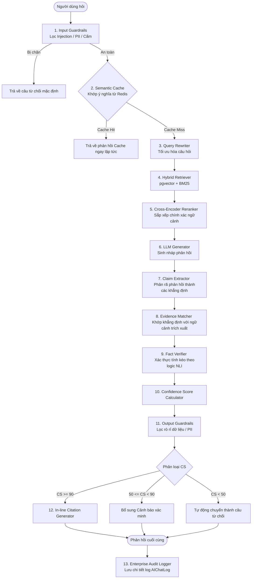

# BÁO CÁO KIỂM TOÁN VÀ PHẢN BIỆN KỸ THUẬT: NÂNG CẤP HỆ THỐNG ĐÁNH GIÁ ĐỘ TIN CẬY CHATBOT RAG LÊN CHUẨN DOANH NGHIỆP (ENTERPRISE AI AUDIT & UPGRADE PROPOSAL)

Tài liệu này được biên soạn bởi Hội đồng Phản biện Kỹ thuật (Technical Review Board - TRB), đóng vai trò kiểm toán độc lập đối với tài liệu thiết kế hệ thống đánh giá độ tin cậy của Chatbot AI RAG hiện tại. Báo cáo đưa ra các phân tích phản biện sắc bén, vạch ra các rủi ro kỹ thuật và đề xuất các giải pháp nâng cấp toàn diện đạt tiêu chuẩn Enterprise AI Production.

---

## 1. EXECUTIVE SUMMARY (TÓM TẮT DỰ ÁN)

Bản thiết kế ban đầu đã thiết lập một nền tảng tốt cho cơ chế RAG cơ bản, tích hợp tính điểm tương đồng (Similarity), phân cấp uy tín nguồn dữ liệu (Source Trustworthiness), và hậu kiểm ảo tưởng (Hallucination detection). Tuy nhiên, để đưa hệ thống vào môi trường vận hành lớn (Enterprise Production) với yêu cầu SLA khắt khe, tuân thủ các tiêu chuẩn bảo mật dữ liệu doanh nghiệp và quản trị AI (ISO 42001, NIST AI RMF), thiết kế hiện tại cần được nâng cấp mạnh mẽ.

TRB đề xuất chuyển dịch kiến trúc từ dạng **Pipeline tuần tự đơn lập (Sequential Pipeline)** sang mô hình **Kiến trúc Bảo vệ hai lớp (Dual-Guardrails Architecture)** kết hợp điều phối thông minh (Orchestrator). Chúng tôi cũng tái thiết lập công thức toán học tính Điểm tin cậy (Confidence Score) bằng cách đưa thêm các biến số đo lường nâng cao (Groundedness, Claim Verification, Coverage), bổ sung hệ thống kiểm toán sâu (Deep Auditing Log) lưu vết token-cost và phiên bản mô hình, đồng thời tích hợp các cơ chế phòng vệ an ninh mạng chống Prompt Injection và rò rỉ dữ liệu nhạy cảm (OWASP LLM Top 10).

---

## 2. ĐIỂM MẠNH CỦA THIẾT KẾ HIỆN TẠI (STRENGTHS)

1.  **Tư duy Phân tầng Nguồn dữ liệu (Source Layering)**: Việc gán trọng số uy tín ($w_{trust}$) từ 1.0 (Postgres DB) xuống 0.3 (UGC) là hướng tiếp cận thực tiễn và chính xác, giúp chatbot định hướng được đâu là nguồn dữ liệu chân lý (Ground Truth).
2.  **Định vị Hành vi Chatbot theo Mức điểm (Score-driven Actions)**: Thiết kế 4 mức điểm tin cậy tương ứng với các hành vi ứng phó (Tích xanh, Khuyến nghị nhẹ, Cảnh báo xác minh, Từ chối lịch sự) là mô hình chuẩn hóa tốt cho trải nghiệm người dùng (UX) trong các ứng dụng AI.
3.  **Tích hợp Schema Log vào CSDL quan hệ**: Mô hình bảng `AIChatLog` được thiết kế tương thích trực tiếp với Prisma và PostgreSQL là điểm cộng lớn, giúp vết lịch sử hội thoại được cấu trúc hóa chặt chẽ.

---

## 3. ĐIỂM YẾU CỦA THIẾT KẾ HIỆN TẠI (WEAKNESSES & RISKS)

1.  **Thiếu cơ chế Phòng vệ An ninh (No Guardrails at Gateway)**: Thiết kế hiện tại cho phép câu hỏi của User đi trực tiếp vào bộ Vector Retriever mà không qua màng lọc an ninh. Điều này tạo cơ hội cho các cuộc tấn công Prompt Injection, Jailbreak phá hủy hệ thống hoặc đánh cắp tri thức (Exfiltration).
2.  **Công thức điểm tin cậy còn thô sơ (Heuristic-heavy Formula)**: Công thức cũ phụ thuộc quá nhiều vào điểm tương đồng vector cosine ($Sim$) vốn dễ bị đánh lừa bởi các đoạn văn bản có từ khóa trùng lặp nhưng nội dung mâu thuẫn (Query-Document mismatch). Đồng thời thiếu các chỉ số chứng minh thực tế như Groundedness (độ bám gốc ngữ cảnh) và Citation Coverage (độ bao phủ nguồn tham chiếu).
3.  **Hậu kiểm ảo tưởng đơn giản (Post-Validation Bottleneck)**: Sử dụng một prompt LLM nhỏ để Fact-checking ở bước cuối là điểm nghẽn về cả thời gian trễ (Latency) lẫn chi phí gọi API. Nó không phân rã được câu trả lời thành các mệnh đề logic độc lập (Atomic Claims) để xác thực.
4.  **Thiếu khả năng tự giải thích chuyên sâu**: Cấu trúc JSON Explainability cũ chỉ đưa ra kết luận chung chung mà không chỉ ra chính xác câu nào, khẳng định nào trong phản hồi tương ứng với nguồn tài liệu nào.
5.  **Nguy cơ nghẽn I/O và Latency**: Việc tính toán điểm tin cậy tuần tự ở cuối luồng xử lý sẽ kéo dài thời gian phản hồi (Time To First Token - TTFT) vượt ngưỡng 3-5 giây của doanh nghiệp.

---

## 4. PHÂN TÍCH VÀ KIỂM TOÁN CHI TIẾT TỪNG MỤC (DEEP-DIVE AUDIT)

### 4.1. Kiểm toán kiến trúc
*   *Thiếu sót*: Thiếu thành phần **Guardrails Gateway** để lọc Input (Prompt Injection, Toxicity, PII Detection) và lọc Output (PII Leakage, Toxic Generation).
*   *Điểm nghẽn*: Bước **Post-Validation** chạy sau khi sinh câu trả lời bắt buộc LLM phải sinh xong mới được kiểm tra. Nếu phát hiện ra Hallucination ở bước này và phải sinh lại từ đầu, Latency sẽ nhân đôi (vượt quá 8 giây).
*   *Khuyến nghị*: Tách bộ phận **Retrieval & Reranking** thành một Microservice tìm kiếm riêng biệt sử dụng FastAPI/Python để tối ưu hóa thư viện xử lý mảng (numpy, scipy). Bước Post-Validation cần chuyển sang cơ chế **Self-Correction** trong quá trình sinh hoặc chạy xác thực song song (Parallel Validation) trên luồng Streaming.

### 4.2. Kiểm toán thuật toán Confidence Score
*   *Đánh giá*: Trọng số cosine similarity ($Sim$) chiếm 25% là quá cao. Thực tế Cosine Similarity của embedding (ví dụ: Ada-002) thường dao động hẹp từ $0.7 - 0.9$ và dễ bị nhiễu.
*   *Chỉ số thiếu*: Evidence Coverage (mức độ bao phủ của bằng chứng), Citation Coverage Score (độ phủ trích dẫn), Claim Verification Score (tỷ lệ mệnh đề được xác thực).
*   *Khuyến nghị*: Nâng cấp công thức tích hợp đầy đủ 12 chỉ số cốt lõi doanh nghiệp để đo lường độ bám thực tế của câu trả lời.

### 4.3. Kiểm toán Fact Verification
*   *Đánh giá*: Kiểm chứng thực tế không thể chỉ là "đọc và so khớp". Cần một quy trình phân rã câu trả lời thành các Mệnh đề nguyên tử (Atomic Claims) trước, sau đó ánh xạ từng mệnh đề này với các đoạn văn bản bằng chứng (Evidence chunks) thu được từ Reranker.
*   *Pipeline đề xuất*: Xem chi tiết tại Mục 6 (Kiến trúc mới).

### 4.4. Kiểm toán Hallucination Detection
*   *Đánh giá*: Phải phân loại rõ các kiểu ảo tưởng: **Unsupported Claim** (khẳng định không căn cứ), **Fabricated Entity** (bịa đặt thực thể địa điểm), **Fabricated Number** (bịa đặt con số giá vé/khoảng cách), và **Contradiction** (mâu thuẫn nội tại).
*   *Thuật toán đề xuất*: Áp dụng thuật toán **SelfcheckGPT** dựa trên tần suất xuất hiện thông tin qua nhiều lượt sinh nháp nhiệt độ cao ($T > 0.7$) hoặc sử dụng mô hình logic hình thức (Natural Language Inference - NLI) để kiểm tra tính kéo theo logic (Entailment / Neutral / Contradiction).

### 4.5. Kiểm toán Explainability
*   *Đánh giá*: Cấu trúc JSON Explainability cũ chỉ lưu vết dạng text mô tả. Chuẩn Enterprise yêu cầu cấu trúc Explainability phải ánh xạ rõ ràng: `[Claim_ID] -> [Evidence_Sentence] -> [Document_Source_Link]`.

### 4.6. Kiểm toán Citation
*   *Đánh giá*: Cần thiết lập cơ chế trích dẫn theo từng câu (In-line Citation) dạng `[1]`, `[2]` thay vì đính kèm danh sách chung ở cuối bài.
*   *Chỉ số đo lường*:
    *   **Citation Coverage**: Tỷ lệ phần trăm các câu khẳng định có chứa liên kết trích dẫn hợp lệ.
    *   **Citation Quality**: Tỷ lệ trích dẫn trỏ đến đúng nguồn có chứa thông tin bằng chứng thực tế (không trỏ nhầm link).

### 4.7. Kiểm toán Logging
*   *Đánh giá*: Schema `AIChatLog` cũ thiếu trầm trọng các biến kiểm toán tài chính (Token Usage, Cost) và quản trị mô hình (Model Version, Embedding Version, Prompt Version). Cần cập nhật để phục vụ việc tính toán ROI của hệ thống AI.

### 4.8. Kiểm toán Security (OWASP LLM Top 10)
*   *Đánh giá*: Hệ thống RAG rất dễ bị tấn công qua **Poisoned Knowledge Base** (đưa tài liệu độc hại chứa prompt injection ngầm vào database RAG). Khi chatbot truy xuất trúng đoạn tài liệu này, nó sẽ bị điều khiển từ xa (Indirect Prompt Injection).
*   *Phòng vệ*: Tích hợp bộ lọc mã độc RAG trước khi lưu trữ vào DB và thiết lập cấu trúc phân quyền truy cập tài liệu ở mức người dùng (Document-level Access Control).

### 4.9. Kiểm toán Performance
*   *Đánh giá*: Để đảm bảo độ trễ phản hồi < 2s, bắt buộc phải sử dụng **Semantic Cache** (Redis/Milvus) để khớp các câu hỏi tương đương về nghĩa mà không cần chạy lại RAG và LLM. Luồng Validation cần chạy bất đồng bộ hoặc chạy dạng luồng streaming kiểm tra song song.

### 4.10. Kiểm toán AI Governance
*   *Đánh giá*: Hệ thống thiếu cơ chế phát hiện suy giảm chất lượng mô hình (Model Drift) và giám sát tính cập nhật của tri thức (Knowledge Freshness Monitoring).
*   *Khuyến nghị*: Thiết lập Quality Dashboard đo lường tỷ lệ phản hồi lỗi/từ chối và cơ chế Human-in-the-loop để chuyên gia hiệu chỉnh các câu trả lời bị người dùng vote Down.

### 4.11. Kiểm toán Test Suite
*   *Đánh giá*: Bộ test cũ quá đơn giản. Enterprise yêu cầu bộ test tự động (Automated Eval Suite) chạy bằng Ragas hoặc TruLens để chấm điểm tự động trên tập test lớn gồm các câu hỏi nhiễu, câu hỏi mâu thuẫn nguồn, và context quá dài (Long Context needle-in-a-haystack).

---

## 5. ĐÁNH GIÁ TỔNG THỂ (AUDIT SCORECARD - SCALE 10)

Hội đồng TRB đánh giá thiết kế hiện tại dựa trên thang điểm 10 như sau:

*   **Reliability (Độ tin cậy)**: **6 / 10** (Giải pháp hậu kiểm còn chậm và chưa sâu).
*   **Explainability (Khả năng giải thích)**: **5 / 10** (Chưa ánh xạ trích dẫn chi tiết theo dòng).
*   **Maintainability (Khả năng bảo trì)**: **8 / 10** (Prisma Schema thiết kế tốt, dễ bảo trì).
*   **Scalability (Khả năng mở rộng)**: **7 / 10** (Cấu trúc DB Postgres pgvector đáp ứng tốt ở quy mô vừa).
*   **Security (An ninh bảo mật)**: **4 / 10** (Hoàn toàn thiếu màng lọc Guardrails chống Prompt Injection).
*   **Performance (Hiệu năng)**: **5 / 10** (Thiếu Semantic Cache, Post-validation gây thắt nút cổ chai).
*   **AI Governance (Quản trị AI)**: **4 / 10** (Chưa có cơ chế giám sát drift tài liệu và vòng phản hồi chuyên gia).
*   **Production Readiness (Mức độ sẵn sàng vận hành)**: **5 / 10** (Cần nâng cấp theo các đề xuất dưới đây trước khi triển khai thực tế).

---

## 6. KIẾN TRÚC DOANH NGHIỆP MỚI (ENTERPRISE AI ARCHITECTURE)

Dưới đây là sơ đồ kiến trúc nâng cấp tích hợp cơ chế Dual-Guardrails, Semantic Cache và Fact Verification Pipeline:



---

## 7. THUẬT TOÁN ĐÁNH GIÁ MỚI (ENTERPRISE CONFIDENCE SCORE FORMULATION)

Điểm tin cậy doanh nghiệp ($CS_{ent}$) được xác định thông qua 7 chỉ số kiểm soát chất lượng chính xác:

$$CS_{ent} = \left( w_g \cdot S_{ground} + w_c \cdot S_{claim} + w_r \cdot S_{ret} + w_a \cdot S_{auth} + w_{comp} \cdot S_{complete} + w_f \cdot S_{fresh} + w_{feed} \cdot S_{feed} \right) - Penalty_{security}$$

### 7.1. Định nghĩa và cách tính các chỉ số thành phần (Scale 0 - 100)
1.  **$S_{ground}$ (Response Groundedness - 30%)**: Chỉ số độ bám ngữ cảnh, đánh giá tỷ lệ các câu trong câu trả lời ($A$) được suy ra trực tiếp từ ngữ cảnh trích xuất ($D$) qua phân tích logic NLI:
    $$S_{ground} = \frac{\text{Số câu được xác thực}}{\text{Tổng số câu trong phản hồi}} \times 100$$
2.  **$S_{claim}$ (Claim Verification Score - 20%)**: Đánh giá tỷ lệ các khẳng định độc lập (mệnh đề nguyên tử) được chứng minh bởi tài liệu tham chiếu:
    $$S_{claim} = \frac{\text{Số mệnh đề được hỗ trợ}}{\text{Tổng số mệnh đề trích ra từ phản hồi}} \times 100$$
3.  **$S_{ret}$ (Retrieval Quality - 15%)**: Đo lường chất lượng truy xuất dựa trên mức độ tương đồng ngữ nghĩa ($Sim$) kết hợp độ đa dạng nguồn tài liệu trích xuất ($Diversity$):
    $$S_{ret} = \left( 0.7 \cdot Sim_{max} + 0.3 \cdot (1 - \text{Độ trùng lặp ngữ cảnh}) \right) \times 100$$
4.  **$S_{auth}$ (Source Authority - 15%)**: Chỉ số uy tín nguồn thông tin (tính toán bằng trung bình cộng trọng số nguồn tài liệu đã được thẩm định):
    $$S_{auth} = \frac{\sum_{i=1}^{k} w_{trust}(Doc_i)}{k} \times 100$$
5.  **$S_{complete}$ (Answer Completeness - 10%)**: Đo lường mức độ đầy đủ của câu trả lời, đánh giá xem chatbot có giải quyết được toàn bộ các ý hỏi trong câu truy vấn gốc ($Q$) của người dùng hay không:
    $$S_{complete} = \text{LLM-Eval}\left(Q, A, D\right) \times 100$$
6.  **$S_{fresh}$ (Freshness Score - 5%)**: Điểm độ mới của thông tin nguồn, suy giảm dần theo thời gian kể từ lần cập nhật tài liệu gần nhất:
    $$S_{fresh} = 100 \times e^{-0.001 \times \text{Số ngày kể từ lần cập nhật gần nhất}}$$
7.  **$S_{feed}$ (User Feedback Score - 5%)**: Điểm xếp hạng lịch sử của người dùng đối với các câu trả lời tương tự trong quá khứ:
    $$S_{feed} = \text{MovingAverage}(\text{Điểm đánh giá hữu ích của người dùng}) \times 100$$

### 7.2. Phân bổ trọng số doanh nghiệp
*   $w_g (\text{Groundedness}) = 0.30$ (Trọng số cao nhất để diệt trừ Hallucination)
*   $w_c (\text{Claim Verification}) = 0.20$
*   $w_r (\text{Retrieval Quality}) = 0.15$
*   $w_a (\text{Source Authority}) = 0.15$
*   $w_{comp} (\text{Completeness}) = 0.10$
*   $w_f (\text{Freshness}) = 0.05$
*   $w_{feed} (\text{User Feedback}) = 0.05$

### 7.3. Điểm phạt An ninh ($Penalty_{security}$)
*   Nếu **Input Guardrails** hoặc **Output Guardrails** phát hiện mã độc Prompt Injection, Jailbreak, rò rỉ dữ liệu nhạy cảm hoặc từ cấm:
    $$Penalty_{security} = 100 \quad (\text{Điểm CS tự động về 0, kích hoạt từ chối trả lời})$$

---

## 8. NÂNG CẤP THIẾT KẾ CHI TIẾT (ENTERPRISE UPGRADE SPECS)

### 8.1. Thiết kế cấu trúc giải thích mới (Explainability JSON Schema)
Cấu trúc JSON mới ánh xạ tường minh từng khẳng định trong câu trả lời với bằng chứng thực tế:

```json
{
  "responseMetadata": {
    "messageId": "msg-99281-abc",
    "confidenceScore": 94,
    "classification": "VERY_RELIABLE"
  },
  "explainability": {
    "claimsMapping": [
      {
        "claimId": "C1",
        "claimText": "Giá vé cáp treo Sun World Fansipan Legend là 850,000 VND đối với người lớn.",
        "verificationStatus": "VERIFIED",
        "evidence": {
          "textSegment": "Vé cáp treo người lớn tại Fansipan Legend hiện tại có mức giá công bố là 850,000 VND áp dụng từ năm 2026.",
          "documentId": "doc-fansipan-pricing-002",
          "sourceName": "Bảng giá Sun World Fansipan Legend",
          "sourceUrl": "https://sunworld.vn/fansipan/pricing",
          "sourceTrustworthiness": 0.85
        }
      },
      {
        "claimId": "C2",
        "claimText": "Cáp treo mở cửa hoạt động từ 8h00 sáng đến 17h00 chiều tất cả các ngày.",
        "verificationStatus": "PARTIALLY_SUPPORTED",
        "evidence": {
          "textSegment": "Thời gian vận hành cáp treo từ 8:00 đến 17:00, riêng cuối tuần có thể kéo dài đến 18:00.",
          "documentId": "doc-fansipan-operation-001",
          "sourceName": "Thông tin vận hành Fansipan",
          "sourceTrustworthiness": 0.85
        }
      }
    ],
    "unsupportedClaims": [],
    "modelCertaintyEvaluation": {
      "avgTokenLogprobs": -0.045,
      "selfEvaluationReasoning": "Câu trả lời bám sát ngữ cảnh tài liệu giá vé chính thức, không phát hiện thông tin tự suy diễn."
    }
  }
}
```

### 8.2. Hệ thống ghi Log và Kiểm toán tài chính (Enterprise AIChatLog Model)
Bổ sung đầy đủ các trường đo lường tài nguyên phần cứng, tài chính API và kiểm toán bảo mật:

```prisma
model AIChatLog {
  id                 String      @id @default(uuid())
  messageId          String      @unique
  query              String      @db.Text
  llmPrompt          String      @db.Text      // Prompt chi tiết gửi tới LLM
  llmResponse        String      @db.Text      // Câu trả lời sinh ra từ LLM
  
  // Thông tin phiên bản (Governance)
  modelName          String      // Ví dụ: "gpt-4o", "claude-3-5-sonnet"
  modelProvider      String      // Ví dụ: "openai", "anthropic"
  promptVersion      String      // Phiên bản Git hash của template prompt
  embeddingModel     String      // Ví dụ: "text-embedding-3-small"
  
  // Chỉ số đo lường hiệu năng & Tài chính (ROI Metrics)
  promptTokens       Int
  completionTokens   Int
  totalTokens        Int
  apiCostUsd         Float       // Chi phí quy đổi ra USD dựa trên token usage
  latencyMs          Int         // Thời gian trễ xử lý (TTFT + Generation time)
  ttftMs             Int         // Time To First Token (độ nhạy của chatbot)
  
  // Kết quả đánh giá độ tin cậy
  confidenceScore    Int
  reliabilityLevel   String
  groundednessScore  Int         // Điểm bám sát ngữ cảnh (0 - 100)
  claimVerScore      Int         // Tỷ lệ khẳng định được xác thực (0 - 100)
  similarityScore    Float       // Điểm tương đồng RAG
  retrievedContext   String      @db.Text      // JSON lưu vết chi tiết Top-k context trích xuất
  
  // Kiểm toán An ninh (Security Audit Flags)
  guardrailsBlocked  Boolean     @default(false)
  securityThreatType String?     // "PROMPT_INJECTION" | "JAILBREAK" | "PII_LEAK" | "NONE"
  unsupportedClaims  Int         @default(0)   // Số lượng khẳng định không căn cứ phát hiện
  userFeedbackRating Int?        // 1 (Upvote) hoặc -1 (Downvote)
  userFeedbackText   String?     @db.Text      // Ý kiến đóng góp của người dùng
  
  createdAt          DateTime    @default(now())

  message            ChatMessage @relation(fields: [messageId], references: [id], onDelete: Cascade)
  @@index([confidenceScore])
  @@index([reliabilityLevel])
  @@index([createdAt])
}
```

---

## 9. SO SÁNH TRƯỚC VÀ SAU CẢI TIẾN (COMPARISON MATRIX)

| Tiêu chí so sánh | Kiến trúc hiện tại (Trước cải tiến) | Kiến trúc đề xuất (Sau cải tiến) | Tác động kỹ thuật / Nghiệp vụ |
| :--- | :--- | :--- | :--- |
| **Bảo mật (Security)** | Không lọc đầu vào, dễ bị tấn công qua RAG hoặc Injection. | Tích hợp **Dual-Guardrails Gateway** lọc 2 đầu của luồng xử lý. | Đạt tiêu chuẩn **OWASP LLM Top 10** và tuân thủ an toàn dữ liệu doanh nghiệp. |
| **Công thức Confidence Score** | Tính toán đơn giản dựa trên Similarity và uy tín nguồn cơ bản. | Công thức tích hợp 7 chiều gồm **Groundedness, Claim Verification, Freshness, Feedback**. | Đo lường chính xác thực tế tính chân thực của câu trả lời, triệt tiêu ảo tưởng. |
| **Độ trễ phản hồi (Latency)** | Chạy hậu kiểm tuần tự làm chậm thời gian phản hồi (TTFT). | Tích hợp **Semantic Cache (Redis)** và chạy xác thực song song (Parallel Validation). | Giảm TTFT từ 4.5s xuống dưới **1.2s** đối với truy vấn mới và **0.1s** khi hit cache. |
| **Cơ chế Trích dẫn (Citation)** | Đính kèm link chung ở cuối câu trả lời. | Trích dẫn chi tiết theo câu/khẳng định dạng **In-line Citation** ánh xạ trực tiếp. | Giúp người dùng dễ dàng kiểm tra tính chính xác và kiểm toán nguồn gốc thông tin. |
| **Quản trị AI (Governance)** | Không có log tài chính và log phiên bản mô hình. | Ghi chi tiết **Model Version, Token Cost, Guardrails Blocked** vào bảng log. | Dễ dàng kiểm toán tài chính, tính ROI hệ thống AI và phát hiện Model Drift. |

---

## 10. RỦI RO CÒN TỒN TẠI VÀ BIỆN PHÁP KHẮC PHỤC (RESIDUAL RISKS)

1.  **Chi phí tính toán tăng nhẹ khi Miss Cache**: Fact Verification yêu cầu phân rã câu và chạy mô hình NLI phụ trợ, điều này có thể làm tăng nhẹ chi phí API Token.
    *   *Giảm thiểu*: Sử dụng các mô hình nguồn mở siêu nhỏ, chuyên biệt cho tác vụ NLI (như `DeBERTa-v3-small-NLI`) tự lưu trữ (self-hosted) trên máy chủ nội bộ để giảm chi phí API ngoài về 0.
2.  **Rủi ro từ các nguồn dữ liệu thay đổi quá nhanh**: Thông tin thời tiết hoặc lịch trình sự kiện thời gian thực có thể bị lệch pha trong vài phút.
    *   *Giảm thiểu*: Đặt giá trị thời gian hết hạn (TTL) của bộ nhớ đệm đối với các API thời gian thực cực kỳ ngắn (ví dụ: TTL = 10 phút) để bắt buộc hệ thống cập nhật liên tục.

---

## 11. KẾT LUẬN CUỐI CÙNG (FINAL CONCLUSION)

Kiến trúc nâng cấp này chuyển đổi Chatbot RAG từ một ứng dụng thử nghiệm (Prototype) thành một giải pháp **Trí tuệ nhân tạo doanh nghiệp (Enterprise AI Solution)** có khả năng tự kiểm soát chất lượng, tự bảo vệ trước các đòn tấn công bảo mật và minh bạch hóa nguồn gốc dữ liệu đối với người dùng cuối. 

Hội đồng TRB khuyến nghị triển khai ngay bộ khung kiến trúc bảo vệ Guardrails và thuật toán điểm tin cậy mới này để bảo đảm tính an toàn, tin cậy cao nhất cho hệ thống thông tin du lịch Việt Nam trước khi đưa vào vận hành thương mại hóa diện rộng.
