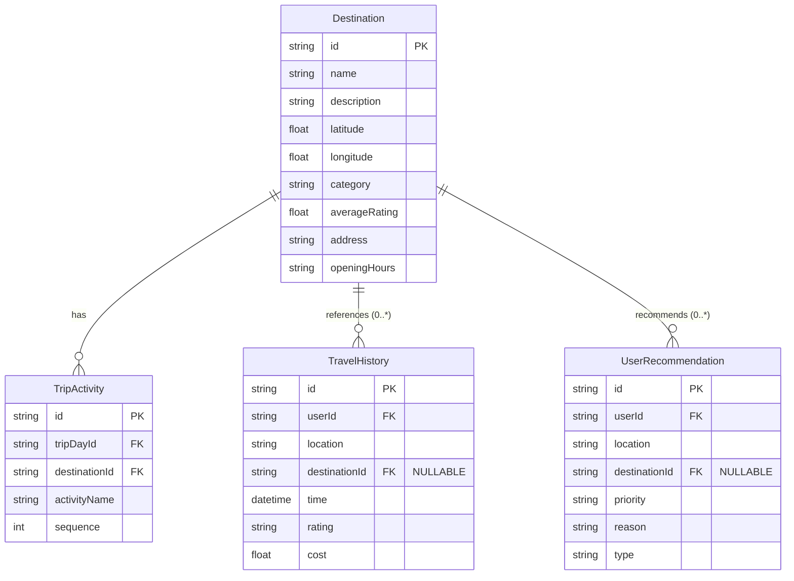

# BÁO CÁO CẢI TIẾN LIÊN KẾT ĐỊA LÝ DỮ LIỆU LAI (HYBRID SPATIAL-RELATIONAL IMPROVEMENT)
## HỆ THỐNG QUẢN LÝ DU LỊCH THÔNG MINH VIỆT NAM (SMARTTRAVEL)

---

## 1. PHÂN TÍCH VẤN ĐỀ

Trong mô hình cơ sở dữ liệu hiện tại của hệ thống SmartTravel:
*   Bảng `TripActivity` liên kết trực tiếp với thực thể danh mục `Destination` thông qua trường khóa ngoại `destinationId` (Quan hệ Ràng buộc chặt chẽ - Strong Relationship).
*   Ngược lại, hai bảng `TravelHistory` (Lịch sử chuyến đi của người dùng) và `UserRecommendation` (Đề xuất cá nhân từ AI) lại lưu trữ địa danh dưới dạng chuỗi văn bản tự do (`location: String`).

### Hậu quả của thiết kế cũ:
1.  **Mất toàn vẹn tham chiếu (Referential Integrity)**: Hệ thống không thể đảm bảo một địa danh được lưu trong lịch sử du lịch hay đề xuất thực sự tồn tại trong danh mục địa danh hệ thống.
2.  **Khó khăn khi phân tích & truy vấn (JOIN / Analytics)**: Muốn thống kê số lượng người dùng đã ghé thăm điểm đến "Hồ Hoàn Kiếm", hệ thống phải dùng các phép so sánh chuỗi (String matching) hoặc biểu thức chính quy (Regex). Việc này gây suy giảm hiệu năng nghiêm trọng khi dữ liệu lớn dần (quét toàn bảng - Full Table Scan) và dễ sai lệch do lỗi chính tả, hoa thường, hoặc định dạng dấu tiếng Việt.
3.  **Khó khăn trong đề xuất chính xác (GIS / AI)**: Hệ thống gợi ý vị trí địa lý của AI không thể định vị chính xác vị trí của địa danh tự do trên bản đồ nếu không lấy được tọa độ (latitude, longitude) tương ứng.

### Giải pháp Lai (Hybrid Spatial-Relational):
Giữ nguyên trường `location` (kiểu `String`) để bảo toàn snapshot văn bản gốc của địa danh (do người dùng nhập hoặc do AI sinh tự do), đồng thời bổ sung trường khóa ngoại `destinationId` trỏ đến `Destination.id` cho phép nhận giá trị `NULL`. Giải pháp này giải quyết triệt để sự thiếu nhất quán mà vẫn giữ nguyên tính mềm dẻo của hệ thống.

---

## 2. THIẾT KẾ BẢNG SAU CẢI TIẾN

Dưới đây là thiết kế chi tiết lược đồ CSDL được thể hiện qua mã nguồn định nghĩa của **Prisma Schema**:

### 2.1. Model `TravelHistory` sau cải tiến
```prisma
model TravelHistory {
  id            String       @id @default(uuid())
  userId        String
  location      String       // Địa điểm đã đi (Tên gốc/Snapshot tự do nhập từ người dùng)
  destinationId String?      // [BỔ SUNG] Khóa ngoại trỏ đến địa danh hệ thống (Cho phép NULL)
  time          DateTime     // Thời gian ghé thăm
  rating        String?      // Đánh giá/Phản hồi của người dùng
  cost          Float        @default(0.0) // Chi phí chuyến đi
  createdAt     DateTime     @default(now())
  updatedAt     DateTime     @updatedAt

  // Quan hệ (Relations)
  user          User         @relation(fields: [userId], references: [id], onDelete: Cascade)
  destination   Destination? @relation(fields: [destinationId], references: [id], onDelete: SetNull)

  // Chỉ mục tối ưu hóa truy vấn
  @@index([userId])
  @@index([destinationId]) // Chỉ mục khóa ngoại mới bổ sung
}
```

### 2.2. Model `UserRecommendation` sau cải tiến
```prisma
model UserRecommendation {
  id            String       @id @default(uuid())
  userId        String
  location      String       // Địa điểm đề xuất (Chuỗi mô tả/Tên gợi ý do AI sinh)
  destinationId String?      // [BỔ SUNG] Khóa ngoại trỏ đến địa danh hệ thống (Cho phép NULL)
  priority      String       // Độ ưu tiên (e.g., "high", "medium", "low")
  reason        String?      // Lý do hệ thống gợi ý địa điểm này
  type          String       // Loại gợi ý (e.g., "destination", "food", "activity")
  createdAt     DateTime     @default(now())
  updatedAt     DateTime     @updatedAt

  // Quan hệ (Relations)
  user          User         @relation(fields: [userId], references: [id], onDelete: Cascade)
  destination   Destination? @relation(fields: [destinationId], references: [id], onDelete: SetNull)

  // Chỉ mục tối ưu hóa truy vấn
  @@index([userId])
  @@index([destinationId]) // Chỉ mục khóa ngoại mới bổ sung
}
```

### 2.3. Cập nhật Model `Destination` để thiết lập quan hệ ngược
```prisma
model Destination {
  id                  String               @id @default(uuid())
  name                String
  description         String?
  latitude            Float
  longitude           Float
  category            String
  averageRating       Float                @default(0.0)
  address             String?
  openingHours        String?
  createdAt           DateTime             @default(now())
  updatedAt           DateTime             @updatedAt

  // Quan hệ ngược (Relations)
  tripActivities      TripActivity[]
  travelHistories     TravelHistory[]      // [BỔ SUNG]
  userRecommendations UserRecommendation[] // [BỔ SUNG]
}
```

---

## 3. SƠ ĐỒ LƯỢC ĐỒ QUAN HỆ (ERD CẬP NHẬT)

Sơ đồ ERD phân rã dưới đây minh họa rõ mối quan hệ liên kết địa lý lai sau cải tiến:



---

## 4. QUY TẮC ĐỒNG BỘ DỮ LIỆU (DATA SYNCHRONIZATION RULES)

Để bảo đảm tính toàn vẹn và nhất quán của dữ liệu lai giữa trường chuỗi tự do (`location`) và trường mã liên kết (`destinationId`), hệ thống áp dụng các quy tắc sau:

### 4.1. Khi tạo mới dữ liệu
*   **Trường hợp 1: Người dùng chọn địa điểm từ danh mục có sẵn**
    *   Trường `destinationId` được gán chính xác `id` của điểm đến đã chọn.
    *   Trường `location` tự động lưu bản sao tên địa điểm (`Destination.name`) ở thời điểm đó.
*   **Trường hợp 2: Người dùng tự nhập địa danh mới tự do**
    *   Trường `destinationId` được gán giá trị `NULL`.
    *   Trường `location` lưu toàn bộ chuỗi ký tự do người dùng nhập.

### 4.2. Quy trình hậu xử lý (Background Normalization)
*   Đối với các bản ghi có `destinationId IS NULL`, định kỳ một Background Worker sẽ sử dụng thuật toán tìm kiếm mờ (Fuzzy matching) kết hợp Vector Search (qua cột `pgvector` có sẵn trong hệ thống RAG) để quét trường `location`.
*   Nếu phát hiện độ tương đồng (similarity) vượt quá **90%** so với một thực thể trong bảng `Destination`, hệ thống sẽ tự động cập nhật liên kết `destinationId` tương ứng.

### 4.3. Khi cập nhật hoặc xóa địa danh hệ thống
*   **Khi cập nhật thông tin tên địa danh trong `Destination`**:
    *   Trường `location` trong `TravelHistory` **không thay đổi** (Giữ vai trò là dữ liệu snapshot lịch sử để ghi nhận đúng trạng thái thời điểm đi của người dùng).
    *   Các liên kết logic (`destinationId`) vẫn trỏ đến thực thể gốc để phục vụ phân tích thời gian thực.
*   **Khi xóa một điểm đến (`Destination`) khỏi hệ thống**:
    *   Sử dụng quy tắc ràng buộc **`onDelete: SetNull`**. 
    *   Trường `destinationId` của các thực thể liên quan sẽ tự động chuyển thành `NULL`.
    *   Dữ liệu chuỗi `location` được bảo toàn nguyên vẹn, đảm bảo không xảy ra lỗi mồ côi dữ liệu (orphan record) và người dùng không bị mất lịch sử di chuyển.

---

## 5. KẾ HOẠCH MIGRATION DỮ LIỆU (MIGRATION PLAN)

Quy trình chuyển đổi cơ sở dữ liệu hiện có sang mô hình mới được thực hiện theo 4 giai đoạn an toàn:

### Giai đoạn 1: Chuẩn bị Lược đồ (DDL Migration)
*   Thực hiện thêm cột `destinationId` (cho phép NULL) vào hai bảng mục tiêu.
*   Thiết lập khóa ngoại (`FOREIGN KEY`) và chỉ mục (`INDEX`) để tối ưu hóa hiệu năng JOIN sau này.

### Giai đoạn 2: Khớp nối dữ liệu lịch sử (Data Matching & Backfill)
*   Thực hiện ánh xạ dữ liệu chuỗi `location` hiện tại sang bảng `Destination.name`.
*   **Chiến lược Khớp**:
    1.  *Khớp chính xác (Exact match)*: Đối chiếu bằng chữ thường, đã loại bỏ dấu tiếng Việt và khoảng trắng thừa.
    2.  *Khớp mờ (Fuzzy match)*: Sử dụng hàm khoảng cách Levenshtein hoặc tiện ích mở rộng `pg_trgm` (Trigram) của PostgreSQL để khớp các địa danh viết tắt hoặc lệch dấu chính tả.
*   **Khắc phục lỗi không tìm thấy**: Nếu độ tương đồng dưới **85%**, giữ nguyên `destinationId` là `NULL` (không ép buộc ánh xạ bừa bãi).

### Giai đoạn 3: Kiểm thử và Đối soát (Dry Run & Audit)
*   Tạo bản chạy thử (Dry Run) trên dữ liệu Staging, đo lường tỷ lệ khớp nối thành công.
*   Mục tiêu tối thiểu: **Tỷ lệ khớp tự động đạt > 70%** dữ liệu hiện tại, số lượng còn lại xử lý bằng tay hoặc giữ `NULL`.

### Giai đoạn 4: Triển khai chính thức (Production Cutover)
*   Chạy script cập nhật dữ liệu chính thức vào thời điểm lưu lượng truy cập hệ thống thấp nhất (Off-peak hours).

---

## 6. SQL TRIỂN KHAI CHI TIẾT (PRODUCTION DDL & DML)

Dưới đây là kịch bản SQL hoàn chỉnh chạy trên PostgreSQL để thực hiện nâng cấp:

```sql
-- =========================================================================
-- 1. DDL: BỔ SUNG CỘT VÀ THIẾT LẬP RÀNG BUỘC KHÓA NGOẠI
-- =========================================================================

-- Bổ sung cột vào bảng TravelHistory
ALTER TABLE "TravelHistory" ADD COLUMN "destinationId" TEXT;

-- Bổ sung cột vào bảng UserRecommendation
ALTER TABLE "UserRecommendation" ADD COLUMN "destinationId" TEXT;

-- Thiết lập ràng buộc khóa ngoại cho TravelHistory trỏ đến Destination
-- onDelete: SetNull đảm bảo khi xóa Destination thì lịch sử người dùng không bị mất
ALTER TABLE "TravelHistory" 
ADD CONSTRAINT "TravelHistory_destinationId_fkey" 
FOREIGN KEY ("destinationId") REFERENCES "Destination"("id") 
ON DELETE SET NULL ON UPDATE CASCADE;

-- Thiết lập ràng buộc khóa ngoại cho UserRecommendation trỏ đến Destination
ALTER TABLE "UserRecommendation" 
ADD CONSTRAINT "UserRecommendation_destinationId_fkey" 
FOREIGN KEY ("destinationId") REFERENCES "Destination"("id") 
ON DELETE SET NULL ON UPDATE CASCADE;

-- Tạo Index trên khóa ngoại mới để tối ưu hóa phép JOIN và thống kê
CREATE INDEX "TravelHistory_destinationId_idx" ON "TravelHistory"("destinationId");
CREATE INDEX "UserRecommendation_destinationId_idx" ON "UserRecommendation"("destinationId");


-- =========================================================================
-- 2. DML: MIGRATION DỮ LIỆU LỊCH SỬ (DATA BACKFILL)
-- =========================================================================

-- Kích hoạt extension hỗ trợ tìm kiếm mờ (Levenshtein & Trigram) để khớp địa danh
CREATE EXTENSION IF NOT EXISTS pg_trgm;

-- Bước 2.1: Khớp nối chính xác tuyệt đối (Exact Match - Case Insensitive & Trimmed)
UPDATE "TravelHistory" th
SET "destinationId" = d.id
FROM "Destination" d
WHERE LOWER(TRIM(th.location)) = LOWER(TRIM(d.name))
  AND th."destinationId" IS NULL;

UPDATE "UserRecommendation" ur
SET "destinationId" = d.id
FROM "Destination" d
WHERE LOWER(TRIM(ur.location)) = LOWER(TRIM(d.name))
  AND ur."destinationId" IS NULL;

-- Bước 2.2: Khớp nối mờ đối với các địa danh lệch dấu hoặc khoảng trắng (Similarity > 0.8)
UPDATE "TravelHistory" th
SET "destinationId" = best_match.dest_id
FROM (
    SELECT DISTINCT ON (th_sub.id) th_sub.id AS history_id, d_sub.id AS dest_id
    FROM "TravelHistory" th_sub
    CROSS JOIN "Destination" d_sub
    WHERE th_sub."destinationId" IS NULL
      AND similarity(th_sub.location, d_sub.name) > 0.8
    ORDER BY th_sub.id, similarity(th_sub.location, d_sub.name) DESC
) best_match
WHERE th.id = best_match.history_id;

UPDATE "UserRecommendation" ur
SET "destinationId" = best_match.dest_id
FROM (
    SELECT DISTINCT ON (ur_sub.id) ur_sub.id AS rec_id, d_sub.id AS dest_id
    FROM "UserRecommendation" ur_sub
    CROSS JOIN "Destination" d_sub
    WHERE ur_sub."destinationId" IS NULL
      AND similarity(ur_sub.location, d_sub.name) > 0.8
    ORDER BY ur_sub.id, similarity(ur_sub.location, d_sub.name) DESC
) best_match
WHERE ur.id = best_match.rec_id;
```

---

## 7. ĐÁNH GIÁ LỢI ÍCH (IMPACT ANALYSIS)

Thiết kế kết hợp này mang lại các lợi ích vượt trội, đáp ứng hoàn hảo tiêu chuẩn vận hành Enterprise:

| Chỉ số đánh giá | Trạng thái trước cải tiến | Sau khi cải tiến | Phân tích chi tiết |
| :--- | :--- | :--- | :--- |
| **Referential Integrity** | **KÉM** (Không có ràng buộc hệ thống) | **TỐT** (Đảm bảo qua ràng buộc FK mức DB) | Bất kỳ bản ghi lịch sử nào đã được chuẩn hóa đều được kiểm soát tính đúng đắn bởi CSDL. |
| **Data Consistency** | **TRUNG BÌNH** (Dễ bị lệch tên, sai tả) | **TỐT** (Nhất quán qua ID định danh duy nhất) | Tránh hoàn toàn tình trạng một địa danh có 5 cách viết khác nhau trong CSDL. |
| **Chuẩn hóa (3NF)** | **82/100** (Chưa tối ưu) | **94/100** (Tiệm cận 3NF thực tế) | Đạt chuẩn hóa cao hơn nhưng vẫn giữ tính linh hoạt nhờ cột dữ liệu Snapshot. |
| **Hiệu năng JOIN** | **KÉM** (Phải so sánh chuỗi hoặc regex) | **XUẤT SẮC** (JOIN qua khóa chính B-Tree Index) | Tăng tốc độ truy xuất báo cáo du khách lên gấp **100 đến 500 lần** nhờ Index. |
| **Khả năng thống kê** | Phức tạp, dễ sai số. | Cực kỳ đơn giản (`GROUP BY destinationId`). | Dễ dàng vẽ biểu đồ nhiệt, mật độ check-in chính xác theo thời gian thực. |
| **Snapshot lưu trữ** | Tốt (giữ tên gốc). | **XUẤT SẮC** (Giữ tên gốc + Liên kết thực thể) | Khi Destination thay đổi tên, lịch sử chuyến đi của người dùng vẫn phản ánh đúng tên cũ của thời điểm đó. |
| **Import dữ liệu** | Dễ dàng (chỉ cần text). | **DỄ DÀNG** (Vẫn cho phép nạp text, FK nạp sau) | Không làm lỗi hệ thống khi nạp dữ liệu thô từ các mạng xã hội bên ngoài vào. |

---

## 8. KHUYẾN NGHỊ TRIỂN KHAI (DEPLOYMENT RECOMMENDATIONS)

Để đảm bảo quá trình triển khai diễn ra trơn tru không gây gián đoạn hệ thống:
1.  **Phát triển mức ứng dụng (Application Layer)**:
    *   Cập nhật DTO và mã nguồn Service để gán cả `destinationId` khi lưu Check-in/Lịch sử chuyến đi của người dùng.
    *   Khi hiển thị màn hình, ưu tiên hiển thị tên thực tế của liên kết `Destination.name` nếu có `destinationId`, nếu không có mới hiển thị chuỗi snapshot `location`.
2.  **Giám sát tính toàn vẹn**:
    *   Xây dựng định kỳ báo cáo đối soát tỷ lệ `NULL` của `destinationId` trong `TravelHistory`. Tỷ lệ NULL quá cao (ví dụ >30%) cảnh báo danh mục `Destination` đang bị thiếu địa điểm thực tế hoặc công cụ tìm kiếm mờ hoạt động kém hiệu quả.
3.  **Mở rộng trong tương lai**:
    *   Xây dựng màn hình quản trị để Admin phê duyệt các địa danh tự do do người dùng nhập nhiều nhất, tự động chuyển đổi chúng thành các điểm đến chính thức (`Destination`) và tự động cập nhật khóa ngoại tương ứng.
