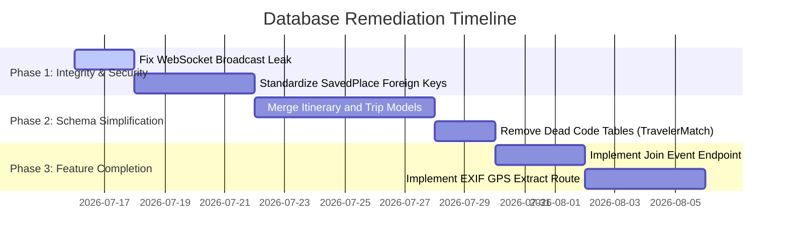

# Database Quality Evaluation Report (DatabaseQualityReport.md)

This report evaluates the quality, resilience, and architectural standards of the **SmartTravel** database design across seven core software engineering dimensions.

---

## 1. Quality Scores Summary

| Evaluation Dimension | Score (0-100) | Rating | Key Strength / Concern |
| :--- | :---: | :---: | :--- |
| **Correctness** | 80 | Good | Schema corresponds to use cases, but contains dead tables and missing fields (EXIF, Event join). |
| **Scalability** | 85 | Very Good | Native vector indexing and spatial index bounding boxes, but flat string arrays limit large-scale searches. |
| **Normalization** | 75 | Fair | Adheres to 3NF generally, but contains redundancies in `SavedPlace` and table duplication (`Trip` vs `Itinerary`). |
| **Maintainability** | 70 | Fair | High schema duplication between trip and itinerary; relies on coordinates repair scripts. |
| **Performance** | 90 | Excellent | Optimized PGVector queries, spatial index bounding filters, and automatic TTL cache cleaners. |
| **Security** | 85 | Very Good | Bcrypt 12 password encryption, verification tokens, but WebSocket broadcast leaks live locations. |
| **Data Integrity** | 80 | Good | Strong cascade delete enforcements and compound unique keys, but contains unvalidated text-based location links. |
| **OVERALL SCORE** | **81 / 100** | **Good** | **Robust performance foundations with minor normalization and maintainability gaps.** |

---

## 2. Detailed Dimension Evaluation

### A. Correctness (Score: 80)
* **Strengths**: Mapped structures successfully model core business requirements (trips, social blogs, chatbot, RAG).
* **Gaps**: 
  - Gaps exist for `UC_MAP_03 (EXIF GPS Extraction)` since no fields store photo metadata in the check-in logs.
  - Contains dead entities (`TravelerMatch`, `LocationHistory`, `EventAttendee`) that are defined in [schema.prisma](file:///d:/Thuc_Tap_NDT/backend/prisma/schema.prisma) but never read or written in the backend.

### B. Scalability (Score: 85)
* **Strengths**: Uses native PostgreSQL extensions (`vector` via PGVector) for high-dimensional semantic search. Cache schemas allow offloading expensive queries.
* **Gaps**: String arrays (`activities`, `travelPreferences` as `String[]`) bypass standard index lookups. As the database grows, querying users with overlapping interest arrays will cause sequential table scans.

### C. Normalization (Score: 75)
* **Strengths**: Transactional entities (posts, comments, likes) are normalized to 3NF, eliminating basic insertion/deletion anomalies.
* **Gaps**: 
  - **1NF Violation**: Use of PostgreSQL string arrays (`String[]`) instead of join tables.
  - **Redundancy**: `SavedPlace` copies `latitude`, `longitude`, `address`, and `category` from `Destination` instead of referencing it.
  - **Table Duplication**: Parallel structures for `Trip` and `Itinerary`.

### D. Maintainability (Score: 70)
* **Strengths**: Prisma Client auto-generates TypeScript types, keeping codebase queries aligned with DB column names.
* **Gaps**: 
  - Duplication between `Trip` and `Itinerary` means database adjustments must be repeated in both schemas.
  - Using flat strings for addresses requires manual coordinate-fixing scripts (`fix-coordinates.ts`, `fix-kiengiang-coords.ts`, `update-addresses.ts`) to fix data anomalies.

### E. Performance (Score: 90)
* **Strengths**: 
  - Compound indexes on coordinates (`latitude`, `longitude`) optimize boundary search speeds.
  - PGVector speeds up cosine similarity lookups for the RAG chatbot.
  - Automated cache cleanup cron jobs keep Cache tables clean.

### F. Security (Score: 85)
* **Strengths**: Secure password hashing (Bcrypt 12), route protection via JWT middleware, and role-based permissions (`UserRole`).
* **Gaps**: 
  - The WebSocket location update listener in `server.ts` broadcasts client positions to *all* active sockets, bypassing friendship restrictions.

### G. Data Integrity (Score: 80)
* **Strengths**: Cascading delete configurations (`onDelete: Cascade`) prevent orphaned database records. Compound unique keys prevent double-RSVPs, double-follows, and duplicate post likes.
* **Gaps**: 
  - Unvalidated location strings (`Post.locationId`, `SavedPlace.address`, `TravelHistory.location`) bypass relational foreign key checks.

---

## 3. Recommended Remediation Plan

