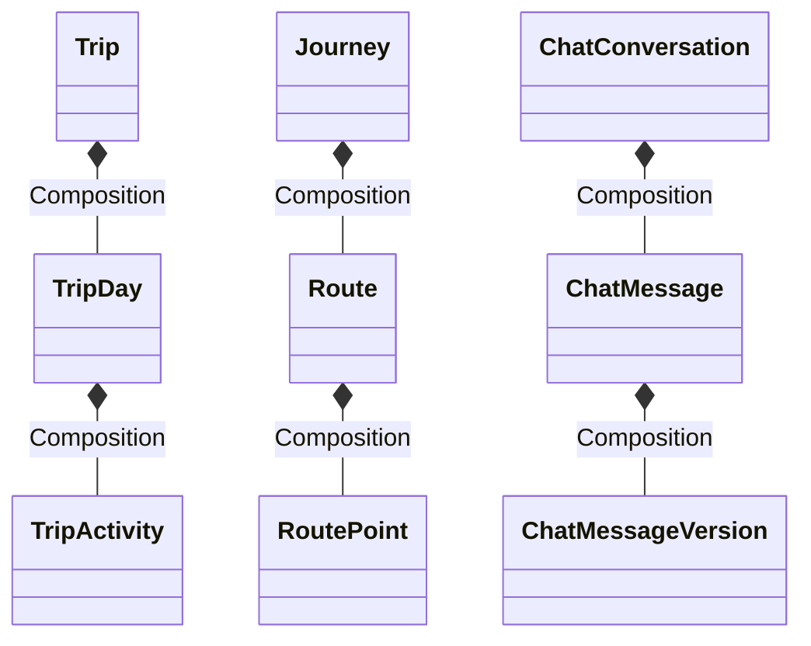
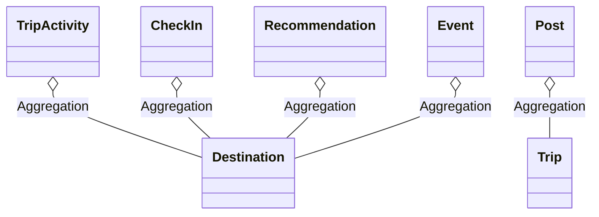

# SmartTravel Relationship Specification

This document provides a detailed analysis of the entity relationships within the **SmartTravel** database, mapping 1-1, 1-N, N-N, recursive, inheritance, composition, aggregation, and weak entity configurations.

---

## 1. One-to-One (1-1) Relationships
These links connect two tables where a record in one table corresponds to at most one record in the other table. In Prisma, this is enforced with a `@unique` constraint on the foreign key field.

| Source Entity | Target Entity | Foreign Key Field | Cardinality | Referential Integrity | Purpose |
| :--- | :--- | :--- | :---: | :--- | :--- |
| `User` | `Profile` | `Profile.userId` | `1:0..1` | `onDelete: Cascade` | Extends users with personal details. |
| `User` | `TravelPreferences`| `TravelPreferences.userId`| `1:0..1` | `onDelete: Cascade` | Saves traveler profile preferences. |
| `User` | `Location` | `Location.userId` | `1:0..1` | `onDelete: Cascade` | Holds active live coordinates of users. |
| `User` | `AIMemory` | `AIMemory.userId` | `1:0..1` | `onDelete: Cascade` | Stores extracted profile details for AI. |
| `ChatMessage` | `AIFeedback` | `AIFeedback.messageId` | `1:0..1` | `onDelete: Cascade` | Saves feedback rating on AI replies. |

---

## 2. One-to-Many (1-N) Relationships
Standard relational associations where a parent record maps to multiple children records.

### A. User Owned Collections
* **`User` -> `Trip`**: User creates multiple trips (`Trip.ownerId` -> `User.id`, `Cascade`).
* **`User` -> `Post`**: User authors multiple posts (`Post.authorId` -> `User.id`, `Cascade`).
* **`User` -> `Comment`**: User writes multiple comments (`Comment.authorId` -> `User.id`, `Cascade`).
* **`User` -> `ChatConversation`**: User creates multiple assistant threads (`ChatConversation.userId` -> `User.id`, `Cascade`).
* **`User` -> `LocationHistory`**: User streams coordinates (`LocationHistory.userId` -> `User.id`, `Cascade`).
* **`User` -> `Journey`**: User authors travel blogs (`Journey.userId` -> `User.id`, `Cascade`).
* **`User` -> `Event`**: User organizes multiple events (`Event.organizerId` -> `User.id`, `Cascade`).

### B. Planner & Itinerary Hierarchies
* **`Trip` -> `TripDay`**: A trip has multiple days (`TripDay.tripId` -> `Trip.id`, `Cascade`).
* **`TripDay` -> `TripActivity`**: A day lists multiple activities (`TripActivity.tripDayId` -> `TripDay.id`, `Cascade`).
* **`Itinerary` -> `ItineraryDay`**: A template contains multiple days (`ItineraryDay.itineraryId` -> `Itinerary.id`, `Cascade`).
* **`ItineraryDay` -> `ItineraryActivity`**: A template day lists activities (`ItineraryActivity.itineraryDayId` -> `ItineraryDay.id`, `Cascade`).

### C. Chat & RAG structures
* **`ChatConversation` -> `ChatMessage`**: Conversation holds multiple chat lines (`ChatMessage.conversationId` -> `ChatConversation.id`, `Cascade`).
* **`ChatMessage` -> `ChatMessageVersion`**: A message holds edit histories (`ChatMessageVersion.messageId` -> `ChatMessage.id`, `Cascade`).
* **`ChatMessage` -> `ToolCall`**: Chat messages trigger tools (`ToolCall.messageId` -> `ChatMessage.id`, `Cascade`).
* **`KnowledgeContent` -> `KnowledgeQuestion`/`KnowledgeAnswer`**: Knowledge content has multiple questions and answers (`contentId` -> `KnowledgeContent.id`, `Cascade`).

---

## 3. Many-to-Many (N-N) Relationships
These links map multiple records in one table to multiple records in another.

### Implicit N-N Relationships (Managed by Prisma)
* **`User` <-> `Conversation`**:
  - Enforced by relation name `"ConversationParticipants"`.
  - Under the hood, Prisma creates a join table `_ConversationParticipants` containing `A` (User ID) and `B` (Conversation ID).
  - Used for peer-to-peer user chat rooms.

---

## 4. Recursive & Self-Referential Relationships
A table containing foreign keys that reference its own primary key, representing trees or networks.

### A. Trip Cloning (1-N Self)
* **Definition**: `Trip.cloneSourceId` references `Trip.id`.
* **Behavior**: If a user clones a public trip, the new trip references the original source trip. If the source trip is deleted, `cloneSourceId` is set to `null` (`onDelete: SetNull`).

### B. Threaded Comments (1-N Self)
* **Definition**: `Comment.parentId` references `Comment.id`.
* **Behavior**: Allows nesting comments/replies. Deleting a parent comment cascades to delete all child replies (`onDelete: Cascade`).

### C. Follower Network (N-N Self via Junction Table)
* **Definition**: Represented by the `Follower` table.
* **Fields**: `followerId` (FK -> `User.id`) and `followingId` (FK -> `User.id`).
* **Enforcement**: `@@unique([followerId, followingId])` ensures unidirectional uniqueness.

### D. Traveler Compatibility Matches (N-N Self via Junction Table)
* **Definition**: Represented by the `TravelerMatch` table.
* **Fields**: `userId` (FK -> `User.id`) and `matchedUserId` (FK -> `User.id`).

---

## 5. Inheritance Mappings (Subtyping)
Prisma does not support SQL inheritance (e.g. `table inherits`). Instead, two logical inheritance patterns are used:

### A. Subtyping / Attribute Extension (1-1 subclass pattern)
* **Configuration**: `User` acts as the base class, while `Profile` and `TravelPreferences` act as logical extensions.
* **Key aspect**: They share the same logical key identity (`userId`), creating a vertical partition of attributes.

### B. Single-Table Type Discrimination
* **Configuration**: A column is used to differentiate behaviors of the record:
  - `SafetyWarning.type` discriminates alerts (`"FLOOD"`, `"LANDSLIDE"`, `"CLOSED_ROAD"`, `"STORM"`).
  - `AIHistory.type` discriminates log types (`"itinerary"`, `"cost_prediction"`, `"route_optimization"`).
  - `Notification.type` discriminates triggers (`"like"`, `"comment"`, `"friend_request"`, `"invitation"`).

---

## 6. Composition Relationships
Composition represents a strong "Has-A" relationship with lifecycle dependency: if the parent is deleted, the children are destroyed immediately.

* **`Trip` ➔ `TripDay` ➔ `TripActivity`**: Deleting `Trip` deletes days, which deletes activities.
* **`Journey` ➔ `Route` ➔ `RoutePoint`**: Deleting `Journey` deletes routes, which deletes points.
* **`ChatConversation` ➔ `ChatMessage` ➔ `ChatMessageVersion` / `ToolCall` / `AIFeedback`**: Deleting a chat thread destroys all messages, versions, logs, and user feedback records.

---

## 7. Aggregation Relationships
Aggregation represents a weak "Has-A" relationship where children have independent lifecycles: if the parent is deleted, the child remains.

* **`TripActivity` ➔ `Destination`**: Deleting the activity does not affect the destination.
* **`Post` ➔ `Trip`**: If a `Trip` is deleted, the `Post` remains; the foreign key `Post.tripId` is set to `null` (`onDelete: SetNull`).
* **`Event` ➔ `Destination`**: If a `Destination` is deleted, the event remains; `Event.destinationId` is set to `null`.

---

## 8. Weak Entities
Entities that cannot exist without a parent entity. In this schema, they are identified by their cascade dependency rules:

1. **`Profile`, `TravelPreferences`, `Location`, `AIMemory`**: Cannot exist without a parent `User`.
2. **`TripDay`**: Cannot exist without a `Trip`.
3. **`TripActivity`**: Cannot exist without a `TripDay`.
4. **`Comment`, `Like`, `Bookmark`**: Cannot exist without a `Post` (and `User`).
5. **`Message`**: Cannot exist without a `Conversation` (and `User`).
6. **`Route`**: Cannot exist without a `Journey`.
7. **`RoutePoint`**: Cannot exist without a `Route`.
8. **`ChatMessage`**: Cannot exist without a `ChatConversation`.
9. **`ChatMessageVersion`, `AIFeedback`, `ToolCall`**: Cannot exist without a `ChatMessage`.
10. **`KnowledgeQuestion`, `KnowledgeAnswer`**: Cannot exist without `KnowledgeContent`.
