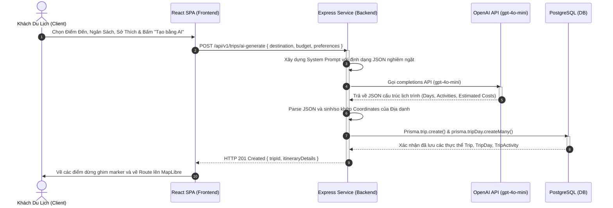
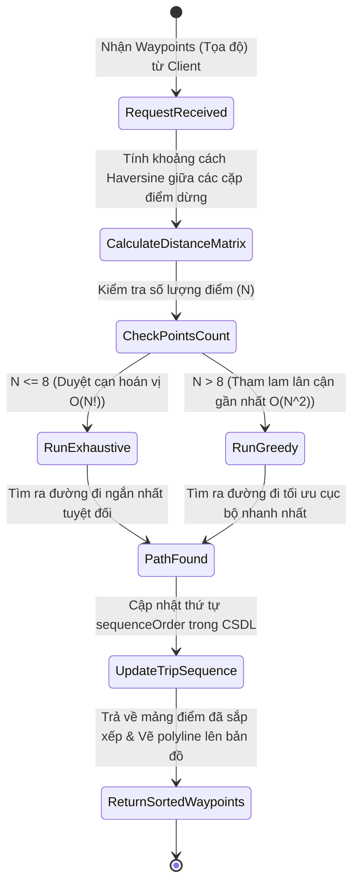
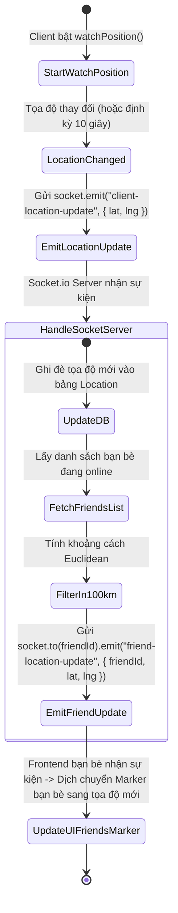
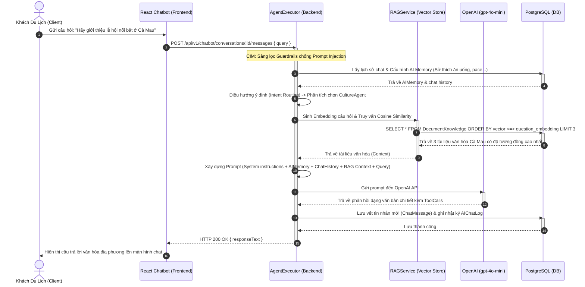
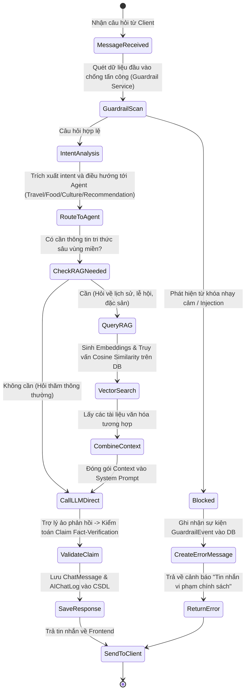

# Ma trận Đối chiếu Use Case Toàn diện (UseCase Mapping Matrix)

Tài liệu này đối chiếu chi tiết toàn bộ các trường hợp sử dụng (Use Cases) của hệ thống **SmartTravel (Terraholic)** với các thành phần thực tế trong dự án (Front-End, API Back-End, Bảng CSDL) và tích hợp các biểu đồ Sequence, Activity cho các luồng cốt lõi.

---

## 1. PHÂN HỆ XÁC THỰC & HỒ SƠ (AUTHENTICATION & PROFILE)

| Mã Use Case | Tên Use Case | Front-End Component | API Back-End (Route & File) | Bảng CSDL | Quan hệ UML (Include, Extend, Generalization) |
| :--- | :--- | :--- | :--- | :--- | :--- |
| **UC_AUTH_01** | Đăng ký tài khoản | `features/auth/Register.tsx` | `POST /api/v1/auth/register` [auth.router.ts:L31](file:///d:/Thuc_Tap_NDT/backend/src/modules/auth/auth.router.ts#L31) | `User` | - |
| **UC_AUTH_02** | Xác thực email | `features/auth/VerifyEmail.tsx` | `GET /api/v1/auth/verify-email` [auth.router.ts:L298](file:///d:/Thuc_Tap_NDT/backend/src/modules/auth/auth.router.ts#L298) | `User` | - |
| **UC_AUTH_03** | Đăng nhập tài khoản | `features/auth/Login.tsx` | (Use Case cha trừu tượng) | `User` | Cha của `UC_AUTH_03A` và `UC_AUTH_03B` |
| **UC_AUTH_03A**| Đăng nhập truyền thống | `features/auth/LoginForm.tsx` | `POST /api/v1/auth/login` [auth.router.ts:L91](file:///d:/Thuc_Tap_NDT/backend/src/modules/auth/auth.router.ts#L91) | `User` | **Generalization** (Kế thừa từ `UC_AUTH_03`) |
| **UC_AUTH_03B**| Đăng nhập Google SSO | `features/auth/GoogleLoginButton.tsx` | `POST /api/v1/auth/google` [auth.router.ts:L216](file:///d:/Thuc_Tap_NDT/backend/src/modules/auth/auth.router.ts#L216) | `User`, `Profile` | **Generalization** (Kế thừa từ `UC_AUTH_03`) |
| **UC_AUTH_04** | Quản lý hồ sơ & bio | `features/profile/EditProfileForm.tsx` | `PUT /api/v1/social/profile` [social.router.ts:L42](file:///d:/Thuc_Tap_NDT/backend/src/modules/social/social.router.ts#L42) | `Profile` | - |
| **UC_AUTH_05** | Quản lý sở thích du lịch | `features/profile/TravelPreferencesForm.tsx` | `PUT /api/v1/social/preferences` [social.router.ts:L177](file:///d:/Thuc_Tap_NDT/backend/src/modules/social/social.router.ts#L177) | `TravelPreferences` | - |
| **UC_AUTH_06** | Tìm kiếm thành viên | `features/social/SearchUsers.tsx` | `GET /api/v1/social/search` [social.router.ts:L210](file:///d:/Thuc_Tap_NDT/backend/src/modules/social/social.router.ts#L210) | `Profile` | - |
| **UC_AUTH_07** | Theo dõi thành viên khác | `features/profile/FollowButton.tsx` | `POST /api/v1/social/follow/:id` [social.router.ts:L68](file:///d:/Thuc_Tap_NDT/backend/src/modules/social/social.router.ts#L68) | `Follower`, `Notification` | Cha / Điểm mở rộng của Unfollow |
| **UC_AUTH_08** | Hủy theo dõi thành viên | `features/profile/FollowButton.tsx` | `DELETE /api/v1/social/unfollow/:id` [social.router.ts:L68](file:///d:/Thuc_Tap_NDT/backend/src/modules/social/social.router.ts#L68) | `Follower` | **Extend** cho `UC_AUTH_07` |
| **UC_AUTH_09** | Xem lịch sử thông báo | `components/layout/NotificationDropdown.tsx` | `GET /api/v1/social/notifications` [social.router.ts:L144](file:///d:/Thuc_Tap_NDT/backend/src/modules/social/social.router.ts#L144) | `Notification` | Điểm mở rộng của Đọc thông báo |
| **UC_AUTH_10** | Đánh dấu đọc thông báo | `components/layout/NotificationDropdown.tsx` | `PUT /api/v1/social/notifications/read` [social.router.ts:L161](file:///d:/Thuc_Tap_NDT/backend/src/modules/social/social.router.ts#L161) | `Notification` | **Extend** cho `UC_AUTH_09` |

---

## 2. PHÂN HỆ LẬP LỊCH TRÌNH & HÀNH TRÌNH (TRIP PLANNING & ITINERARIES)

| Mã Use Case | Tên Use Case | Front-End Component | API Back-End (Route & File) | Bảng CSDL | Quan hệ UML (Include, Extend, Generalization) |
| :--- | :--- | :--- | :--- | :--- | :--- |
| **UC_TRIP_01** | Xem danh sách chuyến đi | `features/trips/TripList.tsx` | `GET /api/v1/trips/` [trips.router.ts:L34](file:///d:/Thuc_Tap_NDT/backend/src/modules/trips/trips.router.ts#L34) | `Trip` | - |
| **UC_TRIP_02** | Xem chi tiết chuyến đi | `features/trips/TripDetail.tsx` | `GET /api/v1/trips/:id` [trips.router.ts:L64](file:///d:/Thuc_Tap_NDT/backend/src/modules/trips/trips.router.ts#L64) | `Trip`, `TripDay`, `TripActivity` | - |
| **UC_TRIP_03** | Tạo chuyến đi thủ công | `features/trips/CreateTripForm.tsx` | `POST /api/v1/trips/` [trips.router.ts:L105](file:///d:/Thuc_Tap_NDT/backend/src/modules/trips/trips.router.ts#L105) | `Trip` | Điểm mở rộng của tạo bằng AI |
| **UC_TRIP_04** | Cập nhật/Tái tạo một phần lịch trình bằng AI (Đổi ngày/buổi) | `features/trips/TripPlanner.tsx` | `POST /api/v1/trips/ai-regenerate-part` [trips.router.ts:L275](file:///d:/Thuc_Tap_NDT/backend/src/modules/trips/trips.router.ts#L275) | `Trip`, `TripDay`, `TripActivity` | **Extend** cho `UC_TRIP_06` |
| **UC_TRIP_05** | Xóa chuyến đi | `features/trips/TripList.tsx` | `DELETE /api/v1/trips/:id` [trips.router.ts:L403](file:///d:/Thuc_Tap_NDT/backend/src/modules/trips/trips.router.ts#L403) | `Trip` | - |
| **UC_TRIP_06** | Tạo lịch trình qua AI | `features/trips/AICreateTrip.tsx` | `POST /api/v1/trips/ai-generate` [trips.router.ts:L234](file:///d:/Thuc_Tap_NDT/backend/src/modules/trips/trips.router.ts#L234) | `Trip`, `TripDay`, `TripActivity` | **Extend** cho `UC_TRIP_03` |
| **UC_TRIP_07** | Tối ưu hóa lộ trình (TSP) | `features/map/MapDashboard.tsx` | `POST /api/v1/trips/optimize-route` [trips.router.ts:L330](file:///d:/Thuc_Tap_NDT/backend/src/modules/trips/trips.router.ts#L330) | - (Thuật toán TSP) | **Extend** cho `UC_TRIP_06` |
| **UC_TRIP_15** | Xem lịch sử du lịch thực tế | `features/profile/ProfilePage.tsx` | `GET /api/v1/travel-history/` [travel-history.router.ts:L13](file:///d:/Thuc_Tap_NDT/backend/src/modules/travel-history/routes/travel-history.router.ts#L13) | `TravelHistory` | - |
| **UC_TRIP_16** | Quản lý nhật ký di chuyển (Thêm/Sửa/Xóa) | `features/profile/ProfilePage.tsx` | `POST /api/v1/travel-history/` [travel-history.router.ts:L12](file:///d:/Thuc_Tap_NDT/backend/src/modules/travel-history/routes/travel-history.router.ts#L12) | `TravelHistory` | - |
| **UC_TRIP_17** | Xem đề xuất điểm đến AI | `features/trips/AICreateTrip.tsx` | `GET /api/v1/recommendations` [recommendations.router.ts:L12](file:///d:/Thuc_Tap_NDT/backend/src/modules/recommendations/recommendations.router.ts#L12) | `UserRecommendation` | Điểm mở rộng của Lưu điểm đề xuất |
| **UC_TRIP_18** | Lưu địa điểm đề xuất vào Trip | `features/trips/AICreateTrip.tsx` | `POST /api/v1/recommendations/save` [recommendations.router.ts:L130](file:///d:/Thuc_Tap_NDT/backend/src/modules/recommendations/save#L130) | `TripActivity` | **Extend** cho `UC_TRIP_17` |

### 2.1. Biểu đồ tuần tự (Sequence Diagram) - Luồng Lập kế hoạch bằng AI (`UC_TRIP_06`)

### 2.2. Biểu đồ hoạt động (Activity Diagram) - Luồng Tối ưu hóa lộ trình di chuyển (TSP) (`UC_TRIP_07`)

---

## 3. PHÂN HỆ MẠNG XÃ HỘI & CỘNG ĐỒNG (SOCIAL & FEED)

| Mã Use Case | Tên Use Case | Front-End Component | API Back-End (Route & File) | Bảng CSDL | Quan hệ UML (Include, Extend, Generalization) |
| :--- | :--- | :--- | :--- | :--- | :--- |
| **UC_SOC_01** | Xem bảng tin cộng đồng | `features/feed/CommunityFeed.tsx` | `GET /api/v1/posts/` [posts.router.ts:L23](file:///d:/Thuc_Tap_NDT/backend/src/modules/posts/posts.router.ts#L23) | `Post`, `User`, `Profile` | - |
| **UC_SOC_02** | Xem chi tiết bài viết | `features/posts/PostDetail.tsx` | `GET /api/v1/posts/:id` [posts.router.ts:L104](file:///d:/Thuc_Tap_NDT/backend/src/modules/posts/posts.router.ts#L104) | `Post`, `Comment` | - |
| **UC_SOC_03** | Tạo bài viết mới kèm ảnh | `features/posts/CreatePostForm.tsx` | `POST /api/v1/posts/` [posts.router.ts:L161](file:///d:/Thuc_Tap_NDT/backend/src/modules/posts/posts.router.ts#L161) | `Post` | **Include** `UC_SOC_03_Upload` |
| **UC_SOC_03_Upload** | Tải hình ảnh bài đăng | `features/posts/ImageUploader.tsx` | Upload trung gian lên Storage | - (Supabase) | **Included** bởi `UC_SOC_03` |
| **UC_SOC_04** | Chỉnh sửa bài viết cá nhân | `features/posts/EditPostForm.tsx` | `PUT /api/v1/posts/:id` [posts.router.ts:L292](file:///d:/Thuc_Tap_NDT/backend/src/modules/posts/posts.router.ts#L292) | `Post` | - |
| **UC_SOC_05** | Xóa bài viết cá nhân | `features/feed/CommunityFeed.tsx` | `DELETE /api/v1/posts/:id` [posts.router.ts:L199](file:///d:/Thuc_Tap_NDT/backend/src/modules/posts/posts.router.ts#L199) | `Post` | - |
| **UC_SOC_06** | Thích bài viết | `features/posts/LikeButton.tsx` | `POST /api/v1/posts/:id/like` [posts.router.ts:L219](file:///d:/Thuc_Tap_NDT/backend/src/modules/posts/posts.router.ts#L219) | `Like`, `Notification` | Điểm mở rộng của Bỏ thích |
| **UC_SOC_07** | Bỏ thích bài viết | `features/posts/LikeButton.tsx` | `POST /api/v1/posts/:id/like` (Toggle) [posts.router.ts:L219](file:///d:/Thuc_Tap_NDT/backend/src/modules/posts/posts.router.ts#L219) | `Like` | **Extend** cho `UC_SOC_06` |
| **UC_SOC_08** | Đánh dấu lưu bài viết | `features/posts/BookmarkButton.tsx` | `POST /api/v1/posts/:id/bookmark` [posts.router.ts:L267](file:///d:/Thuc_Tap_NDT/backend/src/modules/posts/posts.router.ts#L267) | `Bookmark` | - |
| **UC_SOC_09** | Xem danh sách bài viết đã lưu | `features/profile/SavedBookmarks.tsx` | `GET /api/v1/posts/bookmarks` [posts.router.ts:L410](file:///d:/Thuc_Tap_NDT/backend/src/modules/posts/posts.router.ts#L410) | `Bookmark`, `Post` | - |
| **UC_SOC_10** | Viết bình luận bài viết | `features/posts/CommentSection.tsx` | `POST /api/v1/posts/:id/comments` [posts.router.ts:L353](file:///d:/Thuc_Tap_NDT/backend/src/modules/posts/posts.router.ts#L353) | `Comment`, `Notification` | Điểm mở rộng của Phản hồi bình luận |
| **UC_SOC_11** | Phản hồi bình luận (Nested) | `features/posts/CommentSection.tsx` | `POST /api/v1/posts/:id/comments` (Kèm parentId) [posts.router.ts:L353](file:///d:/Thuc_Tap_NDT/backend/src/modules/posts/posts.router.ts#L353) | `Comment`, `Notification` | **Extend** cho `UC_SOC_10` |

---

## 4. PHÂN HỆ BẢN ĐỒ TƯƠNG TÁC & GIS (INTERACTIVE MAP & GIS)

| Mã Use Case | Tên Use Case | Front-End Component | API Back-End (Route & File) | Bảng CSDL | Quan hệ UML (Include, Extend, Generalization) |
| :--- | :--- | :--- | :--- | :--- | :--- |
| **UC_MAP_01** | Xem bản đồ tương tác | `features/map/MapDashboard.tsx` | `GET /api/v1/map/` (OpenStreetMap base) [MapDashboard.tsx](file:///d:/Thuc_Tap_NDT/frontend/src/features/map/MapDashboard.tsx) | - | Điểm mở rộng cho tìm kiếm, check-in, live tracking |
| **UC_MAP_02** | Thực hiện check-in địa điểm | `features/map/MapDashboard.tsx` | `POST /api/v1/map/checkin` [map.router.ts:L12](file:///d:/Thuc_Tap_NDT/backend/src/modules/map/map.router.ts#L12) | `CheckIn`, `Destination` | - |
| **UC_MAP_04** | Xem bản đồ nhiệt check-in | `features/map/MapDashboard.tsx` | `GET /api/v1/map/checkins` [map.router.ts:L77](file:///d:/Thuc_Tap_NDT/backend/src/modules/map/map.router.ts#L77) | `CheckIn` | **Extend** cho `UC_MAP_01` |
| **UC_MAP_05** | Tìm địa điểm xung quanh | `features/map/MapDashboard.tsx` | `GET /api/v1/map/destinations` [map.router.ts:L186](file:///d:/Thuc_Tap_NDT/backend/src/modules/map/map.router.ts#L186) | `Destination` | **Extend** cho `UC_MAP_01` |
| **UC_MAP_06** | Cập nhật vị trí lên live map | `features/map/MapDashboard.tsx` | WebSocket: `ping_location` & `PUT /api/v1/map/location` [map.router.ts:L136](file:///d:/Thuc_Tap_NDT/backend/src/modules/map/map.router.ts#L136) | `Location` | Điểm mở rộng cho định vị live của bạn bè |
| **UC_MAP_07** | Xem vị trí bạn bè live | `features/map/MapDashboard.tsx` | WebSocket: `friend_location_updated` & `GET /api/v1/map/friends-locations` [map.router.ts:L159](file:///d:/Thuc_Tap_NDT/backend/src/modules/map/map.router.ts#L159) | `Location` | **Extend** cho `UC_MAP_06` |
| **UC_MAP_08** | Lọc danh mục & đánh giá | `features/map/MapDashboard.tsx` | `GET /api/v1/map/destinations` [map.router.ts:L186](file:///d:/Thuc_Tap_NDT/backend/src/modules/map/map.router.ts#L186) | `Destination` | **Extend** cho `UC_MAP_01` |
| **UC_MAP_09** | Đề xuất điểm đến AI trên map | `features/map/MapDashboard.tsx` | `GET /api/v1/map/ai-recommendations` [map.router.ts:L439](file:///d:/Thuc_Tap_NDT/backend/src/modules/map/map.router.ts#L439) | - | - |
| **UC_MAP_10** | Hỏi trợ lý ảo về địa điểm | `features/map/MapDashboard.tsx` | `POST /api/v1/map/ai-assistant` [smartTravel.service.ts:L220](file:///d:/Thuc_Tap_NDT/frontend/src/services/smartTravel.service.ts#L220) | - | - |
| **UC_MAP_11** | Tải bản đồ ngoại tuyến | `features/map/MapDashboard.tsx` | - (Frontend simulation / tile caching) | - | - |
| **UC_MAP_12** | Tối ưu lộ trình di chuyển du lịch | `features/map/MapDashboard.tsx` | - (Frontend local greedy TSP sort) | - | - |

### 4.1. Biểu đồ hoạt động (Activity Diagram) - WebSocket GPS Live Tracking (`UC_MAP_06` & `UC_MAP_07`)

---

## 5. PHÂN HỆ TRỢ LÝ ẢO AI & RAG (AI CHATBOT & RAG)

| Mã Use Case | Tên Use Case | Front-End Component | API Back-End (Route & File) | Bảng CSDL | Quan hệ UML (Include, Extend, Generalization) |
| :--- | :--- | :--- | :--- | :--- | :--- |
| **UC_AI_01** | Khởi tạo cuộc hội thoại mới | `features/chatbot/ChatDashboard.tsx` | `POST /api/v1/chatbot/conversations` [chatbot.router.ts:L14](file:///d:/Thuc_Tap_NDT/backend/src/modules/chatbot/routes/chatbot.router.ts#L14) | `ChatConversation` | - |
| **UC_AI_02** | Xem lịch sử cuộc hội thoại | `features/chatbot/ChatDashboard.tsx` | `GET /api/v1/chatbot/conversations` [chatbot.router.ts:L15](file:///d:/Thuc_Tap_NDT/backend/src/modules/chatbot/routes/chatbot.router.ts#L15) | `ChatConversation` | - |
| **UC_AI_03** | Xem chi tiết cuộc hội thoại | `features/chatbot/ChatWindow.tsx` | `GET /api/v1/chatbot/conversations/:id` [chatbot.router.ts:L16](file:///d:/Thuc_Tap_NDT/backend/src/modules/chatbot/routes/chatbot.router.ts#L16) | `ChatMessage`, `ChatMessageVersion` | - |
| **UC_AI_04** | Xóa phiên hội thoại | `features/chatbot/ChatDashboard.tsx` | `DELETE /api/v1/chatbot/conversations/:id` [chatbot.router.ts:L17](file:///d:/Thuc_Tap_NDT/backend/src/modules/chatbot/routes/chatbot.router.ts#L17) | `ChatConversation` | - |
| **UC_AI_05** | Chat trợ lý ảo đa Agent | `features/chatbot/ChatWindow.tsx` | `POST /api/v1/chatbot/conversations/:id/messages` [chatbot.router.ts:L20](file:///d:/Thuc_Tap_NDT/backend/src/modules/chatbot/routes/chatbot.router.ts#L20) | `ChatMessage`, `ToolCall` | **Include** Guardrail, **Extend** Regen/Feedback |
| **UC_AI_06** | Yêu cầu sinh lại câu trả lời | `features/chatbot/MessageActions.tsx` | `POST /api/v1/chatbot/messages/:id/regenerate` [chatbot.router.ts:L21](file:///d:/Thuc_Tap_NDT/backend/src/modules/chatbot/routes/chatbot.router.ts#L21) | `ChatMessageVersion` | **Extend** cho `UC_AI_05` |
| **UC_AI_07** | Đánh giá phản hồi AI | `features/chatbot/MessageActions.tsx` | `POST /api/v1/feedback/` [feedback.router.ts:L12](file:///d:/Thuc_Tap_NDT/backend/src/modules/feedback/routes/feedback.router.ts#L12) | `AIFeedback` | **Extend** cho `UC_AI_05` |
| **UC_AI_08** | Xem cấu hình Bộ nhớ AI | `features/chatbot/MemorySettings.tsx` | `GET /api/v1/chatbot/memory` [chatbot.router.ts:L24](file:///d:/Thuc_Tap_NDT/backend/src/modules/chatbot/routes/chatbot.router.ts#L24) | `AIMemory` | - |
| **UC_AI_09** | Cập nhật cấu hình Bộ nhớ AI | `features/chatbot/MemorySettings.tsx` | `PUT /api/v1/chatbot/memory` [chatbot.router.ts:L25](file:///d:/Thuc_Tap_NDT/backend/src/modules/chatbot/routes/chatbot.router.ts#L25) | `AIMemory` | - |
| **UC_AI_10** | Xóa cấu hình Bộ nhớ AI | `features/chatbot/MemorySettings.tsx` | `DELETE /api/v1/chatbot/memory` [chatbot.router.ts:L27](file:///d:/Thuc_Tap_NDT/backend/src/modules/chatbot/routes/chatbot.router.ts#L27) | `AIMemory` | - |
| **UC_AI_11** | Xem món ăn yêu thích | `features/chatbot/FavoriteFoods.tsx` | `GET /api/v1/favorite-foods/` [favorite-food.router.ts:L13](file:///d:/Thuc_Tap_NDT/backend/src/modules/favorite-foods/routes/favorite-food.router.ts#L13) | `FavoriteFood` | - |
| **UC_AI_12** | Lưu món ăn đặc sản | `features/chatbot/FavoriteFoods.tsx` | `POST /api/v1/favorite-foods/` [favorite-food.router.ts:L12](file:///d:/Thuc_Tap_NDT/backend/src/modules/favorite-foods/routes/favorite-food.router.ts#L12) | `FavoriteFood` | - |
| **UC_AI_13** | Cập nhật / Xóa món đã lưu | `features/profile/FavoriteFoods.tsx` | `DELETE /api/v1/favorite-foods/:id` [favorite-food.router.ts:L15](file:///d:/Thuc_Tap_NDT/backend/src/modules/favorite-foods/routes/favorite-food.router.ts#L15) | `FavoriteFood` | - |

### 5.1. Biểu đồ tuần tự (Sequence Diagram) - Đa Agent RAG & AI Memory (`UC_AI_05`)

### 5.2. Biểu đồ hoạt động (Activity Diagram) - Tầng Bảo vệ Guardrails & RAG Chat

