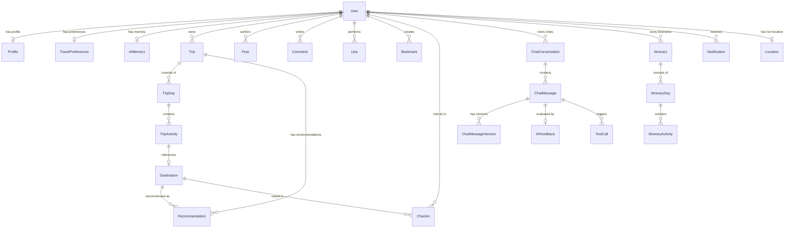

# BÁO CÁO PHÂN TÍCH KIẾN TRÚC & MÃ NGUỒN DỰ ÁN SMARTTRAVEL
*Người lập: Software Architect & Senior Full Stack Developer*
*Thời gian cập nhật: 2026-06-27*

---

## A. Tổng quan dự án
**SmartTravel** là một ứng dụng du lịch thông minh đột phá tích hợp mô hình **AI × Social × Map**. Hệ thống được thiết kế nhằm mang lại trải nghiệm du lịch cá nhân hóa tối đa cho người dùng thông qua các tính năng cốt lõi:
1. **Lập kế hoạch du lịch bằng AI (AI Trip Planner):** Tự động thiết lập lộ trình đi lại chi tiết dựa trên điểm đến, thời gian, ngân sách, phong cách du lịch và sở thích cá nhân. Tích hợp giải thuật tối ưu hóa đường đi ngắn nhất (Traveling Salesperson Problem - TSP).
2. **Bản đồ Xã hội Thời gian thực (Real-time Social Map & GIS):** Cho phép người dùng check-in tại các địa điểm, hiển thị mật độ check-in thông qua bản đồ nhiệt (Heatmap), chia sẻ vị trí trực tiếp cho bạn bè (Heartbeat) và tự động trích xuất tọa độ GPS từ siêu dữ liệu ảnh chụp (JPEG EXIF).
3. **Trợ lý ảo thông minh (AI Chatbot & Memory):** Hỗ trợ tư vấn thông tin ẩm thực địa phương, lịch sử văn hóa vùng miền thông qua hệ thống Multi-Agent có cấu trúc bộ nhớ dài hạn (AIMemory), cho phép đánh giá chất lượng phản hồi và khôi phục lịch sử hội thoại nhiều phiên bản.
4. **Hệ thống RAG (Retrieval-Augmented Generation):** Cơ chế truy xuất thông tin tăng cường giúp LLM trả lời các câu hỏi chuyên sâu về văn hóa, lễ hội và ẩm thực Việt Nam dựa trên kho tài liệu tri thức nội bộ được tính toán độ tương đồng ngữ nghĩa.

---

## B. Công nghệ sử dụng

### 1. Backend Core
*   **Runtime & Framework:** Node.js, Express, TypeScript.
*   **Database ORM:** Prisma ORM, kết nối PostgreSQL cơ sở dữ liệu.
*   **Real-time Communication:** Socket.io (WebSockets) phục vụ cập nhật vị trí trực tiếp và cập nhật cộng tác lịch trình hành trình theo thời gian thực.
*   **Authentication & Security:** Firebase Admin SDK (xác thực Google Auth), JWT (JSON Web Tokens) quản lý phiên đăng nhập (Access Token & Refresh Token), thư viện `bcryptjs` mã hóa mật khẩu.
*   **Caching & Optimization:** Sử dụng các bảng cache được thiết kế trong PostgreSQL (`PlaceCache`, `FoodCache`, `BlogCache`) kết hợp kiểm tra thời gian sống (TTL). Thư viện `ioredis` đã được cài đặt sẵn để chuẩn bị tích hợp.
*   **LLM & Vector Engine:** OpenAI API (`gpt-4o-mini` để sinh lịch trình và hội thoại chatbot, `text-embedding-3-small` phục vụ tạo vector tri thức).

### 2. Frontend Core
*   **Framework & Tools:** React 19 (phiên bản `19.0.0-rc-0`), TypeScript, Vite (bundler siêu tốc).
*   **State Management:** Redux Toolkit (`@reduxjs/toolkit`, `react-redux`) quản lý trạng thái xác thực và bản đồ; React Query (`@tanstack/react-query`) quản lý trạng thái bất đồng bộ và bộ đệm dữ liệu API.
*   **Map Interface (GIS):** Leaflet, Leaflet.markercluster tích hợp nền bản đồ OpenStreetMap.
*   **Network Client:** Axios cấu hình Interceptors tự động quay vòng token (Token Rotation) khi Access Token (15 phút) hết hạn bằng Refresh Token (7 ngày).
*   **Design & Styling:** Vanilla CSS (hệ thống tokens, biến CSS toàn cục được khai báo trong `index.css`) kết hợp Tailwind CSS tạo hiệu ứng mượt mà (glassmorphism, chuyển động vi mô).
*   **Icons:** Lucide React.

---

## C. Kiến trúc hệ thống

Dự án áp dụng các mô hình kiến trúc hiện đại, linh hoạt:

### 1. Kiến trúc Monolith hướng Module (Modular Monolith Architecture)
Ở phía Backend, toàn bộ mã nguồn được chia thành các business module tự chứa trong thư mục `src/modules`. Mỗi module đóng gói đầy đủ các lớp:
```
Module ─── Router ─── Middleware ─── Controller ─── Service ─── Repository ─── Types
```
Cách thiết kế này giúp cô lập logic nghiệp vụ, giảm thiểu sự phụ thuộc chéo và dễ dàng tách ra thành các service riêng biệt khi quy mô hệ thống tăng lên.

### 2. Kiến trúc Cộng tác Hướng Sự kiện (Event-Driven WebSockets)
Hệ thống sử dụng Socket.io để xử lý 3 luồng nghiệp vụ thời gian thực:
*   Phát sóng tọa độ cập nhật vị trí của người dùng đến những người đang theo dõi (`ping_location` -> `friend_location_updated`).
*   Phòng cộng tác lập kế hoạch chung (`join_trip_room` -> `trip_updated` -> `trip_reconciled`).
*   Chat thời gian thực giữa các thành viên.

### 3. Thiết kế AI Agent (Strategy & Dependency Injection Pattern)
Module `ai-agents` được triển khai bằng mẫu thiết kế Chiến lược và Tiêm phụ thuộc:
*   **AgentExecutorService** chịu trách nhiệm điều phối. Nó sử dụng cơ chế **Natural Language Routing** để phân tích câu hỏi người dùng và định tuyến đến Agent chuyên biệt (`TravelAgent`, `FoodAgent`, `CultureAgent`, `RecommendationAgent`).
*   Các **Tool** nghiệp vụ (Map, Weather, Food, Culture, Itinerary) được khởi tạo độc lập và tiêm (inject) vào constructor của từng Agent, đảm bảo tính dễ kiểm thử (testability) và tái sử dụng.

### 4. Kiến trúc RAG (Retrieval-Augmented Generation)
Quy trình xử lý RAG bao gồm 3 bước khép kín:
1.  **Embeddings Generator:** Chuyển đổi văn bản thành vector. Tích hợp cơ chế dự phòng: ưu tiên gọi OpenAI Embeddings API, nếu lỗi hoặc thiếu Key sẽ chuyển sang **Local Hashing Engine** (tự động băm DJB2 chuỗi tokens thành vector 128 chiều chuẩn hóa L2).
2.  **Vector Store & Semantic Retrieval:** Truy vấn và tính toán độ tương đồng Cosine (Cosine Similarity) trực tiếp trong bộ nhớ RAM từ các dòng tải lên từ bảng `DocumentKnowledge`.
3.  **Prompt Builder:** Tự động nhúng ngữ cảnh tri thức tốt nhất vào mẫu prompt định dạng chuẩn để gửi đến OpenAI.

---

## D. Cấu trúc thư mục dự án

```
Thuc_Tap_NDT/
├── backend/
│   ├── prisma/
│   │   ├── migrations/             # Lịch sử di cư database
│   │   └── schema.prisma           # Cấu hình bảng và thực thể DB
│   ├── src/
│   │   ├── app.ts                  # Cấu hình Express app và nạp các routes
│   │   ├── server.ts               # Khởi tạo HTTP Server, WebSockets, và Seeding
│   │   ├── config/                 # Cấu hình kết nối DB, Firebase, Auto-seed
│   │   ├── socket/                 # Xử lý kết nối websocket (nếu có tách file)
│   │   └── modules/                # Thư mục chứa 20 business modules độc lập
│   │       ├── ai/                 # Trực tiếp kết nối OpenAI GPT
│   │       ├── ai-agents/          # Các Agent xử lý logic theo Strategy
│   │       ├── auth/               # Xác thực người dùng và phân quyền
│   │       ├── rag/                # Xử lý nhúng tri thức và tìm kiếm ngữ nghĩa
│   │       ├── optimizer/          # Giải thuật tối ưu hóa lộ trình TSP
│   │       ├── chatbot/            # Quản lý tin nhắn AI chatbot, phiên bản, memory
│   │       └── ...                 # Các modules CRUD khác (trips, posts, social, map...)
│   ├── tsconfig.json
│   └── package.json
└── frontend/
    ├── src/
    │   ├── App.tsx                 # Core UI: định tuyến và tích hợp trang Map, Planner
    │   ├── main.tsx                # Điểm khởi đầu ứng dụng React
    │   ├── index.css               # Chứa toàn bộ giao thiết kế, biến toàn cục CSS
    │   ├── components/             # Các UI components dùng chung (Map, Layout, Auth)
    │   ├── contexts/               # Quản lý Đa ngôn ngữ (Lang) và Giao diện (Theme)
    │   ├── features/               # Các trang theo nghiệp vụ (auth, blog, chatbot, profile)
    │   ├── services/               # API client wrappers (smartTravel.service.ts)
    │   ├── store/                  # Quản lý Global State (Redux Toolkit, authSlice)
    │   └── utils/                  # Xử lý phụ trợ (GPS EXIF, LocalStorage, Storage cache)
    ├── tailwind.config.js
    └── package.json
```

---

## E. Chi tiết 20 Module Backend

1.  **ai:** Tạo kết nối trực tiếp với mô hình OpenAI GPT-4o-mini để biên soạn mẫu cấu trúc kế hoạch du lịch dạng JSON.
2.  **ai-agents:** Điều phối hệ thống đa tác nhân thông minh (`TravelAgent`, `FoodAgent`, `CultureAgent`, `RecommendationAgent`) đi kèm cơ chế tự động định tuyến yêu cầu.
3.  **analytics:** Tổng hợp dữ liệu thống kê hệ thống (lượt check-in, số lượng người dùng, biểu đồ xu hướng du lịch và bản đồ nhiệt GIS check-in).
4.  **auth:** Quản lý quy trình đăng ký, đăng nhập mật khẩu hash và xác thực Google qua Firebase ID Token.
5.  **cache:** Cung cấp bộ đệm TTL-based để giảm tải truy cập API bên ngoài cho địa điểm, món ăn và blog.
6.  **chatbot:** Quản lý hội thoại thông minh, lưu trữ nhiều phiên bản tin nhắn (versioning) giúp người dùng có thể tái tạo câu trả lời của AI và tích hợp bộ nhớ học máy cá nhân (`AIMemory`).
7.  **destinations:** Danh mục các điểm đến du lịch lưu trữ tọa độ, thông tin địa chỉ và xếp hạng trung bình.
8.  **favorite-foods:** CRUD quản lý danh sách món ăn yêu thích theo vùng miền của người dùng.
9.  **feedback:** Ghi nhận đánh giá phản hồi của người dùng đối với các câu trả lời của trợ lý ảo AI (Rating & Comments).
10. **itinerary:** Quản lý cấu trúc lịch trình ảo được sinh ra từ Chatbot để phân biệt với lịch trình cố định của Trip.
11. **map:** Quản lý GIS, ghi nhận check-in người dùng, cập nhật tọa độ GPS trực tiếp và tìm kiếm bạn bè xung quanh.
12. **optimizer:** Chứa giải thuật giải bài toán TSP tối ưu hóa lộ trình di chuyển (bao gồm tìm kiếm đệ quy vét cạn cho dưới 8 điểm dừng để tìm quãng đường tối ưu tuyệt đối, và giải thuật Greedy tiệm cận cho trên 8 điểm).
13. **posts:** Module mạng xã hội cho phép đăng bài viết kèm hình ảnh, thích, bình luận đa cấp (threaded comments) và đánh dấu bài viết (bookmark).
14. **rag:** Thiết lập cơ sở tri thức tăng cường. Tải tài liệu, tính toán vector nhúng và thực hiện tìm kiếm ngữ nghĩa Cosine.
15. **recommendations:** Tính toán điểm gợi ý cá nhân hóa dựa trên độ tương đồng giữa sở thích du lịch và danh mục điểm đến, tìm kiếm địa điểm lân cận bằng bán kính vĩ độ/kinh độ.
16. **saved-places:** CRUD địa điểm lưu trữ ưa thích của người dùng để hiển thị nhanh trên bản đồ.
17. **social:** Xem thông tin cá nhân, thiết lập sở thích, quản lý theo dõi (Follow/Unfollow) và kích hoạt thông báo tự động.
18. **tool-calls:** Ghi nhật ký (audit log) lịch sử các công cụ AI được gọi bởi Agent.
19. **travel-history:** Ghi lại lịch sử các chuyến đi thực tế của người dùng để phục vụ phân tích thói quen.
20. **trips:** Quản lý thông tin chuyến đi tự lập hoặc nhân bản từ các chuyến đi công khai khác.

---

## F. Danh sách tất cả chức năng ứng dụng

### 1. Phân hệ Thành viên & Cá nhân hóa
*   **Đăng ký & Đăng nhập truyền thống:** Sử dụng email, mật khẩu băm bcrypt 12 vòng.
*   **Đăng nhập Google:** Đồng bộ tài khoản qua Firebase Admin Auth ID Token.
*   **Hồ sơ cá nhân:** Xem số lượng bài viết, lượt theo dõi và chỉnh sửa thông tin hiển thị (Avatar, Cover, Bio, Home Location, Số điện thoại).
*   **Cài đặt sở thích du lịch (Travel Preferences):** Thiết lập tốc độ chuyến đi (slow, moderate, fast), ngân sách hàng ngày, danh sách hoạt động, loại điểm đến ưa thích và xu hướng ăn uống để AI cá nhân hóa gợi ý.
*   **Thông báo (Notifications):** Thông báo thời gian thực khi có người thích bài viết, bình luận hoặc bắt đầu theo dõi.

### 2. Phân hệ Lập kế hoạch Du lịch & Tối ưu hóa (Planner & Optimizer)
*   **Lập kế hoạch thủ công:** Khởi tạo chuyến đi, cài đặt ngày bắt đầu/kết thúc, ngân sách tổng và phân loại kiểu bạn đồng hành (solo, family, friends, couple).
*   **Tạo lịch trình tự động bằng AI:** Gọi OpenAI gpt-4o-mini để phân tích yêu cầu điểm đến và sinh chuỗi hoạt động phân bổ theo ngày dưới dạng cấu trúc JSON chính xác.
*   **Tối ưu hóa đường đi ngắn nhất (Route Optimization):** Tích hợp nút tối ưu TSP tự động sắp xếp thứ tự các điểm dừng trong ngày để giảm thiểu tổng quãng đường di chuyển (sử dụng công thức Haversine để đo khoảng cách thực tế giữa các tọa độ địa lý).
*   **Nhân bản lịch trình (Clone Trip):** Cho phép sao chép nguyên trạng một lịch trình đã được đặt ở trạng thái công khai của người dùng khác thành lịch trình của mình.
*   **Tìm kiếm & Khám phá lịch trình công khai:** Bảng tin hiển thị các lịch trình công khai sắp xếp theo thời gian tạo mới nhất.

### 3. Phân hệ Bản đồ nhiệt & GIS thời gian thực
*   **Bản đồ tương tác (Leaflet Map Dashboard):** Hiển thị danh sách các địa danh du lịch và check-in của cộng đồng xung quanh thủ đô Hà Nội hoặc các khu vực khác.
*   **Chế độ xem đa dạng:** Hỗ trợ chuyển đổi nhanh giữa hiển thị ghim (Markers), Gom cụm mật độ (Cluster) và Bản đồ nhiệt (Heatmap) thể hiện mức độ tập trung check-in.
*   **Check-In kèm ghi chú:** Người dùng ghi lại khoảnh khắc tại điểm đến cụ thể.
*   **Chia sẻ vị trí trực tiếp (Live Tracking Heartbeat):** Gửi tọa độ GPS cá nhân lên server thông qua WebSockets và nhận cập nhật vị trí trực tiếp từ những người mình đang theo dõi để hiển thị trên bản đồ.
*   **Trích xuất GPS từ siêu dữ liệu ảnh (JPEG EXIF Extractor):** Người dùng có thể tải lên ảnh chụp từ thiết bị di động, hệ thống tự động phân tích nhị phân EXIF header để lấy tọa độ vĩ độ/kinh độ chụp ảnh, từ đó tự động tìm và định vị điểm check-in gần nhất.
*   **Bộ nhớ ngoại tuyến (Offline Map Caching):** Giả lập việc tải dữ liệu bản đồ về bộ nhớ đệm để sử dụng khi đi phượt không có sóng 4G.

### 4. Phân hệ Mạng xã hội Du lịch (Social Community)
*   **Bảng tin (Social Feed Page):** Nơi hiển thị các bài viết chia sẻ kinh nghiệm du lịch của cộng đồng. Tự động dọn dẹp các bài viết đã bị xóa quá 15 ngày.
*   **Tương tác bài viết:** Like bài viết (kèm tạo thông báo cho tác giả), Bookmark lưu trữ bài viết vào trang cá nhân.
*   **Bình luận đa cấp (Threaded Comments):** Cho phép bình luận bài viết và trả lời bình luận (Reply) lồng nhau.
*   **Đăng tải hành trình (Create Story):** Giao diện soạn thảo bài viết phong phú, hỗ trợ đăng tải hình ảnh và liên kết trực tiếp chuyến đi của mình vào bài đăng.
*   **Tìm kiếm người dùng:** Tìm kiếm nhanh theo email hoặc tên hiển thị.

### 5. Phân hệ Trợ lý ảo AI & RAG
*   **Đa phiên hội thoại (Chat Conversations):** Người dùng có thể tạo nhiều luồng trò chuyện khác nhau với AI.
*   **Tích hợp đa tác nhân thông minh:** Tự động định vị nhu cầu (ẩm thực -> gọi FoodAgent; văn hóa lịch sử -> gọi CultureAgent; gợi ý địa điểm -> gọi RecommendationAgent; thời tiết lộ trình -> gọi TravelAgent).
*   **Nhật ký gọi công cụ (Tool Calls Auditor):** Hiển thị minh bạch các công cụ (Maps, Weather, Food...) mà trợ lý ảo đã kích hoạt để trả lời câu hỏi.
*   **Đa phiên bản tin nhắn (Message Versioning):** Cho phép người dùng nhấp nút "Regenerate" để AI sinh lại câu trả lời mới. Hệ thống sẽ lưu giữ các câu trả lời cũ dưới dạng các phiên bản (V1, V2, V3...) để người dùng so sánh và chuyển đổi qua lại.
*   **Học thói quen người dùng (AI Memory):** Chatbot tự động phân tích và lưu giữ các sở thích ăn uống, phương tiện ưa thích và ngân sách vào bảng `AIMemory` để điều chỉnh giọng điệu và nội dung tư vấn trong các câu trả lời tiếp theo.
*   **Đánh giá chất lượng (AIFeedback):** Thả biểu tượng đánh giá chất lượng câu trả lời kèm đóng góp ý kiến.
*   **Tra cứu văn hóa lễ hội RAG:** Nhập câu hỏi tìm kiếm ngữ nghĩa, hệ thống sẽ thực hiện nhúng câu hỏi, quét cơ sở tri thức nội bộ để tìm ra tài liệu liên quan thông qua Cosine Similarity, hiển thị văn bản ngữ cảnh nguồn và câu trả lời hoàn thiện từ LLM.

### 6. Phân hệ Quản trị & Báo cáo (Admin Dashboard)
*   **Thống kê thời gian thực (Platform Analytics):** Theo dõi tổng số lượng tài khoản, chuyến đi, bài đăng, lượt check-in, số lần gọi AI.
*   **Xếp hạng điểm đến:** Biểu thị phần trạng mức độ phổ biến các địa điểm du lịch dưới dạng thanh tiến trình trực quan.
*   **Chỉ số đo lường hiệu năng AI:** Hiển thị thời gian phản hồi websocket (sync latency), độ chính xác của bộ lọc cộng tác, độ tương đồng Cosine của RAG và thời gian truy vấn dữ liệu địa lý.

---

## G. Danh sách chi tiết các API endpoints

### 1. Phân hệ Xác thực (`/api/v1/auth`)
*   `POST /register`: Đăng ký tài khoản mới.
*   `POST /login`: Đăng nhập truyền thống bằng Email/Password.
*   `POST /google`: Xác thực tài khoản bằng ID Token của Google Auth.
*   `POST /refresh`: Sử dụng Refresh Token để lấy Access Token mới.
*   `GET /me`: Lấy thông tin cá nhân hiện tại (yêu cầu Authorization Header Bearer).

### 2. Phân hệ Lịch trình (`/api/v1/trips`)
*   `GET /`: Liệt kê danh sách chuyến đi của người dùng hiện tại.
*   `GET /discover/public`: Xem các chuyến đi công khai từ người dùng khác (phân trang).
*   `GET /:id`: Xem chi tiết lịch trình của một chuyến đi (bao gồm các ngày và hoạt động bên trong).
*   `POST /`: Tạo thủ công một chuyến đi mới.
*   `POST /ai-generate`: Gửi yêu cầu cấu hình để AI tự sinh lịch trình mới.
*   `POST /optimize-route`: Gửi danh sách điểm dừng để tính toán sắp xếp tối ưu TSP.
*   `POST /:id/clone`: Nhân bản lịch trình công khai của người khác thành của mình.
*   `PUT /:id`: Cập nhật thông tin tiêu đề, mô tả hoặc cấu hình chuyến đi.
*   `DELETE /:id`: Xóa chuyến đi.

### 3. Phân hệ Bài viết & Mạng xã hội (`/api/v1/posts`)
*   `GET /`: Bảng tin cộng đồng (phân trang, hỗ trợ tìm kiếm bài viết qua query `q`).
*   `GET /bookmarks/mine`: Lấy danh sách các bài viết người dùng đã đánh dấu lưu trữ.
*   `GET /:id`: Chi tiết một bài viết kèm danh sách bình luận.
*   `POST /`: Đăng bài viết mới (kiểm tra nội dung tối thiểu 10 ký tự, hỗ trợ mảng hình ảnh).
*   `PUT /:id`: Chỉnh sửa nội dung bài đăng cá nhân.
*   `DELETE /:id`: Xóa bài viết (chuyển trạng thái sang thùng rác thông qua trường `deletedAt`).
*   `POST /:id/like`: Bật/Tắt thích bài viết.
*   `POST /:id/bookmark`: Bật/Tắt lưu bài viết.
*   `GET /:id/comments`: Lấy cấu trúc bình luận phân cấp của bài viết.
*   `POST /:id/comments`: Gửi bình luận mới hoặc trả lời bình luận trước đó (nếu truyền `parentId`).

### 4. Phân hệ Bản đồ & GIS (`/api/v1/map`)
*   `POST /checkin`: Ghi nhận hoạt động check-in của người dùng tại một địa điểm.
*   `GET /checkins`: Liệt kê các lượt check-in mới nhất trên hệ thống.
*   `GET /checkins/nearby`: Tìm kiếm các lượt check-in của mọi người xung quanh một tọa độ cụ thể.
*   `PUT /location`: Cập nhật tọa độ GPS thời gian thực của người dùng hiện tại lên DB.
*   `GET /friends-locations`: Lấy danh sách tọa độ GPS mới nhất của những người dùng đang theo dõi.
*   `GET /destinations`: Trả về danh sách các Marker địa điểm (hỗ trợ lọc theo bán kính địa lý nếu truyền tọa độ trung tâm).

### 5. Phân hệ Gợi ý Điểm đến (`/api/v1/recommendations`)
*   `GET /`: Trả về danh sách điểm đến được tính điểm cá nhân hóa dựa trên Travel Preferences.
*   `GET /nearby`: Tìm địa điểm ăn chơi lân cận thông qua giải thuật Bounding Box kết hợp bộ lọc khoảng cách Haversine chính xác.
*   `GET /destinations`: Trả về toàn bộ danh mục điểm đến có phân trang và lọc theo tên/danh mục.
*   `POST /save-trip-recs`: Lưu trữ các đề xuất được sinh ra bởi AI cho một chuyến đi cụ thể.

### 6. Phân hệ Bạn bè & Thông tin mạng xã hội (`/api/v1/social`)
*   `GET /profile/:userId`: Lấy thông tin công khai của người dùng cùng số lượng bài đăng/followers.
*   `PUT /profile`: Chỉnh sửa thông tin hồ sơ cá nhân.
*   `POST /follow/:targetUserId`: Bật/Tắt theo dõi người dùng khác.
*   `GET /followers/:userId`: Xem danh sách người theo dõi của người dùng.
*   `GET /following/:userId`: Xem danh sách những người người dùng đang theo dõi.
*   `GET /notifications`: Danh sách các thông báo cá nhân.
*   `PUT /notifications/read-all`: Đánh dấu toàn bộ thông báo là đã đọc.
*   `PUT /preferences`: Cập nhật sở thích cá nhân.
*   `GET /search`: Tìm kiếm người dùng theo tên hoặc email.

### 7. Phân hệ Trợ lý ảo AI (`/api/v1/chatbot`)
*   `POST /conversations`: Khởi tạo một phiên trò chuyện mới (tự động tạo tin nhắn system ban đầu).
*   `GET /conversations`: Liệt kê toàn bộ lịch sử các cuộc hội thoại của người dùng.
*   `GET /conversations/:id`: Chi tiết một cuộc hội thoại kèm lịch sử tin nhắn và các phiên bản của nó.
*   `POST /conversations/:id/messages`: Gửi tin nhắn mới của người dùng và nhận phản hồi từ hệ thống đa Agent.
*   `POST /messages/:messageId/regenerate`: Yêu cầu sinh lại phản hồi của AI cho tin nhắn đích (nội dung mới được đánh số phiên bản tiếp theo và đặt trạng thái hoạt động).
*   `GET /memory`: Lấy thông tin bộ nhớ AI của người dùng.
*   `POST /memory` / `PUT /memory`: Cập nhật cấu hình bộ nhớ AI.
*   `DELETE /memory`: Xóa sạch bộ nhớ AI của người dùng.

### 8. Phân hệ Lịch trình Chatbot (`/api/v1/itineraries`)
*   `POST /`: Tạo mới lịch trình.
*   `GET /`: Xem danh sách lịch trình.
*   `GET /:id`: Xem chi tiết lịch trình.
*   `POST /:id/days`: Thêm một ngày dừng chân mới vào lịch trình.
*   `POST /days/:dayId/activities`: Thêm hoạt động cụ thể vào ngày dừng chân.
*   `PUT /activities/:activityId`: Chỉnh sửa thông tin hoạt động lịch trình.
*   `DELETE /activities/:activityId`: Xóa hoạt động.

### 9. Phân hệ RAG (`/api/v1/rag`)
*   `POST /document`: Đăng tải tài liệu tri thức (văn hóa, món ăn...) mới, tự động tính toán vector nhúng và lưu trữ.
*   `POST /query`: Tìm kiếm ngữ nghĩa dựa trên câu hỏi người dùng, thực hiện truy xuất tài liệu và xây dựng prompt mở rộng.

### 10. Phân hệ Phụ trợ (CRUD bổ trợ)
*   `Favorite Foods:` `/api/v1/favorite-foods` (POST, GET, PUT, DELETE) - Món ăn ưa thích.
*   `Saved Places:` `/api/v1/saved-places` (POST, GET, PUT, DELETE) - Điểm lưu trữ ưa thích.
*   `Feedback:` `/api/v1/feedback` (POST, GET, PUT, DELETE) - Đóng góp ý kiến câu trả lời AI.
*   `Tool Calls:` `/api/v1/tool-calls` (POST, GET, GET `/message/:messageId`, PUT `/:id`, DELETE `/:id`) - Nhật ký sử dụng công cụ của Agent.
*   `Cache:` `/api/v1/cache` (POST, GET, DELETE, POST `/clear-expired`) - Quản lý xóa hoặc làm sạch cache.

---

## H. Thiết kế cơ sở dữ liệu (Database Schema)

Cơ sở dữ liệu PostgreSQL sử dụng các khóa chính UUID, các trường thời gian tự động tạo/cập nhật, đi kèm các chỉ mục (index) tại các trường truy vấn thường xuyên. Dưới đây là lược đồ các bảng chính và mối quan hệ giữa chúng:

### Lược đồ quan hệ thực thể (ERD tóm tắt)



### Các bảng cấu trúc và ý nghĩa đặc biệt:
*   **User & Profile:** Quan hệ 1-1. `User` chứa thông tin đăng nhập cốt lõi, vai trò (role) và cờ xác thực. `Profile` lưu trữ thông tin hiển thị cộng đồng độc lập.
*   **Trip -> TripDay -> TripActivity:** Quan hệ phân cấp 1-nhiều. `TripDay` có chỉ mục duy nhất kết hợp `@@unique([tripId, dayIndex])` để đảm bảo thứ tự ngày không trùng lặp. `TripActivity` lưu chi tiết thời gian (`startTime`, `endTime` dạng chuỗi HH:MM) để hiển thị lịch trình dạng timeline.
*   **Destination:** Có chỉ mục phức hợp `@@index([latitude, longitude])` giúp tối ưu hóa cực lớn tốc độ tìm kiếm khu vực lân cận bằng bounding box trong không gian hai chiều trước khi tính toán Haversine chính xác.
*   **ChatMessage & ChatMessageVersion:** Thay vì cập nhật trực tiếp nội dung tin nhắn, mỗi tin nhắn trợ lý AI (`assistant`) liên kết với một danh sách các phiên bản. Phiên bản tích cực (`isActive: true`) sẽ là câu trả lời được chọn hiển thị.
*   **DocumentKnowledge:** Chứa trường `embedding Float[]` dùng để lưu trữ vector đặc trưng của tài liệu, được đánh chỉ mục theo danh mục (`category`) để tăng tốc độ lọc trước khi thực hiện tìm kiếm ngữ nghĩa.

---

## I. Phân quyền người dùng (Authorization System)

Hệ thống triển khai cơ chế phân quyền dựa trên Vai trò (Role-Based Access Control - RBAC) kết hợp với các middleware Express:

1.  **Quyền khách vãng lai (Anonymous / Public):**
    *   Truy cập các endpoint đọc dữ liệu như bảng tin cộng đồng (`GET /posts`), xem chi tiết bài đăng, xem thông báo cập nhật check-in chung (`GET /map/checkins`), tra cứu danh mục điểm đến, duyệt các lịch trình công khai (`GET /trips/discover/public`).
2.  **Quyền người dùng đăng nhập (`requireAuth`):**
    *   Được cấp sau khi xác thực thành công Access Token (Bearer Token trong Header).
    *   Có toàn quyền tạo bài viết, sửa/xóa bài viết của chính mình, bình luận, like, đánh dấu bài viết, check-in, lập kế hoạch du lịch cá nhân, tối ưu hóa TSP, thực thi chat ảo AI và cập nhật thông tin vị trí trực tiếp.
3.  **Quyền quản trị viên (`requireAdmin`):**
    *   Yêu cầu tài khoản có trường `role` mang giá trị `ADMIN` trong bảng `User`.
    *   Được phép truy cập bảng số liệu thống kê nền tảng chi tiết (`GET /analytics/platform` - mặc dù trong giai đoạn chạy thử nghiệm tốt nghiệp hiện tại, endpoint này được mở để thuận tiện cho việc demo kiểm thử).

---

## J. Luồng dữ liệu (Data Flow)

### 1. Luồng yêu cầu HTTP tiêu chuẩn (REST API Request Lifecycle)
```
[Client App] 
     │ (gửi Request kèm Access Token)
     ▼
[Express Router]
     │ (Định tuyến API)
     ▼
[authMiddleware.requireAuth] ──── (Thất bại) ──► [401 Unauthorized / Token Rotation]
     │ (Thành công - Gắn thông tin người dùng vào req.user)
     ▼
[validationMiddleware] ────────── (Lỗi định dạng) ──► [400 Bad Request]
     │ (Thành công - Xác thực định dạng dữ liệu đầu vào)
     ▼
[Controller]
     │ (Trích xuất tham số từ req.body, req.query, req.params)
     ▼
[Service]
     │ (Xử lý nghiệp vụ chính, tương tác thuật toán AI/TSP/RAG)
     ▼
[Repository]
     │ (Truy vấn database sử dụng Prisma Client)
     ▼
[PostgreSQL Database]
```

### 2. Luồng cập nhật tọa độ trực tiếp thời gian thực (Live GPS Sharing)
```
[User Client] ──► (ping_location: userId, lat, lng) ──► [Socket.io Server]
                                                               │
                                                               ▼ (Phát sóng)
[Friend Client 2] ◄── (friend_location_updated) ───────────────┘
```

---

## K. Luồng xử lý chi tiết của từng chức năng cốt lõi

### 1. Luồng sinh và Tối ưu hóa lộ trình bằng AI (AI Trip Planner Pipeline)
```
[Client] Nhập cấu hình ──► [Trips Controller] ──► Gọi [ai-planner] ──► Gọi [OpenAI API (gpt-4o-mini)]
                                                                               │
[Itinerary hiển thị] ◄── [Trả về JSON] ◄── [Lưu AIHistory] ◄── [Nhận cấu trúc JSON] ┘
         │
         ▼ (Nhấp nút Tối ưu hóa đường đi ngắn nhất - TSP)
[Optimizer Service]
         │──► (Số điểm dừng <= 8) ──► Chạy [solveTSPExhaustive] ──► Duyệt hoán vị O(N!) tìm tối ưu tuyệt đối.
         └──► (Số điểm dừng > 8)  ──► Chạy [solveTSPGreedy] ──────► Chạy giải thuật tham lam lân cận O(N^2).
         │
         ▼
[Sắp xếp thứ tự Activity] ──► [Cập nhật hiển thị bản đồ & danh sách hoạt động]
```

### 2. Luồng trích xuất tọa độ GPS từ ảnh chụp (EXIF metadata parsing)
```
[Người dùng tải JPEG] ──► [FileReader (đọc ArrayBuffer)] ──► [DataView kiểm tra EXIF header (0xFFE1)]
                                                                               │
[Đặt tâm bản đồ / Tìm điểm] ◄── [Trả về Lat/Lng] ◄── [Đổi sang độ thập phân] ◄── [Đọc tọa độ GPS IFD] ┘
```

### 3. Luồng hồi đáp đa phiên bản Trợ lý ảo AI (Chatbot Regeneration Flow)
```
[User gửi Tin nhắn] ──► [Chatbot Service] ──► Lấy Lịch sử tin nhắn hoạt động + AIMemory của người dùng
                                                          │
   [Assistant Message hiển thị] ◄── [Lưu DB V1 hoạt động] ◄── [Gọi Agent/GPT-4o-mini sinh nội dung] ┘
         │
         ▼ (Người dùng không hài lòng, bấm "Regenerate")
[Chatbot Service.regenerateResponse]
         │
         ├──► Quét lịch sử các tin nhắn cũ từ vị trí trước tin nhắn hiện tại.
         ├──► Gọi AI sinh câu trả lời thay thế mới.
         ├──► Gọi `deactivateAllVersions` (chuyển toàn bộ phiên bản cũ sang `isActive: false`).
         ├──► Gọi `createMessageVersion` với số thứ tự phiên bản mới (`maxVersion + 1`) và đặt `isActive: true`.
         └──► Trả về phiên bản mới nhất hiển thị trên màn hình chat, người dùng có thể nhấp chọn chuyển đổi qua lại.
```

---

## L. Những thành phần còn thiếu trong dự án
1.  **Cơ sở dữ liệu Vector thực thụ (Vector Database):** Hiện tại, hệ thống RAG đang sử dụng giải pháp in-memory Cosine Similarity (tải toàn bộ văn bản trong DB lên RAM rồi tính toán độ tương đồng bằng JavaScript). Điều này chỉ chạy tốt khi quy mô dữ liệu nhỏ.
2.  **Sử dụng Redis làm Cache thực tế:** Mặc dù gói `ioredis` đã được cài đặt trong `package.json`, các dịch vụ cache trong `cache.service.ts` thực tế vẫn đang viết đè trực tiếp xuống các bảng cache trong cơ sở dữ liệu PostgreSQL.
3.  **Thông báo đẩy thời gian thực qua Socket (WebSocket Notification Push):** Hiện tại, ở frontend (`App.tsx`), hệ thống thông báo đang sử dụng giải pháp HTTP Polling gửi truy vấn kéo dữ liệu sau mỗi 20 giây (`setInterval`).
4.  **Hộp thư trò chuyện trực tiếp giữa người dùng (Peer-to-Peer Chat):** Mới chỉ triển khai trò chuyện giữa Người dùng và Trợ lý AI, chưa có tính năng nhắn tin trực tiếp giữa các thành viên du lịch với nhau trên bản đồ xã hội.

---

## M. Các điểm có thể tối ưu hóa hiệu năng

1.  **Tích hợp `pgvector` cho PostgreSQL:**
    *   Thay vì tải toàn bộ tài liệu lên RAM để tính Cosine Similarity, hãy kích hoạt extension `pgvector` trực tiếp trong cơ sở dữ liệu PostgreSQL.
    *   Sử dụng câu lệnh SQL raw của Prisma để thực hiện tìm kiếm K-lân cận (KNN) bằng các phép toán khoảng cách vector (Cosine, L2) trực tiếp ở cấp độ cơ sở dữ liệu, tận dụng tối đa chỉ mục vector (như HNSW hoặc IVFFlat).
2.  **Chuyển đổi Cache sang bộ nhớ trong RAM (Redis):**
    *   Cấu hình dịch vụ `CacheService` sử dụng kết nối Redis thay vì lưu vào PostgreSQL. Điều này giúp giảm thiểu thời gian truy cập đĩa cứng (Disk I/O), tăng tốc độ phản hồi API caching xuống mức dưới 1ms.
3.  **Thay thế Notification Polling bằng WebSockets:**
    *   Tận dụng kết nối Socket.io hiện tại để phát đi thông báo trực tiếp khi sự kiện xảy ra (ví dụ: khi có người like bài viết, trigger sự kiện bắn thẳng qua websocket đến client đích nếu họ đang online), thay vì bắt thiết bị liên tục thăm dò HTTP sau mỗi 20s gây quá tải băng thông và pin thiết bị.
4.  **Tối ưu thuật toán TSP bằng khoảng cách di chuyển thực tế (Street Network Distance):**
    *   Hiện tại thuật toán TSP sử dụng khoảng cách chim bay (Haversine). Thực tế di chuyển bằng đường bộ có sự chênh lệch lớn về quãng đường và thời gian do cấu trúc đường sá. Nên thay thế khoảng cách chim bay bằng cách gọi API khoảng cách của OpenStreetMap (OSRM) hoặc Google Distance Matrix API để ma trận khoảng cách chính xác tuyệt đối.

---

## N. Những lỗi tiềm ẩn và Rủi ro bảo mật

1.  **Rủi ro tràn bộ nhớ (Out of Memory - OOM):**
    *   *Mô tả:* Lớp `VectorStoreService.search` gọi hàm `prisma.documentKnowledge.findMany()`. Khi số lượng tài liệu trong cơ sở tri thức tăng lên hàng ngàn hoặc hàng chục ngàn bản ghi, việc nạp tất cả các mảng float embedding khổng lồ vào RAM của server Node.js sẽ gây quá tải và làm sập tiến trình server ngay lập tức.
2.  **Lỗi vòng lặp vô hạn và cạn kiệt tài khoản API (Agent Routing Loop):**
    *   *Mô tả:* Cơ chế định tuyến Natural Language Routing dựa trên phân tích từ khóa đơn giản. Nếu câu hỏi chứa các từ khóa phức tạp chồng chéo nhau, Agent có thể định tuyến sai hoặc sinh các câu trả lời chứa từ khóa kích hoạt lại chính nó trong trường hợp tự động phản hồi, dẫn đến việc gọi API OpenAI liên tục gây cạn kiệt số dư tài khoản.
3.  **Nguy cơ bảo mật khi phân tích nhị phân ảnh JPEG (Client-side EXIF Parsing):**
    *   *Mô tả:* Hàm `parseEXIFGPS` tự viết mã nguồn phân tích nhị phân từ cấu trúc ArrayBuffer của ảnh tải lên. Việc đọc các con trỏ offset nhị phân từ file ảnh của người dùng mà không kiểm tra chặt chẽ độ dài byte có thể dẫn đến các lỗ hổng khai thác tràn bộ đệm trình duyệt hoặc lỗi treo ứng dụng phía Client khi gặp tệp JPEG bị hỏng (corrupted file) hoặc cố tình chèn mã độc.
4.  **Rò rỉ tài nguyên kết nối Socket (WebSocket Connection Leak):**
    *   *Mô tả:* Khi người dùng ngắt kết nối hoặc chuyển trang mà không dọn dẹp các sự kiện lắng nghe sự kiện, hoặc khi số lượng phòng co-planning tăng cao mà không có cơ chế tự động dọn dẹp các room trống, hệ thống có thể bị rò rỉ bộ nhớ (memory leak) ở WebSocket server.

---

## O. Danh sách các file quan trọng nhất của hệ thống

| Tên File | Đường dẫn | Ý nghĩa & Vai trò |
| :--- | :--- | :--- |
| **schema.prisma** | [schema.prisma](file:///d:/Thuc_Tap_NDT/backend/prisma/schema.prisma) | Trái tim của hệ thống dữ liệu, định nghĩa toàn bộ mô hình thực thể và quan hệ. |
| **server.ts** | [server.ts](file:///d:/Thuc_Tap_NDT/backend/src/server.ts) | Khởi động máy chủ, bind WebSockets và kích hoạt hạt giống dữ liệu ban đầu. |
| **app.ts** | [app.ts](file:///d:/Thuc_Tap_NDT/backend/src/app.ts) | Quản lý middleware toàn cục và phân phối toàn bộ tuyến đường API. |
| **auth.middleware.ts** | [auth.middleware.ts](file:///d:/Thuc_Tap_NDT/backend/src/modules/auth/auth.middleware.ts) | Cổng bảo vệ xác thực JWT và kiểm tra quyền quản trị ADMIN. |
| **ai-planner.ts** | [ai-planner.ts](file:///d:/Thuc_Tap_NDT/backend/src/modules/ai/ai-planner.ts) | Định nghĩa prompt hệ thống và kết nối trực tiếp mô hình AI tạo lịch trình. |
| **route-optimizer.ts** | [route-optimizer.ts](file:///d:/Thuc_Tap_NDT/backend/src/modules/optimizer/route-optimizer.ts) | Xử lý thuật toán TSP giải bài toán tối ưu hóa đường đi. |
| **agent-executor.service.ts** | [agent-executor.service.ts](file:///d:/Thuc_Tap_NDT/backend/src/modules/ai-agents/services/agent-executor.service.ts) | Lớp điều phối cốt lõi của hệ thống đa tác nhân thông minh. |
| **vector-store.service.ts** | [vector-store.service.ts](file:///d:/Thuc_Tap_NDT/backend/src/modules/rag/services/vector-store.service.ts) | Chứa giải thuật tìm kiếm Cosine Similarity cho RAG. |
| **App.tsx** | [App.tsx](file:///d:/Thuc_Tap_NDT/frontend/src/App.tsx) | Chứa định tuyến frontend, cấu trúc giao diện chính, dashboard bản đồ và thiết kế lịch trình. |
| **smartTravel.service.ts** | [smartTravel.service.ts](file:///d:/Thuc_Tap_NDT/frontend/src/services/smartTravel.service.ts) | Cầu nối API Client kết nối toàn bộ hoạt động frontend đến backend. |

---

## P. Kế hoạch phát triển dự án (Roadmap)

### Giai đoạn 1: Tối ưu hóa nền tảng & Khắc phục rủi ro hiệu năng (Tháng 1 - 2)
*   **Mục tiêu:** Nâng cấp RAG và triển khai bộ đệm Redis.
*   **Công việc:**
    1.  Tích hợp thư viện `pgvector` vào cơ sở dữ liệu PostgreSQL. Cập nhật `vector-store.service.ts` để sử dụng câu lệnh SQL raw tìm kiếm khoảng cách Cosine trực tiếp trong DB.
    2.  Chuyển đổi logic của `cache.service.ts` sang sử dụng client `ioredis` thực tế thay thế cho việc ghi bảng PostgreSQL.
    3.  Khắc phục các lỗi tiềm ẩn về ranh giới đọc mảng nhị phân trong hàm trích xuất GPS ảnh JPEG (`parseEXIFGPS`).

### Giai đoạn 2: Cải thiện trải nghiệm thời gian thực & Kết nối mạng xã hội (Tháng 3 - 4)
*   **Mục tiêu:** Loại bỏ hoàn toàn cơ chế Polling và nâng cấp tính năng tương tác mạng xã hội.
*   **Công việc:**
    1.  Tái cấu trúc hệ thống thông báo đẩy (Notification) sử dụng Socket.io. Server tự động bắn tín hiệu socket `new_notification` đến client ngay khi có tương tác (like, comment, follow).
    2.  Xây dựng tính năng nhắn tin trực tiếp giữa người dùng (Peer-to-Peer Chat) trên bản đồ du lịch Leaflet.
    3.  Tích hợp các thư viện đo khoảng cách thực tế dựa trên bản đồ giao thông đường bộ (như OSRM) thay thế cho khoảng cách chim bay.

### Giai đoạn 3: Phát triển ứng dụng di động & Triển khai đám mây (Tháng 5 - 6)
*   **Mục tiêu:** Đưa sản phẩm lên môi trường ứng dụng di động và triển khai Production.
*   **Công việc:**
    1.  Chuyển đổi mã nguồn React sang React Native hoặc đóng gói bằng công cụ PWA (Progressive Web App) để người dùng dễ dàng chạy ứng dụng thực tế trên điện thoại, hỗ trợ định vị GPS tự động từ thiết bị phần cứng.
    2.  Triển khai Backend lên các dịch vụ đám mây (như AWS EC2 hoặc Render), sử dụng PostgreSQL trên AWS RDS và Redis trên Upstash.
    3.  Thiết lập quy trình CI/CD hoàn chỉnh để tự động kiểm thử và triển khai các thay đổi lên môi trường Product.
