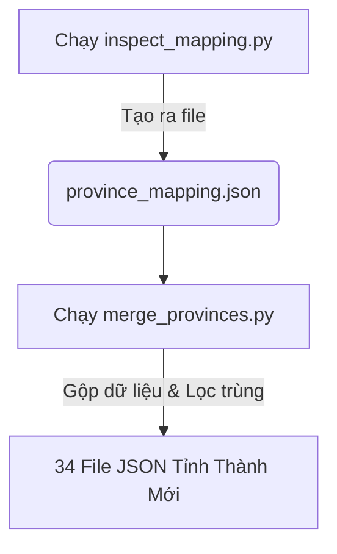

# Hướng Dẫn Vận Hành & Tổng Hợp Toàn Bộ Lệnh Chạy Dự Án

Tài liệu này tổng hợp chi tiết tất cả các script, file thực thi lệnh `.bat` / `.ps1` và các lệnh npm/python trong toàn bộ hệ thống (Frontend, Backend, AI-Service, Knowledge Builder).

---

## 🚀 1. Các Lệnh Khởi Chạy Dự Án & Đồng Bộ Tổng Thể (Root)
*Các file thực thi nằm tại thư mục gốc của dự án giúp khởi chạy toàn bộ dịch vụ hoặc đồng bộ CSDL RAG chỉ với 1 cú click.*

### 1.1 Khởi chạy song song 3 dịch vụ (Frontend, Backend, AI-Service)
Bạn chỉ cần chạy 1 trong các lệnh sau tại thư mục gốc của dự án:
* **Sử dụng file Bat (Khuyên dùng trên Windows):**
  ```bash
  start_project.bat
  ```
* **Hoặc sử dụng Node.js:**
  ```bash
  node start.js
  ```
* **Hoặc sử dụng PowerShell:**
  ```powershell
  ./start_project.ps1
  ```
> **Chức năng:** Lệnh này sử dụng file `start.js` để tự động khởi chạy đồng thời:
> * **Backend:** API Server tại thư mục `backend` (`npm run dev`).
> * **Frontend:** Client tại thư mục `frontend` (`npm run dev` chạy ở cổng 3000).
> * **AI-Service:** FastAPI Server tại thư mục `ai-service` (cổng 8000, sử dụng Python venv).

---

### 1.2 Quy trình đồng bộ cấu trúc Database & dữ liệu RAG (3 Bước tự động)
Để khởi chạy đồng bộ toàn bộ cơ sở dữ liệu và nạp tài liệu tri thức RAG vào Postgres, chạy lệnh:
* **Sử dụng file Bat:**
  ```bash
  sync_and_import.bat
  ```
* **Hoặc sử dụng PowerShell:**
  ```powershell
  ./sync_and_import.ps1
  ```
> **Quy trình hoạt động bên trong:**
> 1. **Bước 1 (DB Sync):** Đồng bộ lược đồ Prisma vào database (`npx prisma db push` trong thư mục `backend`).
> 2. **Bước 2 (Chunking):** Tự động băm nhỏ dữ liệu văn bản RAG (`python chunk.py` trong thư mục `knowledge-builder`).
> 3. **Bước 3 (Vector Import):** Nạp dữ liệu tri thức dạng Vector vào PostgreSQL (`npm run import-json` trong thư mục `knowledge-builder`).

---

## 🔄 2. Quy Trình Chuyển Đổi & Gộp Tỉnh Thành (63 Tỉnh ➔ 34 Tỉnh Mới)
*Khi bạn muốn tổ chức lại toàn bộ file dữ liệu trong `backend/src/config/destinations` theo mô hình đơn vị hành chính mới.*



### Bước 1: `backend/scratch/inspect_mapping.py` (Python)
* **Chức năng:** Gọi thư viện `vietnamadminunits` đối chiếu 63 tỉnh cũ sang 34 tỉnh mới để tạo file ánh xạ.
* **Lệnh chạy:**
  ```bash
  python scratch/inspect_mapping.py
  ```
* **Kết quả:** Tạo ra file `backend/scratch/province_mapping.json`.

### Bước 2: `backend/scratch/merge_provinces.py` (Python)
* **Chức năng:** 
  * Đọc bản đồ ánh xạ và gom các địa điểm của 63 tỉnh cũ vào 34 file JSON của tỉnh mới (ví dụ: gộp chung vào `tinh-vinh-long.json`).
  * **[Cập nhật quan trọng]:** Giữ nguyên tên tỉnh cũ ở trường `"province"` của từng địa điểm (ví dụ: địa điểm ở Bến Tre vẫn lưu `"province": "Bến Tre"`), giúp hỗ trợ người dùng tìm kiếm theo đơn vị hành chính cũ.
  * Tự động lọc trùng các địa điểm trùng lặp tên.
  * Đọc dữ liệu từ bản backup `destinations_backup` nếu tồn tại để tránh rủi ro mất dữ liệu khi chạy lại nhiều lần.
* **Lệnh chạy:**
  ```bash
  python scratch/merge_provinces.py
  ```

### ⚠️ Lệnh Khôi Phục & Reset Dữ Liệu Gốc (Khi dữ liệu bị lẫn lộn)
Nếu trong quá trình thao tác hoặc chạy thử nghiệm, thư mục `destinations` bị lẫn lộn cả file cũ và file mới, bạn hãy chạy cụm lệnh sau trong PowerShell để reset thư mục về 45 file gốc sạch từ Git:
```powershell
# 1. Xóa toàn bộ file đang bị lẫn lộn trong thư mục destinations
Remove-Item -Recurse -Force src/config/destinations/*

# 2. Xóa thư mục backup cũ
Remove-Item -Recurse -Force src/config/destinations_backup

# 3. Khôi phục lại đúng 45 file gốc sạch từ Git
git checkout -- src/config/destinations
```

---

## 📍 3. Xác Thực, Dò Tìm & Cập Nhật Tọa Độ Thực (Geocoding)
*Các script giúp quét phát hiện tọa độ giả và tự động dò tìm bản đồ để sửa lại tọa độ thật.*

### 3.1 `backend/verify_destinations.py` (Python)
* **Chức năng:** Quét các file JSON, tự động làm sạch tên địa điểm (bỏ chú thích ngoặc đơn, bỏ tiền tố thừa, sửa chính tả) và gọi OpenStreetMap API để lấy tọa độ chính xác ghi đè vào file JSON.
* **Lệnh chạy hàng loạt (Tự động bỏ qua các địa điểm đã có tọa độ thật):**
  ```bash
  python verify_destinations.py all 0 --update
  ```
* **Kiểm tra thử một file tỉnh thành cụ thể (chỉ đọc thử 5 địa điểm đầu):**
  ```bash
  python verify_destinations.py phu-yen.json 5
  ```

### 3.2 `backend/generate_verification_links.py` (Python)
* **Chức năng:** Xuất danh sách địa điểm chưa được xác định tọa độ thực ra file `backend/check_destinations.md` kèm liên kết tìm kiếm trực tiếp trên Google Maps để kiểm tra bằng tay.
* **Lệnh chạy:**
  ```bash
  python generate_verification_links.py
  ```

### 3.3 `backend/clean_duplicates.py` (Python)
* **Chức năng:** Lọc và loại bỏ các bản ghi trùng lặp trong cùng một file JSON tỉnh thành.
* **Lệnh chạy:**
  ```bash
  python clean_duplicates.py
  ```

### 3.4 `backend/src/scripts/extract-and-geocode.ts` (TypeScript)
* **Chức năng:** Trích xuất chi phí tự động từ mô tả và gọi microservice geocoding local ở cổng 8000 để cập nhật tọa độ.
* **Lệnh chạy:**
  ```bash
  npx ts-node src/scripts/extract-and-geocode.ts
  ```

---

## 🗄️ 4. Các Lệnh Trong Thư Mục `backend` (API Server)
*Chạy các lệnh này khi mở terminal tại thư mục `d:\Thuc_Tap_NDT\backend`.*

* **Khởi chạy môi trường Dev:**
  ```bash
  npm run dev
  ```
* **Build code TypeScript sang JavaScript:**
  ```bash
  npm run build
  ```
* **Khởi chạy production server:**
  ```bash
  npm run start
  ```
* **Sinh Prisma Client (cập nhật khi schema.prisma thay đổi):**
  ```bash
  npm run prisma:generate
  ```
* **Tạo và áp dụng file migration database mới:**
  ```bash
  npm run prisma:migrate
  ```
* **Nạp dữ liệu mẫu ban đầu (Users, Posts, Destinations) vào DB:**
  ```bash
  npx prisma db seed
  ```

---

## 💻 5. Các Lệnh Trong Thư Mục `frontend` (Client Web)
*Chạy các lệnh này khi mở terminal tại thư mục `d:\Thuc_Tap_NDT\frontend`.*

* **Khởi chạy Client Web (chạy ở cổng 3000):**
  ```bash
  npm run dev
  ```
* **Build ứng dụng sang dạng production tĩnh (Vite):**
  ```bash
  npm run build
  ```
* **Chạy kiểm tra lỗi cú pháp và định dạng code (ESLint):**
  ```bash
  npm run lint
  ```
* **Chạy thử bản build tĩnh cục bộ:**
  ```bash
  npm run preview
  ```

---

## 🧠 6. Dịch Vụ RAG & Crawl (`knowledge-builder`)
*Chạy các lệnh này khi mở terminal tại thư mục `d:\Thuc_Tap_NDT\knowledge-builder`.*

* **Đồng bộ hóa dữ liệu tri thức:**
  ```bash
  npm run sync
  ```
* **Đồng bộ hàng loạt dữ liệu:**
  ```bash
  npm run bulk-sync
  ```
* **Nạp file dữ liệu JSON cụ thể vào PostgreSQL:**
  ```bash
  npm run import-json -- --file="đường_dẫn_file.json"
  ```
* **Dọn sạch dữ liệu tri thức cũ trong database:**
  ```bash
  npm run clean-db
  ```
* **Reset toàn bộ database tri thức:**
  ```bash
  npm run reset-db
  ```
